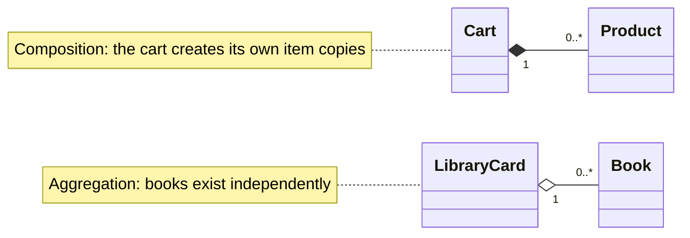

# Class methods and string representation

## Class methods and static methods

An ordinary method receives `self`. `@classmethod` receives the class as `cls`, making it suitable for an alternative constructor. `@staticmethod` automatically receives neither a class nor an instance; it is a helper function logically associated with the class concept. Do not make every method static: the class would stop combining state and behavior and become merely a container of names.

### Example 3. A rectangle from a string

```py
from math import isfinite
from typing import Self


class Rectangle:
    def __init__(self, width: float, height: float) -> None:
        if not self.valid_side(width) or not self.valid_side(height):
            raise ValueError("Sides must be positive")
        self._width = width
        self._height = height

    @staticmethod
    def valid_side(value: float) -> bool:
        return isfinite(value) and value > 0

    @classmethod
    def from_string(cls, text: str) -> Self:
        width, height = text.split("x")
        return cls(float(width), float(height))

    @property
    def area(self) -> float:
        return self._width * self._height

    def __str__(self) -> str:
        return f"{self._width:g} x {self._height:g}"


rectangle = Rectangle.from_string("3x4")
print(rectangle, rectangle.area)
print(Rectangle.valid_side(-1))
```

```
3 x 4 12.0
False
```

`Self` describes an instance of the current class; subclass details will be covered in the next topic. Creating through `cls(...)`, rather than hard-coding `Rectangle(...)`, preserves this intent. Invalid format, an extra separator, or an invalid side raises `ValueError`. Handle it at the interface boundary rather than returning a partially initialized rectangle.

A class attribute can count **created** instances: incrementing after successful validation gives correct statistics. Do not call this the number of **live** objects if it never decreases. Separate subclass counters require a different policy that should be explicitly defined.

## String representation and object relationships

`__str__` provides user-friendly text, while `__repr__` serves developer diagnostics. Both return a string. If `__str__` is absent, Python may use `__repr__`. Do not include secrets in an automatic representation: it can easily appear in a log or debugger. A reproducible construction expression is useful but not always possible or appropriate.

**Association** is a general relationship between objects. **Aggregation** means that a whole references parts that exist independently. **Composition** emphasizes ownership of parts and their lifecycle in the model. In Python, this is primarily a design decision, not a special destruction operator (Fig. 8.4).



Figure 8.4. Ownership of parts and independent objects {.caption}

### Example 4. A cart with its own items

The cart creates `Product` objects from supplied values, making this a composition example. It does not accept a shared mutable list from outside. Prices are integer kopiykas; the discounted total is returned in kopiykas with the fractional part discarded according to the exercise's explicitly chosen rule.

```py
class Product:
    def __init__(self, name: str, price: int) -> None:
        if not name.strip() or type(price) is not int or price < 0:
            raise ValueError("Invalid item")
        self.name = name.strip()
        self.price = price

    def __repr__(self) -> str:
        return f"Product({self.name!r}, {self.price})"


class Cart:
    def __init__(self, discount: int = 0) -> None:
        if not 0 <= discount <= 100:
            raise ValueError("Discount outside 0..100")
        self.__discount = discount
        self._items: list[Product] = []

    def add(self, name: str, price: int) -> None:
        self._items.append(Product(name, price))

    @property
    def total(self) -> int:
        subtotal = sum(item.price for item in self._items)
        return subtotal * (100 - self.__discount) // 100

    def __repr__(self) -> str:
        return f"Cart(items={self._items!r}, total={self.total})"


cart = Cart(10)
cart.add("tea", 4000)
cart.add("bread", 6000)
print(cart.total)
print(len(cart._items))  # debugging demonstration only
```

```
9000
2
```

Reading `_items` directly at the end is a diagnostic demonstration; application clients should use a public method or count property. If items must be exposed externally, returning the internal list itself lets callers bypass validation. Even a tuple of mutable `Product` objects is not a deeply immutable copy: define which changes clients may make.
