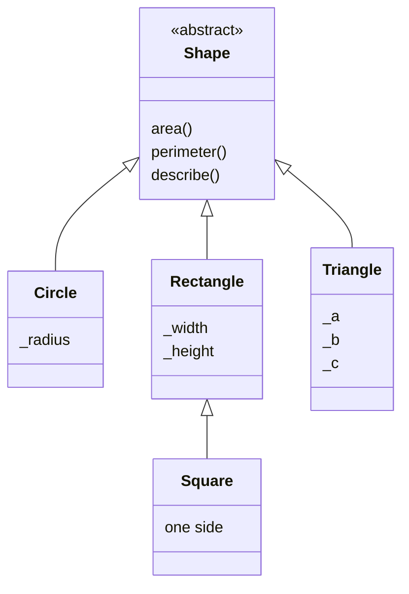

# Abstract classes and methods

## Abstract classes and methods

An abstract base class (**ABC**) specifies required operations. It can also contain implemented shared behavior. Python uses `abc.ABC` and `@abstractmethod`: <https://docs.python.org/3.14/library/abc.html>. An incomplete class cannot be instantiated until all abstract methods and properties are implemented; attempting to do so raises `TypeError`.

Inheriting from `ABC` without abstract methods does not prevent instantiation. An abstract method may have an implementation accessible through `super`, but a derived class must still meet the overriding requirement. `raise NotImplementedError` without `abstractmethod` does not provide this check at object creation.

### Example 1. Geometric shapes

All dimensions are finite and positive; a triangle satisfies the triangle inequality. In this interface, dimensions cannot be changed through public setters after creation. Therefore, `Square` can be a separate way to create a rectangle with equal sides without violating promises of independent width and height changes, which this contract does not make.



Figure 9.1. Inheritance and shared shape operations {.caption}

```py
from abc import ABC, abstractmethod
from math import isfinite, pi, sqrt
from typing import override


class Shape(ABC):
    @abstractmethod
    def area(self) -> float:
        raise NotImplementedError

    @abstractmethod
    def perimeter(self) -> float:
        raise NotImplementedError

    def describe(self) -> str:
        return f"{type(self).__name__}: {self.area():.2f}"


def positive(*values: float) -> None:
    if not all(isfinite(v) and v > 0 for v in values):
        raise ValueError("Dimensions must be positive")


class Circle(Shape):
    def __init__(self, radius: float) -> None:
        positive(radius)
        self._radius = radius

    @override
    def area(self) -> float:
        return pi * self._radius ** 2

    @override
    def perimeter(self) -> float:
        return 2 * pi * self._radius


class Rectangle(Shape):
    def __init__(self, width: float, height: float) -> None:
        positive(width, height)
        self._width, self._height = width, height

    @override
    def area(self) -> float:
        return self._width * self._height

    @override
    def perimeter(self) -> float:
        return 2 * (self._width + self._height)


class Square(Rectangle):
    def __init__(self, side: float) -> None:
        super().__init__(side, side)


class Triangle(Shape):
    def __init__(self, a: float, b: float, c: float) -> None:
        positive(a, b, c)
        if 2 * max(a, b, c) >= a + b + c:
            raise ValueError("Triangle inequality violated")
        self._a, self._b, self._c = a, b, c

    @override
    def perimeter(self) -> float:
        return self._a + self._b + self._c

    @override
    def area(self) -> float:
        s = self.perimeter() / 2
        return sqrt(s * (s-self._a) * (s-self._b) * (s-self._c))


shapes: list[Shape] = [Circle(1), Rectangle(2, 3),
                       Square(2), Triangle(3, 4, 5)]
for shape in sorted(shapes, key=lambda item: item.area()):
    print(shape.describe())
```

```
Circle: 3.14
Square: 4.00
Rectangle: 6.00
Triangle: 6.00
```

The base class's `describe` method calls `self.area`, selecting the actual object's implementation. Adding a new shape type requires no changes to this method or the reporting loop. Sorting is stable: the rectangle and triangle have equal areas, so their original order is preserved.

The example assumes ordinary dimensions suitable for learning. Nearly degenerate triangles or very large numbers require a separate analysis of the numerical stability of Heron's formula. A correct hierarchy does not eliminate floating-point arithmetic error.

### Abstract properties and the template method

For an abstract property, `property` is the outer decorator and `abstractmethod` the inner one. A **template method** defines a sequence of steps, some of which subclasses refine. It helps preserve shared validation, a heading, or a format.

```py
from abc import ABC, abstractmethod


class Report(ABC):
    @property
    @abstractmethod
    def title(self) -> str:
        raise NotImplementedError

    @abstractmethod
    def body(self) -> str:
        raise NotImplementedError

    def render(self) -> str:
        return f"{self.title}\n{self.body()}"


class ShortReport(Report):
    @property
    def title(self) -> str:
        return "Summary"

    def body(self) -> str:
        return "Records: 3"


print(ShortReport().render())
try:
    Report()
except TypeError:
    print("An abstract class cannot be instantiated")
```

```
Summary
Records: 3
An abstract class cannot be instantiated
```

Annotations do not check every semantic promise. An implementation may return the wrong type or an empty heading if the programmer violates the contract. ABC guarantees the required override, not the correctness of the entire algorithm.
