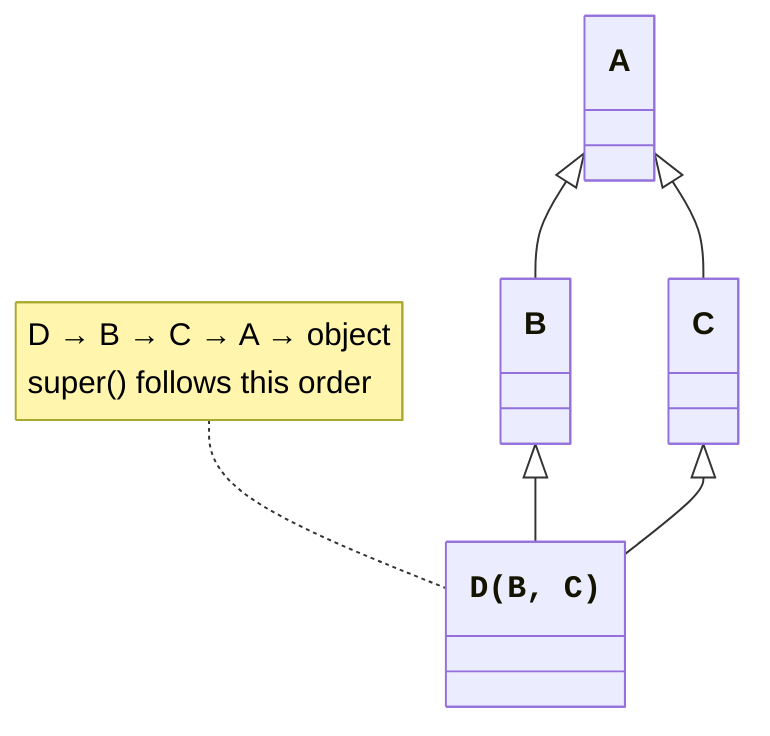
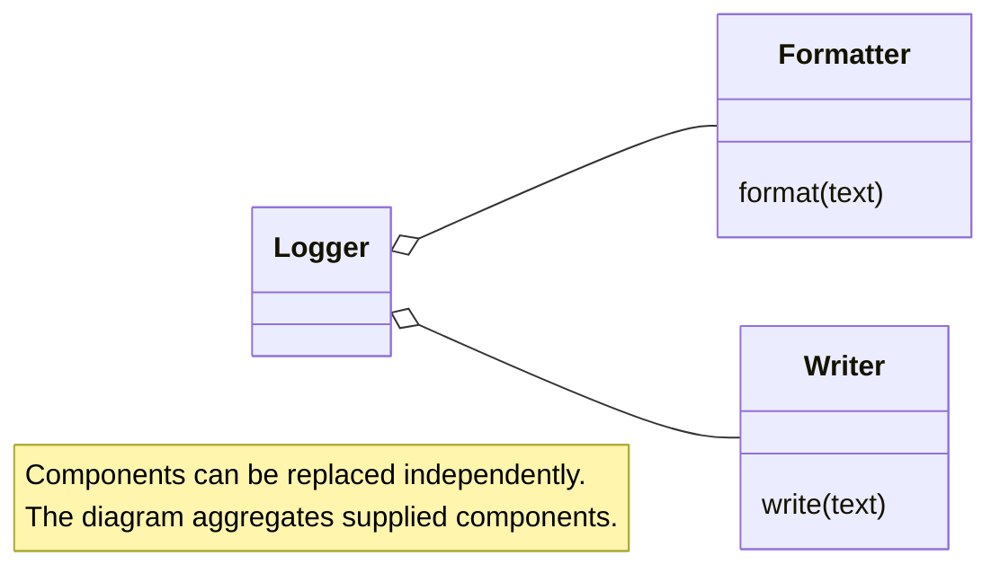

# Multiple inheritance and composition

## Multiple inheritance, MRO, and mixins

A class can have several bases. Python calculates the method resolution order (**MRO**) using the C3 algorithm, which reconciles the local base order with the order of their ancestors. This is not merely an arbitrary “go all the way left first” search. Incompatible ordering requirements cause class definition to fail with `TypeError`. <https://docs.python.org/3.14/howto/mro.html>.



Figure 9.3. A diamond and the sequence of cooperative calls {.caption}

```py
class A:
    def chain(self) -> list[str]:
        return ["A"]


class B(A):
    def chain(self) -> list[str]:
        return ["B"] + super().chain()


class C(A):
    def chain(self) -> list[str]:
        return ["C"] + super().chain()


class D(B, C):
    def chain(self) -> list[str]:
        return ["D"] + super().chain()


print([cls.__name__ for cls in D.__mro__])
print(D().chain())
```

```
['D', 'B', 'C', 'A', 'object']
['D', 'B', 'C', 'A']
```

In method `B`, the next class for an instance of `D` is `C`, not `A`. Each participant calls `super` once and has a compatible signature. Mixing direct base calls with `super` may skip a participant or execute a shared base twice. Design cooperative constructors especially carefully.

A **mixin** adds a small, complete capability: serialization, formatting, or validation. It is usually not instantiated as an independent domain entity. A mixin's contract should explicitly name the methods it expects from the rest of the class and should not rely on incidental internal field names.

### Example 4. Representation and comparison-key mixins

```py
import json


class JsonMixin:
    def fields(self) -> dict[str, str | int]:
        raise NotImplementedError

    def to_json(self) -> str:
        return json.dumps(self.fields(), ensure_ascii=False)


class KeyMixin:
    def key(self) -> tuple[int, str]:
        raise NotImplementedError

    def comes_before(self, other: "KeyMixin") -> bool:
        return self.key() < other.key()


class Record(JsonMixin, KeyMixin):
    def __init__(self, name: str, score: int) -> None:
        self.name, self.score = name, score

    def fields(self) -> dict[str, str | int]:
        return {"name": self.name, "score": self.score}

    def key(self) -> tuple[int, str]:
        return -self.score, self.name


a, b = Record("Anna", 90), Record("Ihor", 80)
print(a.to_json())
print(a.comes_before(b))
print([cls.__name__ for cls in Record.__mro__])
```

```
{"name": "Anna", "score": 90}
True
['Record', 'JsonMixin', 'KeyMixin', 'object']
```

These mixins have no constructors of their own, so they create no initialization conflict. They call the explicitly defined `fields` and `key` methods. We will implement special comparison operators in Topic 10; here, a named method keeps the contract clear.

## Composition and the substitution principle

Inheritance suits an “is a kind of” relationship within a particular contract. Composition and delegation suit cases where an object **uses** another object for part of its behavior. A logger can receive a formatter and writer instead of creating dozens of subclasses for every combination of output methods.



Figure 9.4. Replacing components without expanding a hierarchy {.caption}

In the general principle “composition over inheritance,” composition often means assembling behavior from components. In strict UML terminology, supplied independent formatters and writers are aggregation, hence the hollow diamonds in the diagram. A filled diamond is appropriate when the owner creates and controls the part.

The **Liskov substitution principle** means that a client of the base contract should work correctly with a derived object. A subclass must not unexpectedly require stronger preconditions, weaken promised results, or break invariants. A mathematical relationship between concepts does not always imply suitable inheritance between mutable software objects.

A mutable rectangle class may promise independent width and height setters. A square that automatically changes both sides violates such a client's expectations. Possible solutions include a shared immutable shape interface, separate types without this inheritance, or a contract that does not promise independent side editing.

Other SOLID principles help assess the design: one responsibility per class, adding implementations without changing the client, narrow interfaces, and depending on contracts rather than concrete ways of working. These are guides for discussing tradeoffs, not a requirement to create an abstraction for every function.

## UML, PyCharm, and testing a hierarchy

In UML, a solid line with a hollow triangle points from the derived class to the base. A dashed line to an interface indicates contract implementation. Abstractness is marked with italics or an explicit stereotype. For the lab, the diagram must match the code: verify parameter types, methods, multiplicities, and arrow directions after implementation.

PyCharm shows override icons beside methods. *Override Methods* (**Ctrl+O**) helps create overrides; *Implement Methods* (**Ctrl+I**) supplies required implementations. *Type Hierarchy* (**Ctrl+H**) shows the hierarchy, and **Ctrl+Alt+B** navigates to implementations. Shortcuts depend on the current *Keymap*; the standard Windows keymap is shown here. <https://www.jetbrains.com/help/pycharm/overriding-methods-of-a-superclass.html>.

::: info Screenshot
Circle.area overrides Shape.area; hover gutter icon.
:::

Figure 9.5. An icon marking a shape method implementation {.caption}

::: info Screenshot
New Triangle(Shape), Ctrl+I; select area and perimeter.
:::

Figure 9.6. Selecting abstract methods to implement {.caption}

::: info Screenshot
Shape, Ctrl+H; show Circle Rectangle Square Triangle.
:::

Figure 9.7. The Shape hierarchy in IDE tools {.caption}

Check that the abstract base class cannot be instantiated and that every concrete class passes the same set of contract checks. For a protocol, use two unrelated classes. For MRO, print the order and demonstrate that every cooperative step runs exactly once. Do not limit a test to `isinstance`: it does not prove the result is correct.
