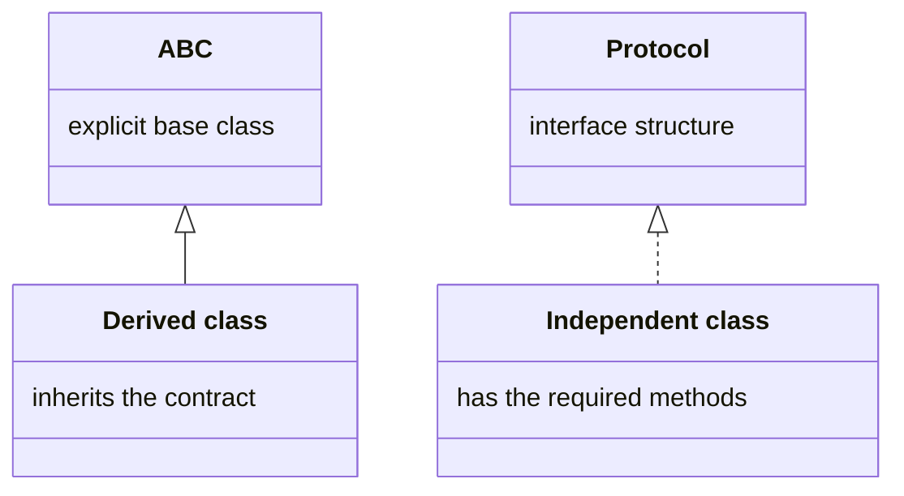

# super, protocols, and collection abstractions

## Extending behavior with `super`

A derived class often adds its own state while leaving shared state to the base class. Constructors must agree on parameters and avoid duplicating validation. Distinguish extension from complete replacement: a method may call `super().method()` first and then add its part of the result.

### Example 2. Employees

The amounts below are whole hypothetical hryvnias, not a real payroll calculation. Hourly pay multiplies hours by a rate, while salaried pay returns a fixed salary. All classes promise a nonnegative integer value for one sample period.

```py
from abc import ABC, abstractmethod
from typing import override


class Employee(ABC):
    def __init__(self, name: str) -> None:
        if not name.strip():
            raise ValueError("A name is required")
        self.name = name.strip()

    @abstractmethod
    def pay(self) -> int:
        raise NotImplementedError


class Hourly(Employee):
    def __init__(self, name: str, hours: int, rate: int) -> None:
        super().__init__(name)
        if not 0 <= hours <= 200 or rate < 0:
            raise ValueError("Invalid hours or rate")
        self.hours, self.rate = hours, rate

    @override
    def pay(self) -> int:
        return self.hours * self.rate


class Salaried(Employee):
    def __init__(self, name: str, salary: int) -> None:
        super().__init__(name)
        if salary < 0:
            raise ValueError("Negative salary")
        self.salary = salary

    @override
    def pay(self) -> int:
        return self.salary


staff: list[Employee] = [Hourly("Olena", 10, 100),
                         Salaried("Ihor", 1500)]
for worker in staff:
    print(worker.name, worker.pay())
print("Total:", sum(worker.pay() for worker in staff))
```

```
Olena 1000
Ihor 1500
Total: 2500
```

`typing.override` tells a static analyzer that you intend to override a base-class method. If you misspell the name, the tool can detect it. The interpreter itself does not prohibit an incorrect override based on this decorator. Similarly, `typing.final` marks a class or method that should not be subclassed or overridden, but this is a static contract.

`Self` from Topic 8 suits methods that return an instance of the same actual class, such as an alternative constructor. It does not mean “an arbitrary object of the base type.” Full type checking and running an analyzer are covered in Topic 16. <https://docs.python.org/3.14/library/typing.html>.

## Protocols and structural typing

An ABC usually specifies explicit ancestry from a shared base. `typing.Protocol` specifies a **structure**: the attributes and methods a consumer needs. An independent class can satisfy a protocol without listing it among its bases. This is especially convenient when the class is external or a shared role does not imply a shared nature of the objects. <https://typing.python.org/en/latest/spec/protocol.html>.



Figure 9.2. Explicit inheritance and a structural contract {.caption}

### Example 3. Printing reports from independent classes

```py
from typing import Protocol, runtime_checkable


@runtime_checkable
class Printable(Protocol):
    def render(self) -> str: ...


class Receipt:
    def __init__(self, total: int) -> None:
        self.total = total

    def render(self) -> str:
        return f"Amount due: {self.total}"


class Notice:
    def __init__(self, text: str) -> None:
        self.text = text

    def render(self) -> str:
        return f"Notice: {self.text}"


def print_report(item: Printable) -> None:
    print(item.render())


items: list[Printable] = [Receipt(150), Notice("Meeting at 12:00")]
for item in items:
    print_report(item)
print(isinstance(items[0], Printable))
```

```
Amount due: 150
Notice: Meeting at 12:00
True
```

`Receipt` does not inherit from `Printable` but has the required method with a compatible signature. A typed consumer sees the minimum contract, not every receipt detail. The ellipsis in the protocol method body indicates a description without an implementation for use as an ordinary object.

`@runtime_checkable` enables a simple `isinstance` check with a protocol. It checks for the required members, but not their types, signatures, or result correctness. An object with `render(x)` may pass this check even though calling `render()` fails. Do not use this decorator as complete plugin validation. Without it, an ordinary protocol is not intended for `isinstance`.

Data members in a protocol impose additional restrictions on `issubclass`: checking a class cannot generally prove the existence of attributes created only in a constructor. In this topic, use protocols mainly as static parameter contracts. Reserve `runtime_checkable` for simple capability checks with a clear understanding of their limits.

## Standard collection abstractions

`collections.abc` contains roles such as `Iterable`, `Sized`, `Sequence`, and `Mapping`: <https://docs.python.org/3.14/library/collections.abc.html>. If a function needs only traversal, annotate `Iterable[T]` rather than forcing the client to create a list. If it needs indices and length, `Sequence[T]` describes a more precise contract. If the function modifies the collection, an immutable abstraction is insufficient.

```py
from collections.abc import Iterable, Mapping, Sized


def total(values: Iterable[int]) -> int:
    return sum(values)


print(total(x * x for x in range(4)))
print(isinstance([1, 2], Sized))
print(isinstance({"A": 1}, Mapping))
```

```
14
True
True
```

An ABC can register an external class as a virtual subclass through `register`. This changes `isinstance` and `issubclass` results but does not add methods or insert the ABC into the MRO. Registration therefore does not “inherit an implementation” or check whether the declared contract is honored.

```py
from abc import ABC, abstractmethod


class Named(ABC):
    @abstractmethod
    def name(self) -> str:
        raise NotImplementedError


class External:
    pass


Named.register(External)
item = External()
print(isinstance(item, Named))
print(hasattr(item, "name"))
```

```
True
False
```

This example deliberately demonstrates a dangerous false registration. In a finished program, register only a class whose behavior has been verified. Protocol is often clearer for a structural description.
