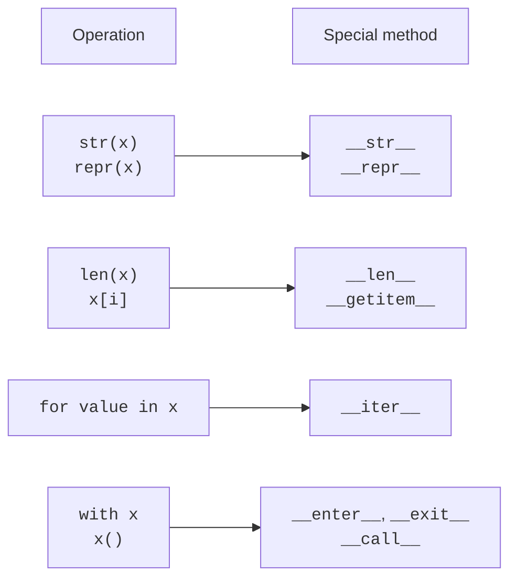
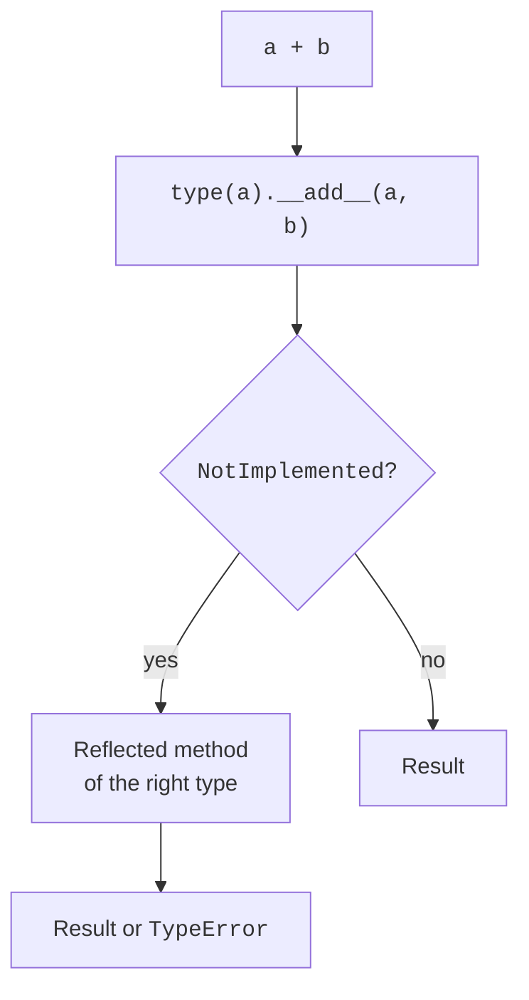

# The data model and arithmetic operations

## The data model and special methods

**Special methods** (*special methods*) have two underscores on each side of their names, such as `__len__`. They are also called *dunder methods*. These are not arbitrary decorations: the interpreter looks for specific methods for specific operations. `len(x)` uses the length protocol, and `x[i]` uses the indexing protocol. Do not invent new names with double underscores: an ordinary domain method only needs a clear name.

For implicit operations, Python generally looks for the method on the type rather than in an individual instance's dictionary. Assigning `x.__len__ = ...` is not a reliable way to give `len(x)` new behavior. Declare the method in the class. Data model reference: <https://docs.python.org/3.14/reference/datamodel.html#special-method-names>.



Figure 10.1. Protocols connect familiar operations to class behavior. {.caption}

The method's contract matters more than its name. `__len__` must return a nonnegative integer, `__str__` a string, and `__bool__` a `bool`. If `__bool__` is absent, truth can be determined through `__len__`: an empty container is false. If both methods are absent, an ordinary instance is true. Do not change state during a truth test: `if x` should be a predictable observation.

## Object representations for users and developers

`__repr__` creates a precise diagnostic representation and is called by `repr`. For simple values, it should ideally resemble an expression that creates the object. `__str__` creates a convenient representation for users and is called through `str` and `print`. If there is no custom `__str__`, `__repr__` is usually used. A representation must not contain passwords or access keys, even in a debugger window.

`__format__(self, spec)` handles `format(x, spec)` and the f-string `f"{x:spec}"`. The specification is a string whose meaning is defined by the class. For a vector, passing the numeric specification to both coordinates is convenient. Then `.2f` means two decimal places in each component, not the precision at which the vector itself is stored.

```py
from dataclasses import dataclass


@dataclass(frozen=True)
class Point:
    x: float
    y: float

    def __str__(self) -> str:
        return f"({self.x}; {self.y})"

    def __format__(self, spec: str) -> str:
        return f"({self.x:{spec}}; {self.y:{spec}})"


p = Point(1.25, 3.5)
print(repr(p))
print(p)
print(f"{p:.1f}")
```

```
Point(x=1.25, y=3.5)
(1.25; 3.5)
(1.2; 3.5)
```

The `dataclass` decorator here only shortens the declaration of fields and utility methods; its rules are discussed below. Rounding `1.25` to one decimal place follows Python's formatting rules. The object still stores its original coordinate. An unsupported specification should cause a clear error rather than silently ignore the user's requested format.

## Arithmetic operations and NotImplemented

The `__add__` method implements addition, `__sub__` subtraction, `__mul__` multiplication, and `__truediv__` true division. Matrix multiplication uses `__matmul__`, which corresponds to `@`. The operations `-x` and `abs(x)` use `__neg__` and `__abs__`. Decide whether an operation returns a new value or changes the existing object; for a mathematical vector, returning a new one while leaving the operands unchanged is more natural.

When the right operand's type is unsupported, a binary method returns the special object `NotImplemented`. This lets Python try the other type's reflected operation. It is **not** the `NotImplementedError` exception, which is raised for behavior that has not yet been implemented. In Python 3.14, evaluating `bool(NotImplemented)` itself raises `TypeError`; do not use this value as a Boolean answer.



Figure 10.2. A simplified addition path for different unrelated types. {.caption}

The diagram does not describe all dispatch rules. If the right type is a strict subclass of the left type and overrides the reflected method, it may take priority. For operands of the same type, the reflected method is not a second attempt after their own `NotImplemented`. If an arithmetic operation ultimately fails, it raises `TypeError`.

`__iadd__` handles `+=` and may modify the instance in place; the returned value is reassigned to the name on the left. If this method is absent or returns `NotImplemented`, Python uses the ordinary addition mechanism. Thus, `a += b` does not guarantee that identity is preserved. For an immutable class, receiving a new instance is entirely normal. Check the effect on other references to the original object.

### Example 1. A two-dimensional vector

A vector stores two finite coordinates. For brevity, this version's constructor accepts numeric values according to its contract; finiteness is checked after creation. You can add another vector and multiply by a finite number. We reject `bool` as a multiplier, although it is technically a subtype of `int`.

```py
from dataclasses import dataclass
from math import hypot, isfinite
from types import NotImplementedType


@dataclass(frozen=True)
class Vector:
    x: float
    y: float

    def __post_init__(self) -> None:
        if not (isfinite(self.x) and isfinite(self.y)):
            raise ValueError("coordinates must be finite")

    def __add__(self, other: object) -> "Vector | NotImplementedType":
        if not isinstance(other, Vector):
            return NotImplemented
        return Vector(self.x + other.x, self.y + other.y)

    def __radd__(
        self, other: object
    ) -> "Vector | NotImplementedType":
        if type(other) is int and other == 0:
            return self
        return NotImplemented

    def __mul__(self, scale: object) -> "Vector | NotImplementedType":
        if type(scale) not in (int, float):
            return NotImplemented
        return Vector(self.x * scale, self.y * scale)

    def __abs__(self) -> float:
        return hypot(self.x, self.y)

    def __bool__(self) -> bool:
        return self.x != 0 or self.y != 0

    def __format__(self, spec: str) -> str:
        return f"({self.x:{spec}}; {self.y:{spec}})"


a = Vector(3, 4)
b = Vector(1, -2)
print(f"{a + b:.1f}", abs(a), bool(Vector(0, 0)))
print(f"{sum([a, b]):.1f}", f"{a * 2:.1f}")
```

```
(4.0; 2.0) 5.0 False
(4.0; 2.0) (6.0; 8.0)
```

`sum` starts with integer zero. This is exactly what `__radd__` accepts; adding an arbitrary scalar to a vector is not allowed. The expression `a + "x"` must raise `TypeError`. There is no reflected multiplication, so `2 * a` is also unsupported; it can be added separately if the contract requires it. Returning a new vector runs the same finiteness check, including after overflow.
