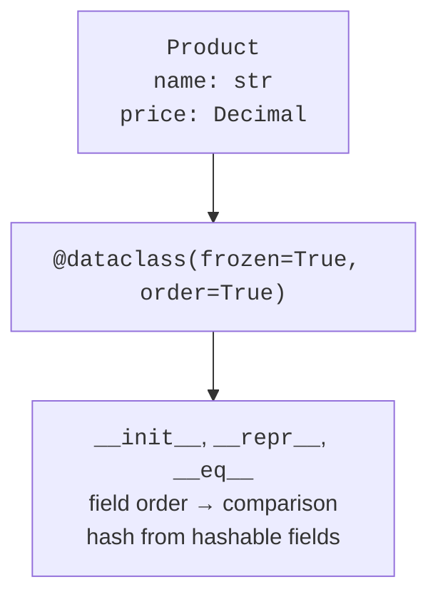
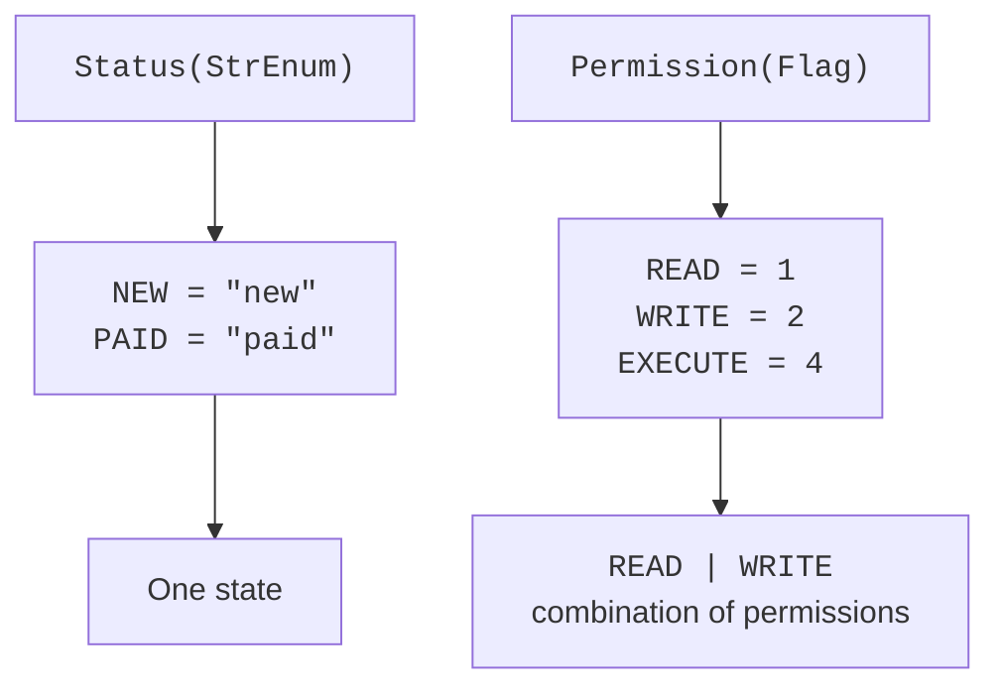

# Data classes and enumerations

## Data classes and generated methods

The `@dataclass` decorator reads annotated fields and generates routine methods. By default, these are `__init__`, `__repr__`, and `__eq__`. Annotations do not perform automatic validation. Use `__post_init__` for validation; the generated constructor calls it after assigning the fields. If you write `__init__` yourself, merely having this method does not cause an automatic call.



Figure 10.3. Fields and decorator parameters determine utility methods. {.caption}

`order=True` generates comparisons in field declaration order. If you declare the name first, products will be compared by name first, not by price. `frozen=True` prohibits ordinary field reassignment but does not make a nested list immutable. `slots=True` removes the usual field dictionary in a simple class and restricts adding new attributes. It is not a way to hide data from the user or a replacement for validation.

`kw_only=True` requires field arguments to be named during construction. This helps avoid swapping price and quantity. `field` configures an individual field: `repr=False` hides it from the automatic representation, `compare=False` excludes it from equality and ordering, and `default_factory=list` creates a new list for each object. The decorator rejects a mutable list as an ordinary default value; the factory must be a function that takes no arguments.

`asdict` converts a dataclass to a dictionary, recursively processing nested data classes; it is not a universal JSON serializer. `Decimal`, an enumeration, or a date may need a separate policy. `replace(obj, field=value)` creates a new instance with replaced fields, running the constructor and `__post_init__` again. Reference: <https://docs.python.org/3.14/library/dataclasses.html>.

::: info Screenshot
Ctrl+P inside Product(; inspection of assignment to a frozen field.
:::

Figure 10.4. A hint showing the generated data-class parameters. {.caption}

`typing.NamedTuple` also defines named fields but remains a tuple: it supports positional access and unpacking. Its equality is tied to tuple values, whereas a dataclass usually compares instances of the same concrete class. Choose NamedTuple for a naturally tuple-like record, and dataclass when custom constructor rules, fields, and domain behavior matter.

## Enumerations and flags

`Enum` defines a finite set of named values. A member has `name` and `value`; `Color["RED"]` looks up by name, and `Color(1)` by value. An invalid name raises `KeyError`, and an invalid value raises `ValueError`. An ordinary `Enum` is not a string or number, even if its value has that type. This prevents mixing different domain enumerations.

`StrEnum` is convenient for string status codes; `IntEnum` provides compatibility with numeric APIs. Such compatibility weakens type separation, so an ordinary `Enum` is often clearer for an internal domain model. `auto()` generates values according to the type's rules: lowercase names for `StrEnum`, individual bits for `Flag`. `@unique` prohibits aliases with identical values.



Figure 10.5. An enumeration defines an individual state; Flag allows a combination of attributes. {.caption}

`Flag` supports bitwise `|`, `&`, `^`, and `~` for a set of attributes. Read and write permissions can be enabled at the same time, so they are not mutually exclusive statuses. `IntFlag` is also compatible with integers. To check a particular permission, use membership or a mask; the truth value of the set only tells you that it is nonempty. Documentation: <https://docs.python.org/3.14/library/enum.html>.

### Example 4. Products and orders

A product is immutable, with its price given in integer kopiykas. An order has a separate product list and a status. Changing one order's list does not affect another thanks to `default_factory`. An empty list is allowed for a new order, but it cannot be paid for.

```py
from dataclasses import dataclass, field, replace
from enum import StrEnum, auto


class Status(StrEnum):
    NEW = auto()
    PAID = auto()


@dataclass(frozen=True, slots=True)
class Product:
    name: str
    cents: int

    def __post_init__(self) -> None:
        if not self.name.strip() or self.cents < 0:
            raise ValueError("invalid product")


@dataclass
class Order:
    products: list[Product] = field(default_factory=list)
    status: Status = Status.NEW

    def total(self) -> int:
        return sum(p.cents for p in self.products)

    def pay(self) -> None:
        if not self.products or self.status is not Status.NEW:
            raise ValueError("payment unavailable")
        self.status = Status.PAID


book = Product("Book", 12000)
first = Order([book, replace(book, cents=10000)])
second = Order()
first.pay()
print(first.total(), first.status.value)
print(len(second.products))
match first:
    case Order(status=Status.PAID):
        print("Ready for delivery")
    case _:
        print("Awaiting payment")
```

```
22000 paid
0
Ready for delivery
```

The `replace` operation does not change `book`; the second price belongs to a new product. The `int` annotation alone does not prohibit `float` or `bool` in the constructor: in this example, argument types are part of the call contract, while domain validation checks the name and sign. At the external-input boundary, check the type and format before construction as well.

## Structural class patterns

`case Point(x=0)` checks the type and attribute value rather than calling the constructor. The positional pattern `Point(0, y)` uses `__match_args__`, a tuple of field names. Dataclass generates it for fields that accept positional arguments; `kw_only` fields are excluded. Named patterns withstand the addition of new fields better.

Write enumeration members in patterns with their class name: `Status.PAID`. A bare, unqualified name usually means capturing a value rather than comparing it with a constant. Checks for valid status transitions must remain in domain methods; `match` alone does not prohibit a transition from a paid order back to a new one.

## Testing value types and common mistakes

For an arithmetic class, test the identity value, ordinary operands, an unknown type, the reflected operation, and that the original objects remain unchanged. For a hashable class, create two equal independent instances and verify that a set combines them. Do not compare the numeric hash value itself with a constant: it is not a stable storage format across runs.

For a container, test the empty state, first and last elements, a negative index, a slice, and two independent traversals. For a context manager, test normal exit and an exception in the body. For a dataclass, test factory independence, rejection of frozen-field reassignment, and repeated validation during `replace`.

- Returning `False` for an unknown operand prevents the other type from performing the comparison. Use `NotImplemented`.
- `frozen=True` with a list inside does not provide deep immutability. For values, choose a tuple or another immutable component.
- `order=True` sorts by field order, not their domain significance. Specify an explicit sort key if you need a different rule.
- `__exit__` with a true result hides an exception. Return `False` unless suppression is documented behavior.
- An `__iter__` that returns the same exhausted iterator makes the next loop empty. Create a new traversal.
