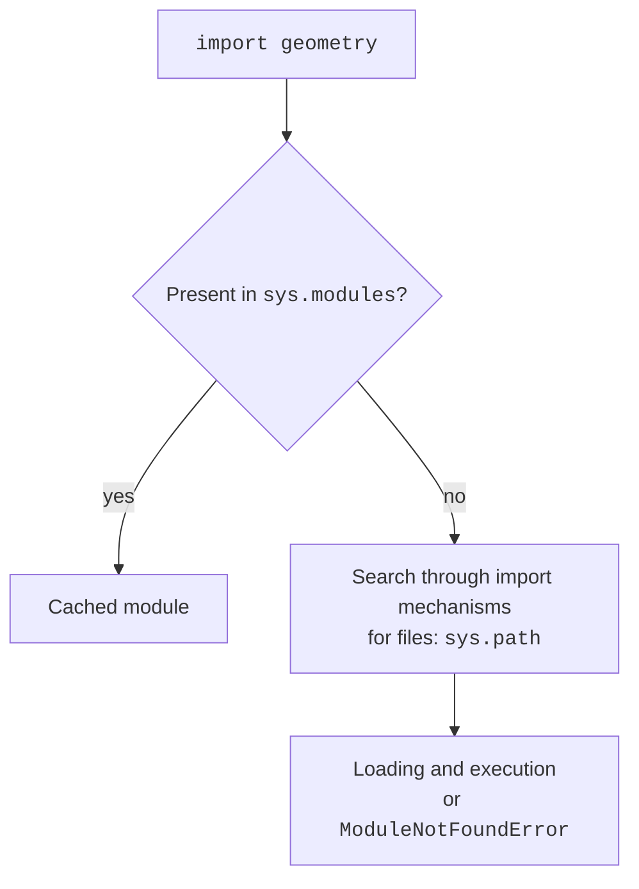
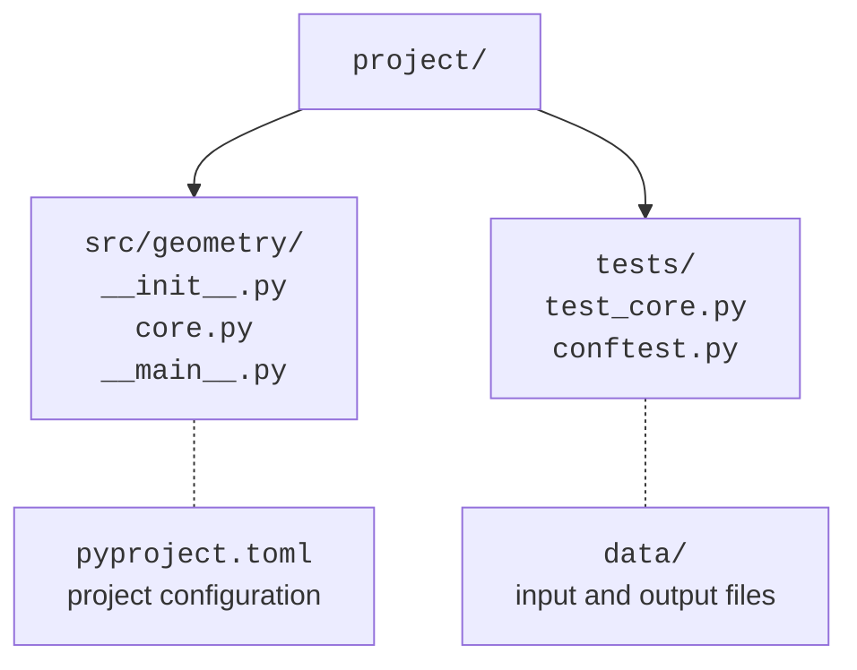

# Modules, packages, and the entry point

## Modules and imports

A **module** (*module*) is a unit of code and namespace organization. An ordinary `geometry.py` file can be imported as `geometry`. `import geometry` binds the module name, while `from geometry import area` binds the specific name `area`. Do not write the `.py` suffix in an import. `as` creates a local alias without renaming the file. Documentation: <https://docs.python.org/3.14/tutorial/modules.html>.

The first import executes the module's top-level code. Subsequent imports usually return the same object from `sys.modules`. Thus, `input` prompts, file writes, and demonstration `print` calls at a library's top level are undesirable side effects. Move execution into `main()` and call it under the condition `__name__ == "__main__"`. During an ordinary import, `__name__` contains the module name.



Figure 11.1. A simplified import diagram without details of custom loaders. {.caption}

`sys.path` contains search directories for file-based modules. It is affected by the launch method, environment, and installed packages. Built-in modules and other import mechanisms do not reduce to simply searching folders. Do not name your file `json.py`, `csv.py`, or `pytest.py`: it may shadow a library and cause a confusing “partially initialized module” error.

The `__pycache__` directory contains cached bytecode. It speeds up loading rather than turning the program into a standalone executable. Do not add it to the repository. `__all__` controls the names used by `from module import *`, but it is not a mechanism for protecting private attributes. Explicit imports are clearer in an ordinary project.

A **circular import** occurs when modules need each other before initialization finishes. Shared types or constants are better moved to a third, lower-level module. Do not fix every cycle by moving imports randomly inside functions: first check the direction of dependencies between program components.

## Packages and the entry point

An ordinary **package** (*package*) is a directory with `__init__.py`. It can contain modules and subpackages. Within a package, `from .core import area` means a relative import of a neighboring module. `from geometry.core import area` is absolute. Namespace packages may lack `__init__.py` and combine parts from several locations, but we choose an ordinary package for the learning application.

The `__main__.py` file is the entry point for `python -m geometry`. This launch preserves the package context; directly running `python geometry/__main__.py` may break relative imports. The `-m` command takes a module name, not a file path.



Figure 11.2. Separate directories for code, tests, data, and configuration. {.caption}

The `src/` layout separates the imported package from the repository root. A finished package is installed into the environment; packaging is discussed in detail in Topic 16. In the short example below, the package is directly in the root, so running from that root works without extra configuration. Marking *Sources Root* in PyCharm helps the IDE but does not itself install the package for someone else's ordinary terminal.

::: info Screenshot
Project; src as Sources Root, tests as Test Sources Root.
:::

Figure 11.3. A package, tests, and configuration in one project. {.caption}

### Example 1. The geometry package

Create a `geometry` folder and an empty `geometry/__init__.py`. The following file, `geometry/core.py`, contains only calculations. It rejects a nonfinite or nonpositive radius.

```py
# geometry/core.py
from math import isfinite, pi


def area(radius: float) -> float:
    if not isfinite(radius) or radius <= 0:
        raise ValueError("radius must be finite and positive")
    result = pi * radius * radius
    if not isfinite(result):
        raise ValueError("area is too large")
    return result
```

The second file is `geometry/__main__.py`. Together with the empty `__init__.py` and the previous module, this is a complete program.

```py
# geometry/__main__.py
import argparse
from .core import area


def main() -> None:
    parser = argparse.ArgumentParser(description="Area of a disk")
    parser.add_argument("radius", type=float)
    parser.add_argument("--digits", type=int, choices=range(5),
                        default=2)
    args = parser.parse_args()
    try:
        result = area(args.radius)
    except ValueError as error:
        parser.error(str(error))
    print(f"Area: {result:.{args.digits}f}")


if __name__ == "__main__":
    main()
```

Run from the directory containing the package folder:

```text
python -m geometry 2 --digits 3
```

```
Area: 12.566
```

The `argparse` module automatically generates `--help`, checks for the positional argument, and converts it to `float`. `choices` restricts precision to 0..4. An argument error terminates the command with code 2 and a message on the error stream. Domain validation remains in `area`, so it works the same way when called directly from another program or a test. API reference: <https://docs.python.org/3.14/library/argparse.html>.
