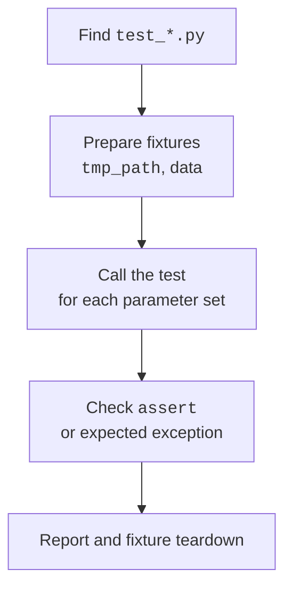

# Unit testing with pytest

## Unit tests and pytest

A **unit test** checks a small behavior with known input. A test consists of setup, an action, and a result check. It should be independent of execution order and the user's real data. Lower-level tests are supplemented by file integration checks and a small number of complete CLI scenarios. This is the practical meaning of the testing pyramid, not a requirement to count a strict ratio of test types.

Install pytest into the project environment with `python -m pip install pytest`. In a uv-managed project, you can use `uv add --dev pytest`. Pin the dependency version; the examples were checked with pytest 9.1.1. Running `python -m pytest -v` explicitly uses pytest from the selected interpreter. Documentation: <https://docs.pytest.org/en/stable/>.

Typical file names are `test_*.py`, and function names are `test_...`. The body uses ordinary `assert`; pytest shows the values of parts of a failed expression. `pytest.raises` checks an expected exception, and `pytest.approx` checks a numeric result with a specified tolerance. Do not round both numbers to one decimal place just to make a test pass: the tolerance should follow from the problem.



Figure 11.5. A test receives isolated data, performs an action, and checks the contract. {.caption}

### Example 4. Expense-tracking tests

Create `test_expenses.py` beside `expenses.py`. The first test has three datasets and therefore runs three times. The second checks a complete save-and-load cycle. The `tmp_path` fixture gives each test invocation its own temporary directory as a `Path`.

```py
# test_expenses.py
from pathlib import Path
import pytest
from expenses import Expense, load, save


@pytest.mark.parametrize("amount", [0, -1, True])
def test_invalid_amount(amount: object) -> None:
    with pytest.raises(ValueError, match="positive integer"):
        Expense("Food", amount)


def test_round_trip(tmp_path: Path) -> None:
    expected = [Expense("Transport", 3000)]
    path = tmp_path / "expenses.json"
    save(path, expected)
    assert load(path) == expected
    assert "Transport" in path.read_text(encoding="utf-8")


def test_bad_shape(tmp_path: Path) -> None:
    path = tmp_path / "expenses.json"
    path.write_text('{"category": "Food"}', encoding="utf-8")
    with pytest.raises(ValueError, match="array"):
        load(path)
```

Running `python -m pytest -q test_expenses.py` finishes with five successful checks. The time in the summary depends on the computer; the meaningful part of the report is `5 passed`.

The invalid-type test intentionally passes a value that contradicts the `int` annotation: it checks protection at the external-data boundary. A static analyzer may warn about this call; that is no reason to remove the check. The test should demonstrate both the normal contract and the intended behavior when it is violated.

## Fixtures, dependencies, and test diagnostics

A **fixture** (*fixture*) prepares state for a test. The `@pytest.fixture` decorator marks a function, and a test requests its result through a parameter with the same name. Shared fixtures belong in `conftest.py`; you do not need to import this file into each test. The default scope is one test. An overly broad scope can accidentally make tests depend on changes to a shared list.

`capsys` captures standard output and the error stream. `monkeypatch` temporarily changes an attribute, environment variable, or working directory and restores it after the test. Replace a system boundary, such as `input`, rather than the internal formula whose correctness you intend to establish. Otherwise, the test confirms its own replacement instead of the program's behavior.

```py
# test_console.py
import pytest


def greet() -> None:
    name = input("Name: ").strip()
    print(f"Hello, {name}!")


def test_greet(monkeypatch: pytest.MonkeyPatch,
               capsys: pytest.CaptureFixture[str]) -> None:
    monkeypatch.setattr("builtins.input", lambda _: "Olena")
    greet()
    assert capsys.readouterr().out == "Hello, Olena!\n"


def test_approximation() -> None:
    assert 0.1 + 0.2 == pytest.approx(0.3, abs=1e-12)
```

The `-k round_trip` option selects tests by a name expression, `-x` stops execution after the first failure, and `-v` shows individual identifiers. *FAILED* means a check failed; *ERROR* may occur during test collection or fixture setup. Read the first cause before trying to fix every line of the traceback at once.

::: info Screenshot
pytest -v; deliberately change the expected result in a copy of a test.
:::

Figure 11.6. Parameterized cases and the cause of a failed check. {.caption}

## Project configuration and running in PyCharm

In `pyproject.toml`, you can restrict the test directory and enable an explicit import mode. For the learning `src/` layout without installing the package, set the path for pytest only:

```toml
[tool.pytest.ini_options]
testpaths = ["tests"]
pythonpath = ["src"]
addopts = "--import-mode=importlib"
```

This configuration does not affect an ordinary `python -m package` launch. For a complete project, install the package into the environment as described in Topic 16; do not add `sys.path.append` to every module. In the short examples shown here, all files are in the root, so no configuration is needed.

In PyCharm, select pytest as the test runner in Python Integrated Tools settings. Running from the icon next to a function opens the results tree; you can rerun only failed cases. *Go to Test* uses Ctrl+Shift+T in the default Windows keymap. The IDE and terminal must use the same environment. Official instructions: <https://www.jetbrains.com/help/pycharm/pytest.html>.

::: info Screenshot
Default test runner: pytest; check the interpreter.
:::

Figure 11.7. Selecting pytest in Python Integrated Tools settings. {.caption}

::: info Screenshot
Run: test\_expenses.py, parameterized identifiers.
:::

Figure 11.8. Individual results and assertion details in PyCharm. {.caption}

Coverage shows which parts of the code ran during tests. The additional `pytest-cov` plugin can measure it, but the percentage alone does not prove the checks are correct: a test may execute a function without checking its result. First provide meaningful cases, then use coverage to find missed branches. This plugin is not a dependency of the examples shown.

## Common mistakes and finishing the work

- The name `json.py` shadows the standard library. Rename your module and restart the interpreter.
- Running a file inside a package directly loses the relative-import context. Run the module through `-m` from the correct directory.
- Mode `w` truncates a file before writing. Do not open the user's real database in a test; use `tmp_path`.
- Valid JSON does not yet mean a valid domain record. Check its shape, keys, types, and bounds.
- `split` does not implement CSV rules. Use the `csv` module and check headers and field counts.
- A test depends on a previous test or the current date. Pass the dependency explicitly and create a separate initial state.
