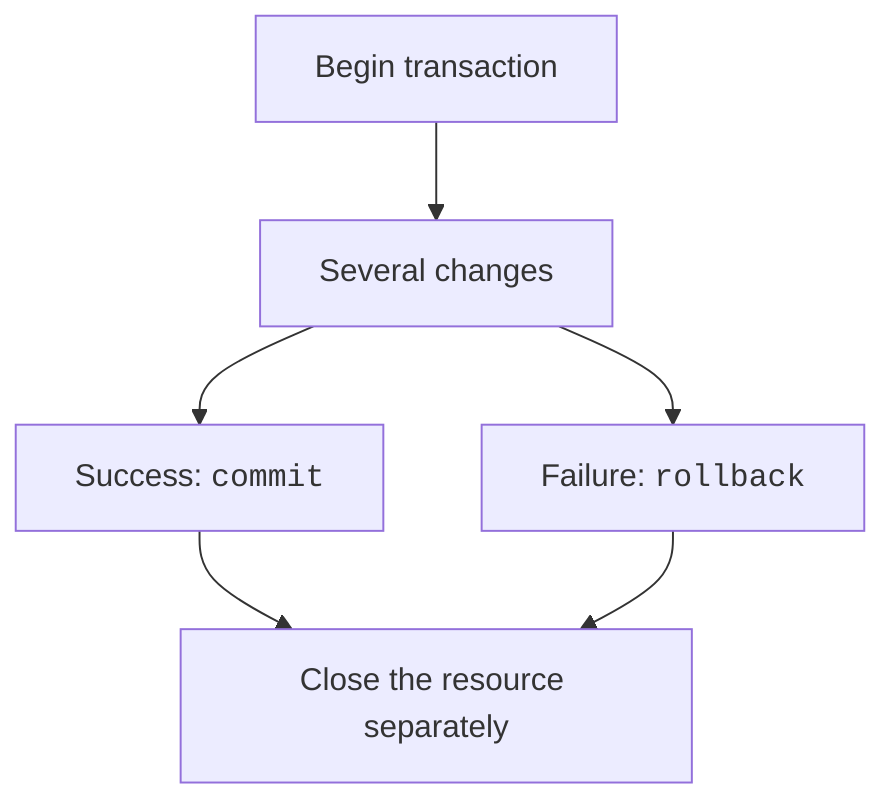

# Reports and transactions

## JOIN, aggregates, and reports

`INNER JOIN` returns only matching pairs. `LEFT JOIN` preserves every row of the left table; when there is no match, the right-hand fields contain NULL. A condition on the right table in `WHERE` may remove these rows; if you need to preserve left-hand records, choose the filter's location in `ON` carefully or use an explicit NULL check.

`COUNT`, `SUM`, `AVG`, `MIN`, and `MAX` aggregate values. `GROUP BY` defines groups, `HAVING` filters the resulting groups, and `WHERE` filters the original rows. `COUNT(*)` counts rows, while `COUNT(column)` counts non-NULL values in that column. For a student without grades after a `LEFT JOIN`, this distinction is crucial.

### Example 2. Academic performance tracking

Create students and grades, including a student without grades. The foreign key is enabled before the transaction. `LEFT JOIN` keeps all students, and `COUNT(g.score)` gives zero for missing grades. Use the identifier for sorting.

```py
import sqlite3
from contextlib import closing


with closing(sqlite3.connect(":memory:", autocommit=True)) as db:
    db.execute("PRAGMA foreign_keys=ON")
    db.autocommit = False
    with db:
        db.execute("""CREATE TABLE students (
            id INTEGER PRIMARY KEY, name TEXT NOT NULL)""")
        db.execute("""CREATE TABLE grades (
            student_id INTEGER NOT NULL REFERENCES students(id),
            score INTEGER NOT NULL CHECK(score BETWEEN 0 AND 100))""")
        db.executemany("INSERT INTO students VALUES(?,?)",
                       [(1, "Olena"), (2, "Ivan"), (3, "Mariia")])
        db.executemany("INSERT INTO grades VALUES(?,?)",
                       [(1, 80), (1, 100), (2, 70)])
    query = """SELECT s.name, COUNT(g.score), AVG(g.score)
        FROM students AS s
        LEFT JOIN grades AS g ON g.student_id=s.id
        GROUP BY s.id, s.name
        ORDER BY s.id"""
    for name, count, average in db.execute(query):
        text = "none" if average is None else f"{average:.1f}"
        print(name, count, text)
```

```
Olena 2 90.0
Ivan 1 70.0
Mariia 0 none
```

For groups with an average of at least 80, add `HAVING AVG(g.score)>=80` before `ORDER BY`. A student without grades has no average, rather than an average of zero. `CREATE VIEW` lets you name a recurring query; an ordinary view stores the query, not a separate copy of all its results. A subquery can be used, for example, to compare a grade with the overall average.

SQLite has no separate universal calendar-date type. For simple tasks, store `YYYY-MM-DD` as TEXT and validate it through `date.fromisoformat` before writing. Do not rely on the old default `sqlite3` date adapters: they have been deprecated since Python 3.12. The format and time zone must be an explicit convention.

## Transactions and recovery after errors

A **transaction** combines several changes into one logical operation. Either all necessary changes are committed or none remain. For example, importing ten rows with an invalid eleventh row must not leave an unknown portion of the import behind. `commit` confirms changes, and `rollback` restores the previous state.



Figure 12.6. Success and failure end transactions differently. {.caption}

`IntegrityError` reports a constraint violation, such as uniqueness; `OperationalError` may indicate invalid SQL, a missing table, or locking. Do not catch an error inside `with db` if you want the context to roll back changes automatically: an error caught without being reraised looks like success.

### Example 3. Atomic order import

In this example, the data has already been validated for structure and supplied as a list of pairs, as after reading CSV. The second new row repeats an existing order number. Both rows of the new batch must be rolled back, even though the first is valid on its own.

```py
import sqlite3
from contextlib import closing


with closing(sqlite3.connect(":memory:", autocommit=False)) as db:
    with db:
        db.execute("""CREATE TABLE orders (
            id INTEGER PRIMARY KEY,
            cents INTEGER NOT NULL CHECK(cents > 0))""")
        db.execute("INSERT INTO orders VALUES(1,1000)")
    try:
        with db:
            db.executemany("INSERT INTO orders VALUES(?,?)",
                           [(2, 2000), (1, 3000)])
    except sqlite3.IntegrityError:
        print("Import rolled back")
    rows = db.execute("SELECT id,cents FROM orders ORDER BY id")
    print(rows.fetchall())
```

```
Import rolled back
[(1, 1000)]
```

There are no foreign keys here, so the connection can use `autocommit=False` immediately. For a large import, `executemany` does not automatically imply atomicity on its own: the transaction boundary defines it. After a successful import, check totals; after failure, check that the original rows remain unchanged.
