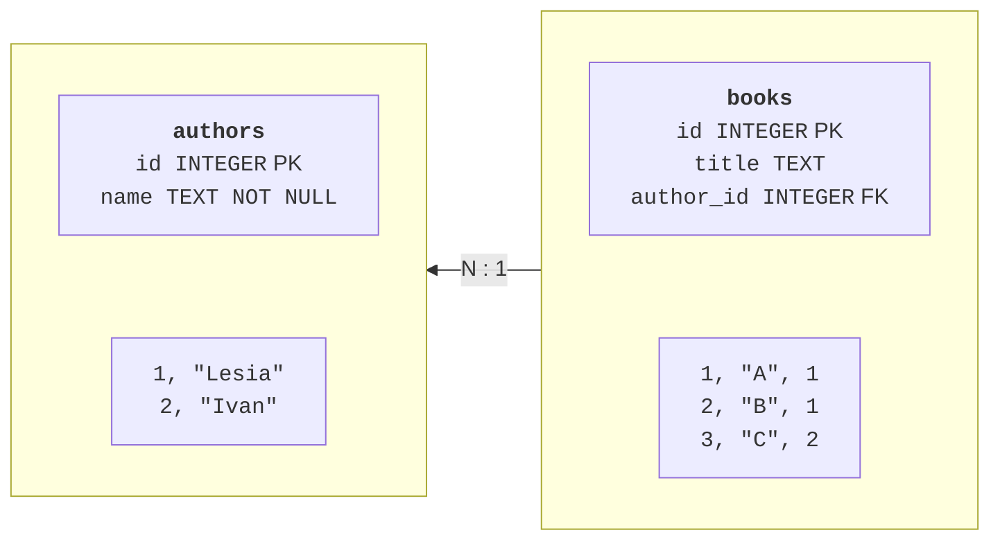
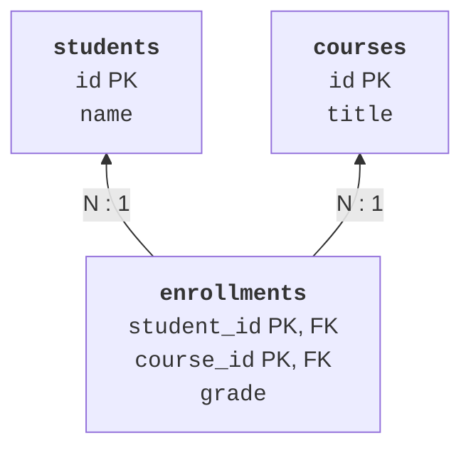

# The relational model and SQL

## The relational model and relationships

A **table** describes records of one kind; a **row** is a specific record, and a **column** is one of its properties. A **primary key** (*primary key*, PK) identifies a row. A person's name is unsuitable as a universal key: names can repeat and change. A **foreign key** (*foreign key*, FK) references a key in another table and lets you check relationship integrity.



Figure 12.1. One author can have many books; a book references its author. {.caption}

A 1:N relationship is implemented with a foreign key on the many side. M:N requires a junction table: a student can study many courses, and a course has many students. The pair of keys in the enrollment table can be a composite primary key; the grade belongs to this relationship, not to the student or course separately. A 1:1 relationship requires an additional uniqueness constraint on the foreign key.



Figure 12.2. An M:N relationship with a grade as a property of course enrollment. {.caption}

Normalization reduces inconsistent duplication. In first normal form, a field does not contain a list of independent values that must be parsed as a separate table. In second normal form, a non-key field depends on the entire composite key rather than part of it. Third normal form removes unnecessary transitive dependencies of non-key attributes. Thus, it is better to store an instructor's name in an instructors table and their identifier in a course, rather than repeated text.

## SQLite and table schemas

SQLite runs as a library inside the application process and usually stores the database in a file. No separate server is needed for the lab. This is convenient for local applications and tests; many concurrent writers or centralized access by many clients may require a server DBMS such as PostgreSQL. All required examples in this work use SQLite. SQL reference: <https://sqlite.org/lang.html>.

An ordinary SQLite table has flexible typing; values belong to the storage classes NULL, INTEGER, REAL, TEXT, and BLOB. A `STRICT` table strengthens checks of permitted column types and is available from SQLite 3.37. Check the bundled library version through `sqlite3.sqlite_version`, not just the Python version number. Reference: <https://sqlite.org/stricttables.html>.

The `CREATE TABLE` statement defines the schema. `NOT NULL` prohibits a missing value, `UNIQUE` prohibits duplicates, `CHECK` prohibits violations of a condition, and `DEFAULT` supplies a value when a column is omitted. `INTEGER PRIMARY KEY` in an ordinary SQLite table is linked to `rowid`; the additional word `AUTOINCREMENT` is not needed merely to assign a number automatically.

```sql
CREATE TABLE contacts (
  id INTEGER PRIMARY KEY,
  name TEXT NOT NULL CHECK (length(trim(name)) > 0),
  phone TEXT NOT NULL UNIQUE
) STRICT;
```

The schema does not fully validate input: for example, a unique phone number may still have an invalid format. Validation at the program boundary provides a helpful message, while a database constraint protects data from another client or a coding error. Both levels are needed. `ALTER TABLE` changes the schema within the capabilities of the particular DBMS, and `DROP TABLE` deletes a table along with its data.

`CREATE INDEX` speeds up matching searches but requires space and work when rows change. Do not index every column without analyzing queries. In SQLite, explicitly enable foreign keys with `PRAGMA foreign_keys=ON` for each connection **outside a transaction**. Check that `PRAGMA foreign_keys` returns 1. Documentation: <https://sqlite.org/foreignkeys.html>.

::: info Screenshot
sqlite3 school.db; .tables; .schema; .mode table.
:::

Figure 12.3. Viewing the schema and rows in the SQLite console. {.caption}

## Data changes and SQL queries

`INSERT` adds a row, `UPDATE` changes it, and `DELETE` removes it. Before executing `UPDATE` or `DELETE`, check the `WHERE` condition: without it, the action affects all rows. `RETURNING` returns data from changed rows in modern SQLite; `lastrowid` is also available for a simple single-row insertion through Python. `ON CONFLICT ... DO UPDATE` specifies an update for a particular uniqueness conflict; it is not a universal way to ignore errors.

`SELECT` specifies the required columns. `WHERE` filters rows, `ORDER BY` defines order, and `LIMIT` and `OFFSET` select part of the result. Without `ORDER BY`, order is not guaranteed. For a stable page, add a unique key as the final sort criterion. `DISTINCT` removes identical results from the selected columns.

Conditions may contain `BETWEEN`, `IN`, `LIKE`, and comparisons. `LIKE` uses `%` for any sequence and `_` for one character; it is a pattern, not a regular expression. For a missing value, use `IS NULL`, not `= NULL`: SQL has separate logic for unknown values. The driver passes Python `None` as SQL NULL.

```sql
SELECT id, name, phone
FROM contacts
WHERE name LIKE ?
ORDER BY name, id
LIMIT ? OFFSET ?;
```

The `?` signs in this fragment are Python parameter placeholders. If you run the query manually in a GUI console, its parameter mechanism may differ. The query logic remains the same. Parameters cannot replace a table or column name: for dynamic sorting, choose a name from a fixed allowed set and pass the filter value separately.
