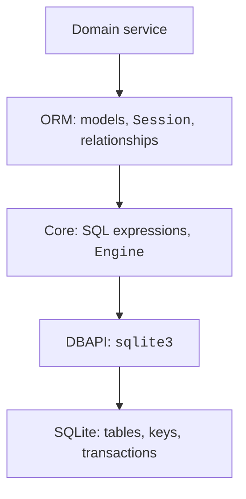
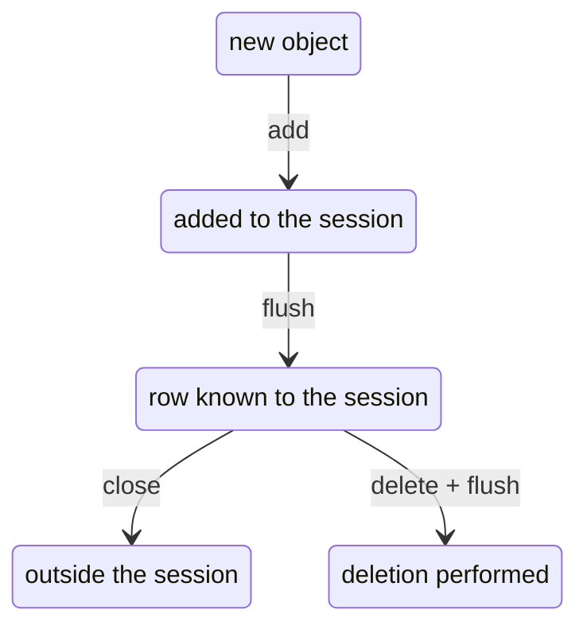

# The SQLAlchemy ORM

## Moving from SQL to SQLAlchemy

SQLAlchemy has two related layers. **Core** builds SQL expressions and works with tables and connections. **ORM** (*object-relational mapping*) maps classes to tables, attributes to columns, and instances to rows. This reduces routine data conversion but adds a session lifecycle, loading rules, and its own exceptions. You must be able to read the emitted SQL.



Figure 12.7. The ORM uses Core and the driver, while storage rules remain in the DBMS. {.caption}

The examples were checked with stable SQLAlchemy 2.0.54. Install it into the environment with `python -m pip install SQLAlchemy`. We use the 2.0 style: `DeclarativeBase`, `Mapped`, `mapped_column`, `select`, and `Session.scalars`. We do not mix it with older learning code using `session.query`. Getting started: <https://docs.sqlalchemy.org/en/20/orm/quickstart.html>.

`Engine` holds DBMS access configuration and manages connections. The URL `sqlite:///shop.db` denotes a relative file, while `sqlite://` in our single-threaded examples denotes an in-memory database. `echo=True` shows SQL and helps explain queries; do not enable it casually for a log containing private parameters. For raw SQL in Core, use `text()` and parameters, not concatenation.

## Declarative models and sessions

A subclass of `DeclarativeBase` contains shared metadata. In a model, `__tablename__` specifies the table, `Mapped[int]` describes a mapped attribute, and `mapped_column(primary_key=True)` defines a key. Under the default rules, `Mapped[str | None]` allows NULL, while `Mapped[str]` does not. A `String(100)` constraint does not mean SQLite itself checks a length of 100: add `CHECK` if needed.

`Base.metadata.create_all(engine)` creates missing tables. This command is not a migration system: changing a class will not automatically transform an existing column. It is sufficient for a new learning database; existing production data requires a controlled schema-change plan.

`Session` tracks objects and accumulates changes. `add` adds an object to the unit of work; `flush` sends the necessary SQL but does not commit the transaction. `commit` confirms changes, and `rollback` cancels them. The `with Session(engine) as session` context closes the session but does not itself promise a commit. Use an additional `with session.begin():` for a clear boundary.



Figure 12.8. Main states of an ORM object; rollback can change this path. {.caption}

A new object is *transient*; after `add`, it is *pending*, and after insertion, *persistent*. Closing the session detaches objects (*detached*). The identity map means that within one session, one key corresponds to one tracked instance; it is not a cache of all queries across processes.

With the default `expire_on_commit=True`, attributes may need to be reloaded after commit. Accessing an unloaded relationship after the session closes may cause `DetachedInstanceError`. Read the required data within the session, or explicitly load it and convert it into separate results. After a failed flush, rollback is required before using that session again.

## ORM relationships and queries

`ForeignKey` defines a table-level constraint, while `relationship` describes navigation between objects. These are different things: an `author` attribute does not replace the `author_id` column. The `back_populates` pair keeps both sides in sync. `cascade="all, delete-orphan"` describes ORM management of child objects and is appropriate only for true ownership. It is not identical to `ON DELETE CASCADE` in the database.

Use a junction table for M:N. If a relationship has a quantity, grade, or date, mapping it as a separate association class is convenient. For example, `Enrollment` contains two foreign keys and a grade. Do not store identifiers as a list in a text field merely because the ORM lets you work with lists in Python.

The query `select(Book).where(Book.title == title)` is an SQL expression. `session.scalars(stmt).all()` returns a list of objects, `session.execute(stmt)` returns result rows, and `session.get(Model,id)` looks up by primary key. Grouping uses `func.count`, `func.sum`, and `group_by`; `order_by` defines the order. For SQL logic, use `and_`, `or_`, or expression operators with the correct parentheses, not Python's `and` and `or`.

### Example 4. Authors and books through the ORM

The complete program below creates two models and a pair of relationships. A connection event enables foreign keys for each new DBAPI connection by temporarily leaving transaction mode. `ConnectionPoolEntry` describes the event's second argument.

```py
# authors_orm.py
import sqlite3
from sqlalchemy import ForeignKey, create_engine, event, select
from sqlalchemy.orm import DeclarativeBase, Mapped, Session
from sqlalchemy.orm import mapped_column, relationship, selectinload
from sqlalchemy.pool import ConnectionPoolEntry


class Base(DeclarativeBase):
    pass


class Author(Base):
    __tablename__ = "authors"
    id: Mapped[int] = mapped_column(primary_key=True)
    name: Mapped[str]
    books: Mapped[list["Book"]] = relationship(
        back_populates="author", cascade="all, delete-orphan")


class Book(Base):
    __tablename__ = "books"
    id: Mapped[int] = mapped_column(primary_key=True)
    title: Mapped[str]
    author_id: Mapped[int] = mapped_column(ForeignKey("authors.id"))
    author: Mapped[Author] = relationship(back_populates="books")


engine = create_engine("sqlite://",
                       connect_args={"autocommit": False})


@event.listens_for(engine, "connect")
def foreign_keys(db: sqlite3.Connection,
                 record: ConnectionPoolEntry) -> None:
    previous = db.autocommit
    db.autocommit = True
    cursor = db.execute("PRAGMA foreign_keys=ON")
    cursor.close()
    db.autocommit = previous


Base.metadata.create_all(engine)
with Session(engine) as session:
    with session.begin():
        author = Author(name="Lesia")
        author.books = [Book(title="Forest"), Book(title="City")]
        session.add(author)
    query = select(Author).options(selectinload(Author.books))
    for author in session.scalars(query.order_by(Author.id)):
        titles = sorted(book.title for book in author.books)
        print(author.name, ", ".join(titles))
engine.dispose()
```

```
Lesia City, Forest
```

`selectinload` loads collections with an additional grouped query. Without an explicit strategy, accessing each author's books may create a separate query: one query for authors plus N queries for books, the N+1 problem. With many rows, even grouped loading may be split into several queries. `joinedload` loads through a JOIN; for collections, account for duplicate rows and the requirement to call `unique()` on the result. Reference: <https://docs.sqlalchemy.org/en/20/orm/queryguide/relationships.html>.

::: info Screenshot
In a copy of authors\_orm.py, add echo=True; show INSERT and SELECT.
:::

Figure 12.9. SQL generated by the ORM to create and load a relationship. {.caption}
