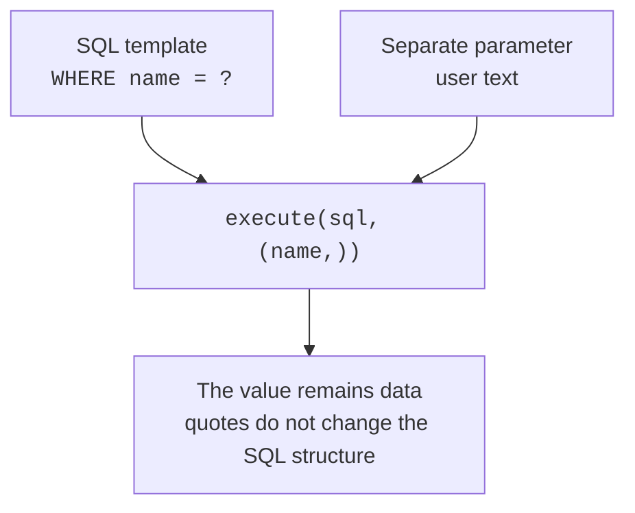

# The sqlite3 module and query parameters

## The sqlite3 API and resource management

`connect` creates a `Connection`, and `execute` returns a `Cursor`. You can read one row from the cursor with `fetchone`, all rows with `fetchall`, or iterate over results in a loop. `fetchone` returns `None` when there is no row. `executemany` repeats one parameterized statement for many parameter sets. `executescript` is intended for a fixed SQL script, not user input or a replacement for parameterization.

In Python 3.14, we explicitly set the transaction mode. `autocommit=False` keeps a transaction open and starts a new one after `commit` or `rollback`. To configure foreign keys, first connect with `autocommit=True`, enable the PRAGMA, and then switch to `False`. We do not rely on the current default, `LEGACY_TRANSACTION_CONTROL`.

The `with connection:` context commits or rolls back the transaction but **does not close the connection**. An outer `contextlib.closing` closes it on exit. Closing is not a way to commit changes: failing to call `commit` may lose work. Reference: <https://docs.python.org/3.14/library/sqlite3.html>.

### Example 1. A phone directory

A small in-memory database demonstrates adding, reading, updating, and deleting records. `sqlite3.Row` lets you access columns by name. Phones are stored as strings to preserve leading zeros. The data is for learning purposes; the in-memory database disappears when closed.

```py
import sqlite3
from contextlib import closing


with closing(sqlite3.connect(":memory:", autocommit=True)) as db:
    db.execute("PRAGMA foreign_keys=ON")
    db.autocommit = False
    db.row_factory = sqlite3.Row
    with db:
        db.execute("""CREATE TABLE contacts (
            id INTEGER PRIMARY KEY,
            name TEXT NOT NULL CHECK(length(trim(name)) > 0),
            phone TEXT NOT NULL UNIQUE) STRICT""")
        db.executemany("INSERT INTO contacts(name,phone) VALUES(?,?)",
                       [("Olena", "0123"), ("Ivan", "0456")])
    with db:
        db.execute("UPDATE contacts SET phone=? WHERE name=?",
                   ("0789", "Olena"))
        db.execute("DELETE FROM contacts WHERE name=?", ("Ivan",))
    for row in db.execute("SELECT name,phone FROM contacts"):
        print(row["name"], row["phone"])
```

```
Olena 0789
```

The single-element parameter set is written as `("Ivan",)` with a comma. Without the comma, it is a string, which the driver should not treat as the required tuple. To preserve data between runs, replace `:memory:` with a separate file such as `contacts.db`, and separate schema creation from repeated insertion of demonstration data.


Figure 12.4. Parameterized changes and the phone-directory result. {.caption}

## Parameters and SQL injection

SQL injection occurs when entered text becomes part of the command syntax. A fragment such as `' OR '1'='1` in an incorrectly constructed string can change the condition. Do not escape it manually or insert it through an f-string. Pass the SQL template and values as separate arguments. The driver binds the parameter as data regardless of any quotes it contains.



Figure 12.5. The query structure is separate from the search value. {.caption}

Instead of positional `?` placeholders, you can use named parameters such as `:name` and a dictionary. Choose one style within a query. Parameterization does not check domain bounds: a negative quantity is a safe SQL parameter but an invalid order. To test the protection, add a test with a quote in an ordinary name and with an SQL-like string: both must remain text.
