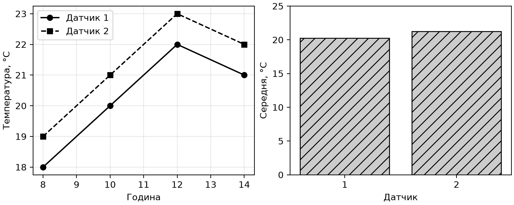

# Program examples and common mistakes

## Program examples

### Example 1. A measurement matrix

Three sensors took two measurements. Add individual offsets, reject nonnumeric or nonfinite data, and show each sensor's mean. The function does not change the supplied arrays.

```py
import numpy as np
from numpy.typing import NDArray


def calibrate(data: NDArray[np.float64],
              offsets: NDArray[np.float64]) -> NDArray[np.float64]:
    if data.ndim != 2 or data.shape[0] == 0:
        raise ValueError("A nonempty matrix is required")
    if data.shape[1] == 0 or offsets.shape != (data.shape[1],):
        raise ValueError("An offset is required for each sensor")
    if not np.isfinite(data).all() or not np.isfinite(offsets).all():
        raise ValueError("Values must be finite")
    return data + offsets


def main() -> None:
    data = np.array([[10., 20., 30.], [12., 22., 32.]])
    fixed = calibrate(data, np.array([1., -1., 2.]))
    for index, value in enumerate(fixed.mean(axis=0), start=1):
        print(f"Sensor {index}: {value:.1f}")
    print(f"Overall maximum: {fixed.max():.1f}")


if __name__ == "__main__":
    main()
```

Output:

```
Sensor 1: 12.0
Sensor 2: 20.0
Sensor 3: 33.0
Overall maximum: 34.0
```

The `shape` check happens before addition, so accidental broadcasting compatibility does not hide an incorrect number of offsets. The result array is independent because addition creates new data. In a test, compare the original before and after the call, and pass one offset instead of three, `NaN`, and an empty matrix.

### Example 2. Cleaning sample sales

The CSV contains a category, quantity, and price in kopiykas. Integer quantities of 1–1000, prices of 0–100000, and a nonempty category are allowed. Show invalid records separately; calculate the total only after validation. The file contains no multiline text fields.

```py
from io import StringIO
import pandas as pd


def main() -> None:
    source = ("category,qty,price\n"
              "paper,2,2500\npen,3,1000\npaper,bad,1200\n")
    frame = pd.read_csv(StringIO(source), dtype="string")
    qty = pd.to_numeric(frame["qty"], errors="coerce")
    price = pd.to_numeric(frame["price"], errors="coerce")
    valid = (qty.between(1, 1000) & price.between(0, 100000)
             & qty.mod(1).eq(0) & price.mod(1).eq(0)
             & frame["category"].str.strip().ne(""))
    valid = valid.fillna(False)
    clean = frame.loc[valid].copy()
    clean["total"] = (qty[valid] * price[valid]).astype("int64")
    clean["category"] = clean["category"].str.strip()
    report = clean.groupby("category")["total"].sum()
    for category, cents in report.items():
        print(f"{category}: {cents // 100},{cents % 100:02d}")
    print(f"Rejected: {int((~valid).sum())}")


if __name__ == "__main__":
    main()
```

Output: `paper: 50,00`, `pen: 30,00`, `Rejected: 1`. The bounds also reject infinities. Missing mask results are explicitly converted to `False`; they must not disappear from the rejection report. This short example prints the error count; the lab variants also require returning numbers and reasons. The monetary total preserves kopiykas.

### Example 3. Energy by day

Each record contains energy for a separate interval, not a cumulative reading. Validate the time, sort the records, and add the intervals for each day. Mark a missing day as no data; do not replace it with zero consumption.

```py
import pandas as pd


def main() -> None:
    frame = pd.DataFrame({
        "time": ["2026-09-01 08:00", "2026-09-01 09:00",
                 "2026-09-03 08:00"],
        "kwh": [1.5, 2.0, 1.0]})
    frame["time"] = pd.to_datetime(
        frame["time"], format="%Y-%m-%d %H:%M", errors="raise")
    if frame["time"].duplicated().any():
        raise ValueError("Duplicate interval")
    series = frame.set_index("time").sort_index()["kwh"]
    daily = series.resample("D").sum(min_count=1)
    for day, value in daily.items():
        shown = "no data" if pd.isna(value) else f"{value:.1f}"
        print(f"{day:%d.%m}: {shown}")


if __name__ == "__main__":
    main()
```

Output: `01.09: 3.5`, `02.09: no data`, `03.09: 1.0`. `min_count=1` requires at least one value; otherwise, the result is missing. Test duplicate times and an empty dataset. For a real log, add nonnegativity and finiteness checks for energy before building the time series.

### Example 4. A report with two plots

Plot changes in two sensors over time and bars showing their means. All values are given in the program. The lines differ in markers and dash style, so they remain clear in monochrome print.

```py
import numpy as np
import matplotlib
matplotlib.use("Agg")
import matplotlib.pyplot as plt


def main() -> None:
    hours = np.array([8, 10, 12, 14])
    data = np.array([[18., 19.], [20., 21.],
                     [22., 23.], [21., 22.]])
    fig, axes = plt.subplots(1, 2, figsize=(8, 3.2),
                             layout="constrained")
    for index, style in enumerate(["o-", "s--"]):
        axes[0].plot(hours, data[:, index], style,
                     color="black", label=f"Sensor {index + 1}")
    axes[0].set(xlabel="Hour", ylabel="Temperature, °C")
    axes[0].legend()
    axes[0].grid(alpha=0.3)
    axes[1].bar(["1", "2"], data.mean(axis=0),
                color="0.8", edgecolor="black", hatch="//")
    axes[1].set(xlabel="Sensor", ylabel="Mean, °C", ylim=(0, 25))
    fig.savefig("sensor-report.png", dpi=200)
    plt.close(fig)
    print("Saved sensor-report.png")


if __name__ == "__main__":
    main()
```

The result is a `sensor-report.png` file and a message confirming it was saved. The first sensor's mean is 20.25 °C, and the second's is 21.25 °C. Fig. 13.6 shows both the changes and the mean comparison; a bar chart alone would hide changes during the day.



Figure 13.6. Temperature changes and sensor means {.caption}

::: info Screenshot
Open sensor-report.png; show readable axes and legend.
:::

Figure 13.7. Viewing a saved plot in PyCharm {.caption}

## Testing the pipeline and common mistakes

Test calculation functions separately from file input and image generation. NumPy provides `np.testing.assert_allclose`, and pandas provides `pd.testing.assert_frame_equal`. Specify a tolerance where it has physical meaning. Different table-output formatting does not necessarily mean different data.

A useful set of checks includes empty input, one record, a missing value, a nonnumeric value, infinity, a duplicate key, an incorrect shape, an unexpected category, and a missing lookup table. Every process that rejects records must satisfy this balance: the number of records read equals the number accepted plus the number rejected. For grouping, check the sum before and after; for merge, check row counts and key cardinality.

Checking a PNG has two parts. Automatically, you can verify that the file was created and has dimensions; visually, check that labels are not clipped, units are correct, and the legend matches the series. An image's existence does not prove that the data is correct. In the lab report, include a small manual calculation for one total and explain the missing-value policy.

Table 13.1. Common mistakes in numerical and tabular analysis {.caption}

| **Mistake** | **Cause and correction** |
| --- | --- |
| Incorrect means | The `axis` is wrong; check the result shape. |
| The original NumPy array changed | The slice is a view; use `copy` for independence. |
| Pandas assignment did not work | Use one `.loc` instead of a chain. |
| The row count grew after merge | Check key cardinality through `validate`. |
| Missing values became zeros | The filling policy changed the meaning; explain it. |
| The plot prevents the program from finishing | Use `Agg` and `savefig` for batch execution. |
