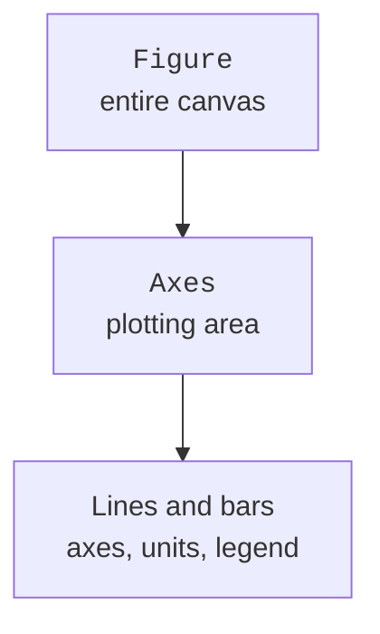

# Grouping, time series, and plots

## Grouping, merging, and time series

`groupby` divides records by key, after which aggregation gives one summary for each group. Use named `agg` results so output column names match their meaning. By default, missing keys may be excluded from groups: choose a `dropna` rule or reject such keys earlier.

```py
import pandas as pd

frame = pd.DataFrame({"group": ["A", "B", "A"],
                      "score": [80, 90, 70]})
report = frame.groupby("group", as_index=False).agg(
    count=("score", "count"), mean=("score", "mean"))
for row in report.itertuples(index=False):
    print(f"{row.group}: {row.count}, {row.mean:.1f}")
```

Output: `A: 2, 75.0`, `B: 1, 90.0`. `count` counts nonmissing values in a column, while `size` counts rows. This distinction matters when not all values were measured. For a pivot table, use `pivot_table`, specifying the index, columns, values, and aggregation function; its shape should be defined by the report contract.

### Checking merge cardinality

`merge` combines tables by keys. If a key repeats on both sides, the row count may grow as the product of the numbers of matches. For a lookup table with one record per key, specify `validate="many_to_one"`. The `indicator=True` argument helps identify records without a match. Full description: <https://pandas.pydata.org/docs/user_guide/merging.html>.

```py
import pandas as pd

orders = pd.DataFrame({"code": [1, 1, 2], "qty": [2, 3, 1]})
catalog = pd.DataFrame({"code": [1, 2], "name": ["A", "B"]})
joined = orders.merge(catalog, on="code", how="left",
                      validate="many_to_one", indicator=True)
assert joined["_merge"].eq("both").all()
print(joined["name"].tolist())
print(joined["qty"].sum())
```

Output: `['A', 'A', 'B']`, then `6`. Checking row counts and total product quantity reveals errors that are invisible in a single table fragment. Pandas can match missing keys to each other, unlike usual expectations for SQL NULL. Therefore, validate lookup-table keys before merge.

### Time and frequency

`pd.to_datetime` converts strings to time values. Specify `format` when the input file's format is known; an ambiguous value such as `01/02/2026` should not depend on the library's guess. For measurements with time zones, agree on one zone or UTC. In the learning examples below, ISO time is local and has no daylight-saving transitions; this is an explicit data simplification, not a general rule.

After setting a `DatetimeIndex`, the `resample` method groups by time intervals. The choice of `sum`, `mean`, or the last value depends on physical meaning: energy over intervals is added, while temperature is usually averaged. Do not add cumulative meter readings; consumption requires differences between adjacent readings and a check for meter resets.

## Matplotlib plots

In the object-oriented style, **Figure** is the canvas, and **Axes** is the plotting area (Fig. 13.5). `plt.subplots` returns these objects. The methods `ax.plot`, `ax.bar`, `ax.scatter`, and `ax.hist` add lines, bars, points, or a histogram. The name `Axes` here means the entire area, not one coordinate axis.



Figure 13.5. Canvas and plotting-area objects {.caption}

Choose the form according to the question. A line shows change in an ordered process; bars compare categories; a scatter plot shows pairs of observations; a histogram shows one variable's distribution across intervals. Connecting unordered categories with a line can falsely suggest a continuous process.

For each plot, specify axis names, units, series meanings, and a legend if needed. In a printed guide, distinguish series using more than color: use markers, dashes, and hatching. Bars usually start at zero; a truncated scale must be explicitly explained. Do not add 3D effects that distort comparisons of lengths or areas.

### Saving and running without a window

`fig.savefig` saves a file, `plt.show` starts an interactive display, and `plt.close(fig)` releases the canvas resources. For automated reports and tests, use the `Agg` backend, set before importing `pyplot`. The program then writes a PNG without waiting for a window to close. `layout="constrained"` helps position labels but does not remove the need to inspect long names visually.

```py
import matplotlib
matplotlib.use("Agg")
import matplotlib.pyplot as plt

fig, ax = plt.subplots(figsize=(5, 3), layout="constrained")
ax.bar(["A", "B"], [75, 90], color="0.75", edgecolor="black")
ax.set(xlabel="Group", ylabel="Average score", ylim=(0, 100))
fig.savefig("scores.png", dpi=160)
plt.close(fig)
print("Saved scores.png")
```

A plot should draw a conclusion from validated data. Zero in an empty group and an absent group have different meanings; labels should reflect the chosen rule. Correlation between two variables does not prove causation, and a small learning sample is not a representative population study.
