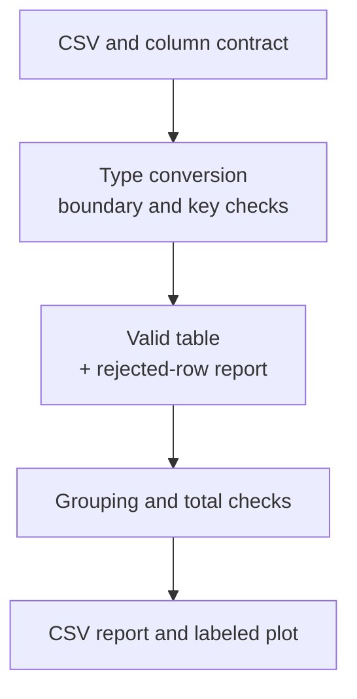

# Pandas tables and missing data

## Pandas tables: labels and positions

`Series` represents one labeled column, and `DataFrame` represents a table of columns. Different columns can have different types. An **index** (*index*) is a set of row labels, not necessarily a sequence of 0, 1, 2. This distinction explains the difference between `.loc` (labels) and `.iloc` (positions).

```py
import pandas as pd

frame = pd.DataFrame({"group": ["A", "B", "A"],
                      "score": [80, 90, 70]}, index=[10, 20, 30])
print(frame.loc[20, "score"])
print(frame.iloc[1, 1])
print(frame.loc[frame["score"] >= 80, "group"].tolist())
```

Output: `90`, `90`, `['A', 'B']`. `frame["score"]` returns a `Series`, whereas `frame[["score"]]` returns a one-column table. In the slice `.loc[10:20]`, the final label is included for an ordinary ordered index; in `.iloc[0:2]`, the right-hand position is excluded. To avoid hidden assumptions, use explicit masks for complex filters early in the course.

### Assignment and Copy-on-Write

In pandas 3, the **Copy-on-Write** model does not allow a chain of selections to be used to modify the original table. Instead of `frame["score"][mask] = 0`, write `frame.loc[mask, "score"] = 0`. Documentation: <https://pandas.pydata.org/docs/user_guide/copy_on_write.html>. Combine selection and assignment into one operation and verify the result. Do not disable warnings to hide an incorrect contract.

```py
import pandas as pd

frame = pd.DataFrame({"score": [80, 90, 70]})
mask = frame["score"] < 75
frame.loc[mask, "score"] = 75
print(frame["score"].tolist())
print(frame.sort_values("score")["score"].tolist())
```

Output: `[80, 90, 75]`, then `[75, 80, 90]`. By default, `sort_values` returns a result that must be saved; the call itself does not change the original variable. Operations between `Series` align by index labels, not just positions. If the labels differ, missing values may appear; check the expected keys first.

## Input, missing values, and the data contract

Before reading CSV, document the column names, delimiter, encoding, date formats, permitted units, and values. `read_csv` can infer types automatically, but for codes with leading zeros and learning validation, it is useful to read text fields first and convert them explicitly. API specification: <https://pandas.pydata.org/docs/reference/api/pandas.read_csv.html>.

A missing value does not mean zero. `NaN`, `pd.NA`, and `NaT` represent missing data in different types; check them with `isna`, not equality with `NaN`. `dropna` discards rows or columns, and `fillna` fills missing values according to a rule. Both actions require an explanation: replacing unknown consumption with zero changes the meaning of the total.

```py
from io import StringIO
import pandas as pd

source = "code;amount\n001;12\n002;bad\n003;\n"
frame = pd.read_csv(StringIO(source), sep=";", dtype="string")
frame["amount"] = pd.to_numeric(frame["amount"], errors="coerce")
bad = frame["amount"].isna()
print(frame.loc[bad, "code"].tolist())
print(frame.loc[~bad, "amount"].sum())
```

Output: `['002', '003']`, then `12`. `errors="coerce"` turns an unusable field into a missing value but does not by itself report which rows were lost. We therefore preserve the mask and produce a rejection report. If even one error should stop the import, use strict mode or explicitly raise `ValueError`.



Figure 13.3. An analysis pipeline that separately tracks invalid rows {.caption}

### Checking bounds, keys, and infinities

After converting numbers, check `isfinite`, lower and upper bounds, and integrality where only integers are allowed. A score of 101 is a number but is invalid on a 0–100 scale. `duplicated` finds repetitions by specified columns; the decision to “keep the first” is not neutral. Determine whether it is a duplicate record, a correction, or a separate event.

An empty CSV, an empty table after filtering, and a missing required column are different cases. The message should name the cause. The first data row in a file usually has physical line number 2 because of the header; do not confuse a `DataFrame` position with a CSV line number. If a file has quoted multiline fields, a more precise contract for tracking physical line numbers is needed; our tasks do not contain them.

::: info Screenshot
Debug sales example after clean table creation; expand DataFrame.
:::

Figure 13.4. Viewing a validated table in PyCharm {.caption}
