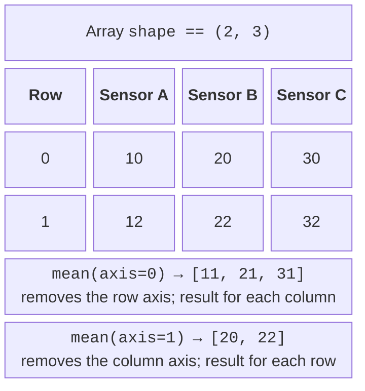
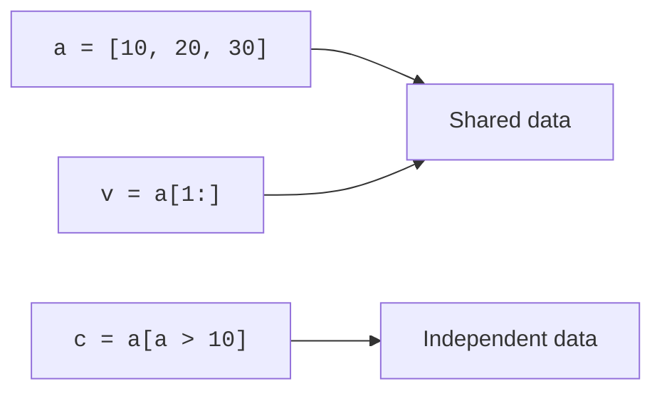

# Vectorized operations and slices

## Vectorized operations, axes, and masks

**Vectorization** (*vectorization*) describes an operation on an entire array at once. `values + 2` adds two to each element, and `values * values` multiplies elementwise. The `@` operator performs matrix multiplication, so do not confuse it with `*`. Python lists behave differently: `[1, 2] * 2` repeats the list.

```py
import numpy as np

celsius = np.array([0.0, 10.0, 20.0])
fahrenheit = celsius * 1.8 + 32
print(fahrenheit)
mask = (celsius >= 5) & (celsius <= 20)
print(mask)
print(celsius[mask])
```

Output: `[32. 50. 68.]`, `[False True True]`, `[10. 20.]`. A comparison returns an array of Boolean values, a **mask** (*mask*). Elementwise combinations require `&`, `|`, and `~`, rather than Python's `and`, `or`, and `not`; put each condition in parentheses because of operator precedence. Writing `if array:` for an array of several elements does not specify whether you mean “at least one” or “all.” Use `mask.any()` or `mask.all()` according to the intended meaning.

### What axis removes

`mean`, `sum`, `min`, and `max` can calculate a result over the entire array or along one axis. The `axis` argument names the axis to reduce. For a measurement×sensor matrix, `axis=0` removes measurements and gives a result for each sensor; `axis=1` removes sensors and gives a result for each measurement (Fig. 13.1).



Figure 13.1. Matrix axes and the shape of an aggregation result {.caption}

```py
import numpy as np

data = np.array([[10, 20, 30], [12, 22, 32]], dtype=float)
print(data.mean(axis=0))
print(data.mean(axis=1))
print(data.sum())
print(data.mean(axis=1, keepdims=True).shape)
```

Output: `[11. 21. 31.]`, `[20. 22.]`, `126.0`, `(2, 1)`. `keepdims=True` preserves the reduced axis with length one, making it easier to subtract the mean from each row afterward. Handle empty data before `min` or `mean`: there is no universally “correct average” for an empty sample.

## Slices, copies, and broadcasting

A basic NumPy slice usually creates a **view** (*view*) that references the same data. Changing such a view may change the original array. In contrast, indexing with a list of indices or a Boolean mask creates a separate array (Fig. 13.2). Do not automatically apply NumPy's behavior to Python lists or pandas tables.



Figure 13.2. Shared slice storage and independent selection data {.caption}

```py
import numpy as np

a = np.array([10, 20, 30])
view = a[1:]
selected = a[a > 10]
view[0] = 99
selected[0] = -1
print(a.tolist())
print(selected.tolist())
print(np.shares_memory(a, view))
```

Output: `[10, 99, 30]`, `[-1, 30]`, `True`. When a function must return an independent result, write `a[1:].copy()`. This is not always the cheapest operation in memory terms, but it makes the contract unambiguous. Do not copy large arrays unnecessarily.

### Broadcasting

**Broadcasting** (*broadcasting*) lets you combine compatible shapes without a manual loop. Dimensions are compared from right to left: they must match, or one must equal one. A missing leading axis is treated as length one. The rules are described at <https://numpy.org/doc/stable/user/basics.broadcasting.html>.

```py
import numpy as np

measurements = np.array([[10., 20., 30.], [12., 22., 32.]])
offsets = np.array([1., -1., 2.])
corrected = measurements + offsets
centered = corrected - corrected.mean(axis=1, keepdims=True)
print(corrected)
print(np.allclose(centered.mean(axis=1), 0.0, atol=1e-10))
```

Output:

```
[[11. 19. 32.]
 [13. 21. 34.]]
True
```

Shape `(2, 3)` is compatible with `(3,)`, but not `(2,)`. A separate offset for each row requires a column of shape `(2, 1)`. Check the combination of `(n, 1)` and `(n,)` especially carefully: it produces an `(n, n)` matrix even though the author may have expected n values. State the expected shape after each important step.

### Random numbers and approximate equality

For a learning generator, use `np.random.default_rng` with a recorded initial seed. The same seed in the same environment lets you repeat an experiment. For long-term archiving, also save the data itself and the versions: a seed is not a universal interchange format across all future generator implementations. This generator is not intended for passwords or tokens.

For real values, use `np.isclose` and `np.allclose` with explicitly chosen `atol` and `rtol`. They specify the permitted absolute and relative errors and should be chosen according to the problem's units. Rounding solely for printing should not affect subsequent calculations. A measurement's deviation from the mean is not proof of sensor failure without an additional model and validation.
