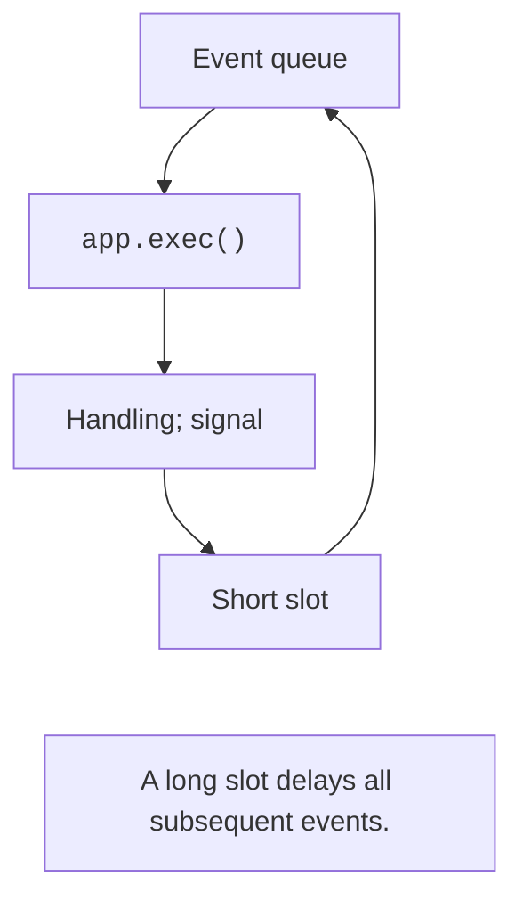

# The application and the event loop

## From a console program to a GUI application

A console program often determines the order of actions itself: it reads data, computes a result, and exits. In a GUI application, the user can edit any field, click buttons, and resize the window. Therefore, the program reacts to **events** rather than waiting for the next `input`. The computational functions from previous topics remain useful: now event handlers call them.

**Qt** is a set of libraries for GUI and other applications. **Qt for Python** provides the official Python bindings, **PySide6**. In this topic, we use **Qt Widgets**: ordinary desktop buttons, fields, tables, and windows. Qt Quick/QML is a different way of building interfaces and is not needed in this lab. <https://doc.qt.io/qtforpython-6/>.

The `QtCore` module contains the Qt object model, signals, timers, and basic types; `QtGui` contains actions, fonts, images, and validators; `QtWidgets` contains widgets and layouts. `QAction` is imported from `QtGui`, not from `QtWidgets`. Do not mix PySide6 and PyQt6 imports in one process. They are different Qt bindings with their own usage rules.

`tkinter` ships with the Python standard library and is suitable for simple forms. PySide6 provides a mature system of models and delegates, Designer, and many ready-made components. Cross-platform support does not remove the need to check fonts, paths, keyboard shortcuts, and sizes on the target operating system.

### Setting up the environment

As of September 17, 2026, PySide6 6.11.2 has been verified: the package metadata specifies Python from 3.10 up to (but not including) 3.15, so Python 3.14 is supported. Open a project with its own `.venv` and install the package; record the dependency version in the project file. <https://pypi.org/project/PySide6/>.

```powershell
uv add pyside6==6.11.2
uv run python -c "import PySide6; print(PySide6.__version__)"
```

The expected result of the check is `6.11.2`. PyCharm must run the interpreter from exactly this environment. A `ModuleNotFoundError` after installation most often means that the package was installed in one environment and the program runs in another. The official getting-started guide: <https://doc.qt.io/qtforpython-6/gettingstarted.html>.

PySide6 has open-source licensing options, including LGPLv3, as well as a commercial path. This does not mean the same terms apply to every Qt module and every method of distribution. Before publishing a product, check the terms of the chosen components; for course code, keep information about dependencies and the authorship of resources. <https://doc.qt.io/qtforpython-6/licenses.html>.

## QApplication and the event loop

A process creates one `QApplication` before any widgets. It manages events, the style, and the services of a GUI application. The window is created separately; `show()` makes it visible, but it is `app.exec()` that starts processing events. Without an event loop, the window will not work as an interactive application.

```py
import sys
from PySide6.QtWidgets import (
    QApplication, QLabel, QPushButton, QVBoxLayout, QWidget,
)

if __name__ == "__main__":
    app = QApplication(sys.argv)
    window = QWidget()
    window.setWindowTitle("Hello, Qt")
    layout = QVBoxLayout(window)
    layout.addWidget(QLabel("My first application"))
    close = QPushButton("Close")
    close.clicked.connect(window.close)
    layout.addWidget(close)
    window.show()
    raise SystemExit(app.exec())
```

The program shows a label and a button. Clicking "Close" closes the last window; with the default settings, the loop then ends. `raise SystemExit(...)` passes the process exit code. The window and the application object are kept in variables for the whole run.



Figure 14.1. Handling an event and returning to the Qt loop {.caption}

The **event loop** receives clicks, mouse movements, timer signals, and repaint requests. It delivers each event to the appropriate object. If a handler executes `time.sleep(5)` or a long loop, subsequent events wait, and the window stops responding (Fig. 14.1). Calling `processEvents()` in random places is not a substitute for properly organizing a long-running operation.

::: info Screenshot
Run the minimal program on Windows 11, light theme; show title, label and Close button.
:::

Figure 14.2. The first PySide6 window {.caption}
