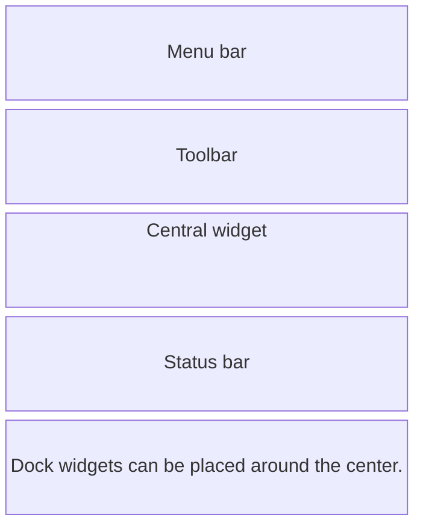

# The main window, actions, and timers

## The main window, menus, and actions

`QMainWindow` already has areas for a menu, toolbars, dock widgets, and a status bar. Install your own layout on a central `QWidget` passed to `setCentralWidget`, not directly on the `QMainWindow` (Fig. 14.9).



Figure 14.9. Areas of a QMainWindow {.caption}

`QAction` represents an action independently of its location on the screen. A single action can appear in a menu and on a toolbar and have a keyboard shortcut. Its enabled state is synchronized in all these places. `QKeySequence.StandardKey` helps you follow the usual platform key combinations. The status bar is suitable for a brief result of an action and the cursor position.

### A notepad

The program edits plain text and saves it to `note.txt` in the current directory in UTF-8. This is a fixed path for learning purposes; choosing a file with a dialog comes in the next topic. Closing the window or creating a new document asks for confirmation if there are unsaved changes. A write error does not reset the modified flag and does not close the window.

```py
import sys
from pathlib import Path
from PySide6.QtCore import Slot
from PySide6.QtGui import QAction, QCloseEvent, QKeySequence
from PySide6.QtWidgets import (
    QApplication, QMainWindow, QMessageBox, QPlainTextEdit,
)


class Notepad(QMainWindow):
    def __init__(self, path: Path) -> None:
        super().__init__()
        self.path = path
        self.setWindowTitle("Notepad")
        self.editor = QPlainTextEdit()
        self.setCentralWidget(self.editor)
        menu = self.menuBar().addMenu("File")
        toolbar = self.addToolBar("Actions")
        for title, shortcut, handler in (
            ("New", QKeySequence.StandardKey.New, self.new),
            ("Save", QKeySequence.StandardKey.Save, self.save),
            ("Exit", QKeySequence.StandardKey.Quit, self.close),
        ):
            action = QAction(title, self)
            action.setShortcut(shortcut)
            action.triggered.connect(handler)
            menu.addAction(action)
            toolbar.addAction(action)
        self.editor.cursorPositionChanged.connect(self.position)
        self.resize(550, 360)
        self.position()

    def may_discard(self) -> bool:
        if not self.editor.document().isModified():
            return True
        answer = QMessageBox.question(
            self, "Unsaved changes", "Discard changes?",
            QMessageBox.StandardButton.Yes
            | QMessageBox.StandardButton.No,
            QMessageBox.StandardButton.No,
        )
        return answer == QMessageBox.StandardButton.Yes

    @Slot()
    def new(self) -> None:
        if self.may_discard():
            self.editor.clear()
            self.editor.document().setModified(False)

    @Slot()
    def save(self) -> None:
        try:
            self.path.write_text(
                self.editor.toPlainText(), encoding="utf-8"
            )
        except OSError as error:
            self.statusBar().showMessage(f"Error: {error}")
            return
        self.editor.document().setModified(False)
        self.statusBar().showMessage(f"Saved: {self.path}")

    @Slot()
    def position(self) -> None:
        cursor = self.editor.textCursor()
        row = cursor.blockNumber() + 1
        column = cursor.positionInBlock() + 1
        message = f"Line {row}, column {column}"
        self.statusBar().showMessage(message)

    def closeEvent(self, event: QCloseEvent) -> None:
        event.accept() if self.may_discard() else event.ignore()


if __name__ == "__main__":
    app = QApplication(sys.argv)
    window = Notepad(Path("note.txt"))
    window.show()
    raise SystemExit(app.exec())
```

Enter two lines and place the cursor at the start of the second one: the status bar shows `Line 2, column 1`. After saving, the file contains the same text. Answering No to the discard prompt keeps the document open. Also test an inaccessible directory: a write error must leave the text in the editor.

::: info Screenshot
Open the File menu in Notepad; show New, Save, Exit shortcuts, toolbar and cursor position.
:::

Figure 14.10. A notepad with a menu, an actions toolbar, and a status bar {.caption}

## Timers and UI responsiveness

`QTimer` emits `timeout` at specified intervals while the event loop is running. Create it with a parent, connect a handler, and call `start(1000)` for an approximate interval of 1000 ms. `stop()` stops the repetition, and `QTimer.singleShot` schedules a single call. <https://doc.qt.io/qtforpython-6/PySide6/QtCore/QTimer.html>.

A timer does not guarantee the exact moment of execution: a busy system or a long slot delays the event. A stopwatch must not add "exactly 0.1 seconds" on every timeout. The correct approach is to read `time.perf_counter()` or `QElapsedTimer` and use the timer only to refresh the screen. On pause, accumulate the actual elapsed interval.

A long-running operation is split into short steps or moved to a worker object in a `QThread`; the result is passed back through a signal. Widgets are modified only in the GUI thread. Merely creating a `QThread` does not move an arbitrary function call to another thread. In this lab, short slots and a timer without threads are sufficient.

### A registration form

The form accepts a name, an age of 16–100, and consent to the rules. The button is enabled only for a nonempty name and a checked box. The slot rechecks the conditions before emitting `registered(str, int)`: the button's state is a hint, not the only safeguard.

```py
import sys
from PySide6.QtCore import Signal, Slot
from PySide6.QtWidgets import (
    QApplication, QCheckBox, QFormLayout, QLabel, QLineEdit,
    QPushButton, QSpinBox, QWidget,
)


class Registration(QWidget):
    registered = Signal(str, int)

    def __init__(self) -> None:
        super().__init__()
        self.setWindowTitle("Registration form")
        self.name = QLineEdit()
        self.name.setPlaceholderText("Participant name")
        self.age = QSpinBox()
        self.age.setRange(16, 100)
        self.consent = QCheckBox("I agree to the rules")
        self.submit = QPushButton("Register")
        self.result = QLabel()
        layout = QFormLayout(self)
        layout.addRow("Name", self.name)
        layout.addRow("Age", self.age)
        for widget in (self.consent, self.submit, self.result):
            layout.addRow(widget)
        self.name.textChanged.connect(self.validate)
        self.consent.toggled.connect(self.validate)
        self.submit.clicked.connect(self.send)
        self.validate()

    @Slot()
    def validate(self) -> None:
        valid = bool(self.name.text().strip())
        self.submit.setEnabled(valid and self.consent.isChecked())

    @Slot()
    def send(self) -> None:
        self.validate()
        if not self.submit.isEnabled():
            return
        name = self.name.text().strip()
        self.registered.emit(name, self.age.value())
        self.result.setText(f"Registered: {name}")


if __name__ == "__main__":
    app = QApplication(sys.argv)
    window = Registration()
    window.show()
    raise SystemExit(app.exec())
```

Initially, the button is disabled. Spaces instead of a name do not enable it. The name `Anna` together with consent allows registration and produces the message `Registered: Anna`. The `QSpinBox` itself limits the age. If strict validation of imported data is needed, it is performed separately, even if the GUI field already has a range.
