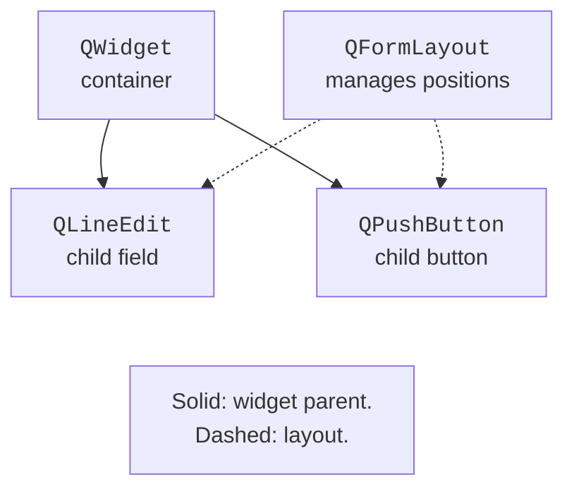
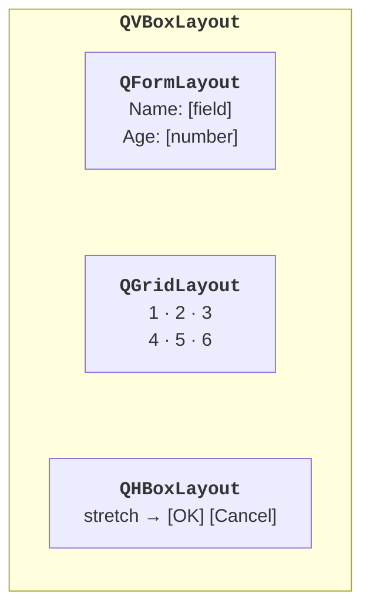
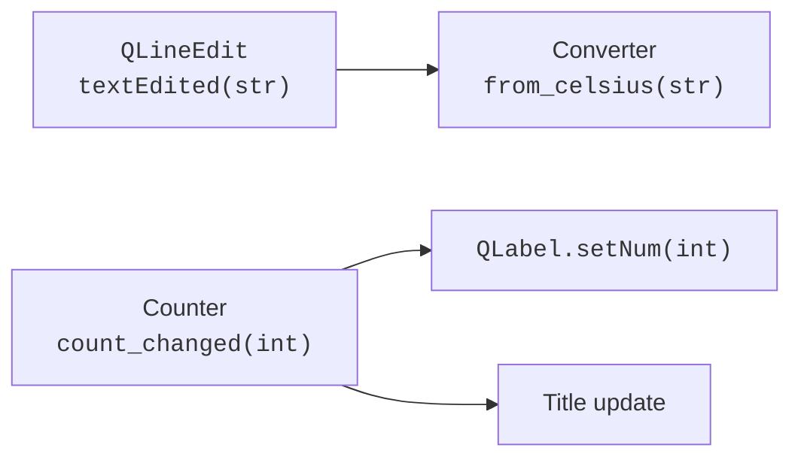

# Widgets, layouts, and signals

## Widgets and the ownership tree

A **widget** is a user interface element: a button, a field, or a container. A `QWidget` without a parent widget is usually a separate window. A Qt parent object owns its children and destroys them together with itself. A layout positions widgets, but do not confuse the layout tree with the tree of actual widget parents.

For example, `QVBoxLayout(window)` installs a layout in `window`. The added fields and buttons become child widgets of the container. A nested `QFormLayout` manages positioning, but it is not the parent widget of the fields. The diagram in Fig. 14.3 distinguishes these relationships.



Figure 14.3. Widget ownership and control of their positioning {.caption}

Store widgets you need to access later in `self.name`, `self.button`, and so on. A local widget without a parent created inside a function can lose its Python reference after the function returns and disappear. Even if Qt owns the object, an attribute is convenient for reading the value and checking the state. Do not keep references to a Qt object that has already been deleted.

### Basic interface elements

`QLabel` displays text or an image, `QPushButton` triggers an action, and `QLineEdit` edits a single line. `QPlainTextEdit` is intended for ordinary multiline text; `QTextEdit` also supports rich text. For user-entered strings shown in labels, you can set `Qt.TextFormat.PlainText` so that HTML-like text is not interpreted as markup.

`QSpinBox` holds an integer with a range and a step; `QDoubleSpinBox` holds a real number with a given number of decimal places. Read the value with `value()` rather than by converting the visible text. `QCheckBox` sets an independent flag. For mutually exclusive options, use `QRadioButton` in a `QButtonGroup`; check whether an option is selected.

`QComboBox` provides a list of options. It is convenient to pass the technical value as item data with `addItem("Ukrainian", "uk")` and read it with `currentData()` instead of comparing the translated caption. `QSlider` changes an integer value, and `QProgressBar` shows progress. Do not invent a completion percentage when the amount of work is unknown: set the indeterminate mode with a range of 0–0.

`QListWidget` is convenient for a small list of items. Large data and complex editing require the models from the next topic. `QDateEdit` provides a calendar date; `QDate` is a Qt type that can be converted to a Python date with `toPython()`.

::: info Screenshot
Create a small gallery in Designer: labelled LineEdit, SpinBox, DoubleSpinBox, CheckBox, exclusive RadioButtons, ComboBox, Slider, ProgressBar and DateEdit.
:::

Figure 14.4. Typical Qt fields, toggles, and indicators {.caption}

## Layouts instead of fixed coordinates

A **layout** determines the relative placement and sizes of widgets. `QVBoxLayout` arranges them vertically, `QHBoxLayout` horizontally, `QGridLayout` in a grid, and `QFormLayout` in "label – field" rows. Nesting lets you combine a form, a table, and a row of buttons. <https://doc.qt.io/qt-6/layout.html>.



Figure 14.5. Nested form layouts {.caption}

`addStretch()` adds a flexible space, for example, before buttons that should stay on the right. `setContentsMargins` sets the outer margins, and `setSpacing` sets the distances between items. In a grid, you can stretch a particular row or column with stretch factors. `QSizePolicy` tells the layout whether a widget wants to expand.

Do not call `setLayout` twice for the same container. For several parts, create nested layouts or a `QGroupBox` with its own layout. `resize` sets the initial size, while `setFixedSize` prevents adaptation and often clips translated captions. Check the minimum width, the system scale, and long names.

::: info Screenshot
Run Registration below and capture narrow/wide window states, fields readable and no overlaps.
:::

Figure 14.6. A registration form at different window widths {.caption}

## Signals and slots

A **signal** announces an event or a state change. A **slot** is a function called in response. The expression `button.clicked.connect(self.save)` passes the function, whereas `connect(self.save())` first calls it and passes the result. The latter is usually a mistake. <https://doc.qt.io/qt-6/signalsandslots.html>.



Figure 14.7. One signal can notify several handlers {.caption}

`textChanged(str)` is emitted both on a programmatic `setText` and when the user edits the text. `textEdited(str)` is emitted only when the user edits it. `valueChanged` reports the new number; `currentIndexChanged` reports the new index of a list item. `clicked` can pass the checked flag; a slot without parameters can accept only the fact of the click itself.

The `@Slot()` or `@Slot(int)` decorator registers a method as a Qt slot and makes the expected signature explicit. A lambda is convenient for a short forwarding call. In a loop, capture values explicitly: `lambda checked=False, n=number: self.choose(n)`; otherwise, all handlers may see the last value of the variable. `functools.partial` is also suitable for binding arguments.

Do not create repeated connections every time the window is updated: a single click will start performing the action several times. Connections are usually made in the constructor; if needed, `signal.disconnect(slot)` removes a specific connection. Do not disconnect a nonexistent connection at random.

### A custom signal: a click counter

Let us declare `Signal(int)` at the class level of a `QWidget` subclass, not in `__init__`. After the counter changes, we call `emit`. Two independent listeners update the number and the title. The window should not need to know who else has subscribed to its changes.

```py
import sys
from PySide6.QtCore import Signal, Slot
from PySide6.QtWidgets import (
    QApplication, QLabel, QPushButton, QVBoxLayout, QWidget,
)


class CounterWindow(QWidget):
    count_changed = Signal(int)

    def __init__(self) -> None:
        super().__init__()
        self.count = 0
        self.setWindowTitle("Click counter")
        self.label = QLabel("0")
        self.button = QPushButton("Add")
        reset = QPushButton("Reset")
        layout = QVBoxLayout(self)
        for widget in (self.label, self.button, reset):
            layout.addWidget(widget)
        self.button.clicked.connect(self.increment)
        reset.clicked.connect(self.reset)
        self.count_changed.connect(self.label.setNum)
        self.count_changed.connect(self.update_title)

    @Slot()
    def increment(self) -> None:
        self.count += 1
        self.count_changed.emit(self.count)

    @Slot()
    def reset(self) -> None:
        self.count = 0
        self.count_changed.emit(self.count)

    @Slot(int)
    def update_title(self, value: int) -> None:
        self.setWindowTitle(f"Clicks: {value}")


if __name__ == "__main__":
    app = QApplication(sys.argv)
    window = CounterWindow()
    window.show()
    raise SystemExit(app.exec())
```

After three clicks, the label shows `3` and the title shows `Clicks: 3`. "Reset" returns both values to zero. A test checks the `count` state and the number of signals, not just the image of the button. Custom signals can likewise be declared in a separate `QObject` subclass if a component has no visual representation.
