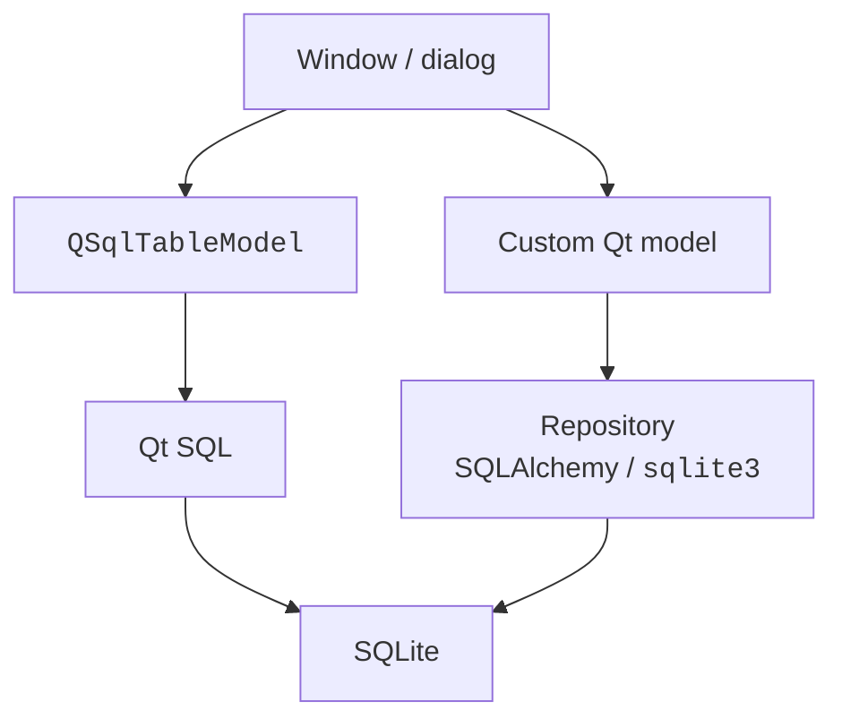

# Qt SQL, repositories, and settings

## Qt SQL and saving changes

In Topic 12, SQL separated tables from Python objects. The `QtSql` module lets you connect SQL data to Qt views. `QSqlDatabase.addDatabase("QSQLITE", name)` creates a named connection; set the path, call `open`, and check the result. A failed open must not be ignored. <https://doc.qt.io/qt-6/sql-programming.html>.

`QSqlQuery` executes queries. For user-entered values, use `prepare` and `bindValue`, not SQL f-strings. For example, prepare `INSERT INTO authors(name) VALUES (:name)`, bind the value `:name`, and check `exec()`. Table and column names are not replaced with parameters: they are chosen from a set defined in the code.

`QSqlTableModel` is bound to a single table. `setTable` sets it, and `select` loads the data. `OnFieldChange` submits changes early, `OnRowChange` submits them when moving off a row, and `OnManualSubmit` accumulates them until `submitAll`. The last option provides clear "Save" and "Cancel" buttons via `revertAll`.

The model buffer and a database transaction are different things. `submitAll()` returns a bool; on failure, read `lastError`. For an atomic batch, open a transaction before the submit, commit after success, or roll back on error. After a failed submit, the model may keep the unsaved buffer so the user can correct the data; `revertAll` discards it explicitly.

`QSqlRelationalTableModel` adds a display of foreign keys: the database stores author\_id, while the user sees the author's name. `QSqlRelation("authors", "id", "name")` describes the relationship, and `QSqlRelationalDelegate` provides a selection editor. The foreign key constraint must also be enforced in SQLite, not only in the interface.

### Example 3. A book catalog

The application creates a separate learning database `books.sqlite` in the current directory, together with the authors and books tables if they do not exist. SQLite generates the book identifier. Books are added, edited, and deleted in the model buffer; the user explicitly saves or cancels the batch. Unsaved changes block closing, with an explanation.

```py
import sys
from PySide6.QtCore import QSettings
from PySide6.QtGui import QCloseEvent
from PySide6.QtSql import (
    QSqlDatabase, QSqlQuery, QSqlRelation, QSqlRelationalDelegate,
    QSqlRelationalTableModel, QSqlTableModel,
)
from PySide6.QtWidgets import (
    QApplication, QHBoxLayout, QLabel, QPushButton,
    QTableView, QVBoxLayout, QWidget,
)


def open_database(path: str, name: str) -> QSqlDatabase:
    db = QSqlDatabase.addDatabase("QSQLITE", name)
    db.setDatabaseName(path)
    if not db.open():
        raise RuntimeError(db.lastError().text())
    query = QSqlQuery(db)
    commands = [
        "PRAGMA foreign_keys=ON",
        "CREATE TABLE IF NOT EXISTS authors "
        "(id INTEGER PRIMARY KEY, name TEXT NOT NULL)",
        "CREATE TABLE IF NOT EXISTS books "
        "(id INTEGER PRIMARY KEY, title TEXT NOT NULL "
        "CHECK(length(trim(title))>0), author_id INTEGER "
        "NOT NULL REFERENCES authors(id))",
        "INSERT OR IGNORE INTO authors VALUES (1, 'Lesya Ukrainka')",
        "INSERT OR IGNORE INTO authors VALUES (2, 'Ivan Franko')",
    ]
    for sql in commands:
        if not query.exec(sql):
            raise RuntimeError(query.lastError().text())
    return db


class BooksWindow(QWidget):
    def __init__(self, db: QSqlDatabase) -> None:
        super().__init__()
        self.db = db
        self.setWindowTitle("Book catalog")
        self.settings = QSettings("CourseDemo", "Books15")
        geometry = self.settings.value("geometry")
        if geometry is not None:
            self.restoreGeometry(geometry)
        self.model = QSqlRelationalTableModel(self, db)
        self.model.setTable("books")
        relation = QSqlRelation("authors", "id", "name")
        self.model.setRelation(2, relation)
        strategy = QSqlTableModel.EditStrategy.OnManualSubmit
        self.model.setEditStrategy(strategy)
        if not self.model.select():
            raise RuntimeError(self.model.lastError().text())
        self.view = QTableView()
        self.view.setModel(self.model)
        self.view.setItemDelegate(QSqlRelationalDelegate(self.view))
        self.view.hideColumn(0)
        self.status = QLabel("Changes have not been saved yet")
        buttons = QHBoxLayout()
        for title, handler in (
            ("Add", self.add), ("Remove", self.remove),
            ("Save", self.save), ("Cancel", self.revert),
        ):
            button = QPushButton(title)
            button.clicked.connect(handler)
            buttons.addWidget(button)
        layout = QVBoxLayout(self)
        layout.addWidget(self.view)
        layout.addLayout(buttons)
        layout.addWidget(self.status)

    def add(self) -> None:
        record = self.model.record()
        record.setNull(0)
        record.setValue(1, "New book")
        record.setValue(2, 1)
        if not self.model.insertRecord(-1, record):
            self.status.setText(self.model.lastError().text())

    def remove(self) -> None:
        index = self.view.currentIndex()
        if index.isValid():
            self.model.removeRow(index.row())

    def save(self) -> bool:
        if not self.db.transaction():
            self.status.setText(self.db.lastError().text())
            return False
        if not self.model.submitAll():
            message = self.model.lastError().text()
            self.db.rollback()
            self.status.setText(message)
            return False
        if not self.db.commit():
            message = self.db.lastError().text()
            self.db.rollback()
            self.model.select()
            self.status.setText(message)
            return False
        self.status.setText("Saved")
        return True

    def revert(self) -> None:
        self.model.revertAll()
        self.model.select()
        self.status.setText("Unsaved changes discarded")

    def closeEvent(self, event: QCloseEvent) -> None:
        if self.model.isDirty():
            self.status.setText("Save or cancel the changes")
            event.ignore()
            return
        self.settings.setValue("geometry", self.saveGeometry())
        event.accept()


if __name__ == "__main__":
    app = QApplication(sys.argv)
    database = open_database("books.sqlite", "books-demo")
    window = BooksWindow(database)
    window.show()
    code = app.exec()
    database.close()
    raise SystemExit(code)
```

After "Add", `New book` appears with the default author. Change the title and the author in the editor; until "Save", a separate SQL query does not see the new record. "Cancel" removes the unsaved item. An empty title violates the CHECK constraint: the batch is rolled back, and the previously saved data remains. A commit error also requires a rollback; after it, the example rereads the database state.

::: info Screenshot
Run BooksWindow on a fresh demo database, add a book, edit the author with the combo delegate; show Save/Revert and status.
:::

Figure 15.10. A relational book catalog with manual saving {.caption}

Do not call `removeDatabase(name)` while models, queries, or copies of `QSqlDatabase` that use the connection still exist. First release the connection's users, then close and remove it. In this short example, the named connection is closed after the application loop and the process exits; the connection is not removed and recreated with the same name.

## A custom repository as an alternative approach

A model over `sqlite3` or SQLAlchemy lets you separate domain rules from Qt. The window calls a model method, the model calls a service or repository, and the repository executes the transaction (Fig. 15.11). This is convenient if the same operations are also needed in a CLI or in automated tests without Qt.



Figure 15.11. Two ways to access SQLite {.caption}

With this approach, do not edit the same records simultaneously through an independent `QSqlTableModel`: two buffers are hard to reconcile. Choose the owner of the transaction. After the repository succeeds, update the model's cache and emit signals; after an error, keep the previous cache and show an explanation. The employees example in the lab uses SQLAlchemy from Topic 12 and a custom Qt table.

For a large database, do not load an unbounded list in the constructor: use batches, `canFetchMore`/`fetchMore`, or pages. Do not execute slow SQL from `data`. Background work uses a separate connection in the corresponding thread, and the model is changed in the GUI thread after the result arrives.

## Settings, CSV, and testing

`QSettings` stores user settings, such as the window geometry, the last directory, or the selected filter. `saveGeometry` and `restoreGeometry` work with a QByteArray. The organization and application names separate the settings namespace. This is not a business-data database and not a place for secrets. In tests, use a separate temporary INI file so as not to change personal settings.

For CSV, explicitly specify the headers, UTF-8 encoding, `newline=""`, types, and rules for duplicates. Handle Cancel without an error message. An export must define which data it saves: the entire source or only the current filter; label this in the interface. Saving to the chosen path can end with an OSError, so a successful dialog does not yet mean a successful write.

Test the model independently of rendering: the row count, roles, rejected values, and signals after adding and removing. For a proxy, test search and removal after sorting. For a dialog, test Accept and Cancel; for SQL, test batch rollback, a repeated run, and preservation of foreign keys. `QAbstractItemModelTester` from QtTest helps check the invariants of custom models but does not replace domain tests.

## Common mistakes

- The source is changed without begin/end or `dataChanged`: the view does not know about the new state. Send precise notifications.
- Text is returned for every role: handle the supported roles and return `None` for the rest.
- A proxy row is used as a source row: apply `mapToSource`.
- `select()` is called on top of unsaved changes: first save them or explicitly agree to discard them.
- `submitAll` is not checked: show the error and manage the transaction.
- A dialog changes data before OK: accumulate the input separately.
- The connection is removed before the models: order the lifetimes properly.
- CSV rows are added one by one before validation: first validate the entire set, then perform a single logical operation.
