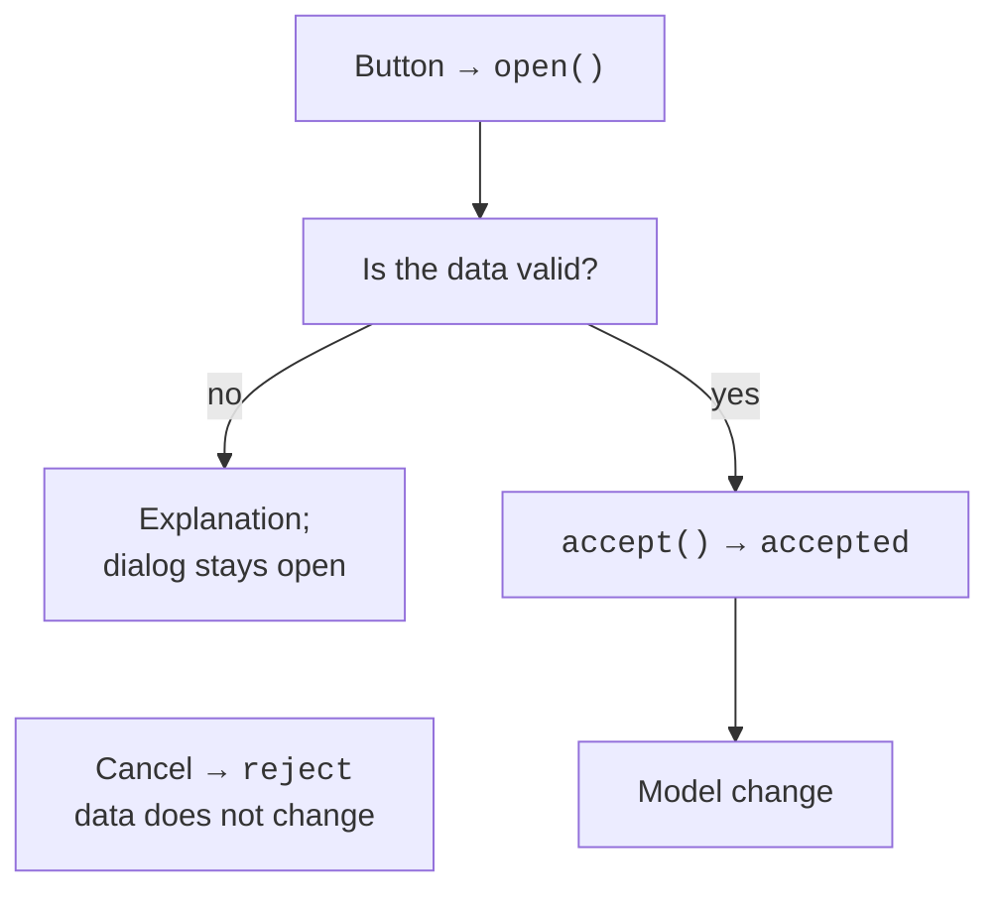

# Custom dialogs

## Custom dialogs and their results

A **dialog** is a temporary window for a separate interaction. A modal dialog blocks interaction with the parent window, while a modeless dialog allows working in parallel. The parent determines the relationship between windows, ownership, and convenient positioning. `QDialogButtonBox` provides standard buttons and the accepted/rejected signals. <https://doc.qt.io/qt-6/qdialog.html>.

Calling `dialog.exec()` returns `QDialog.DialogCode.Accepted` or Rejected, but it starts a nested event loop. Qt recommends using the asynchronous `open()` with the `accepted` signal where possible: control returns immediately, so the dialog must be stored in an attribute or its lifetime ensured in some other way. `show()` usually displays a modeless dialog.



Figure 15.7. Confirming a dialog after validation {.caption}

`accept()` means successful completion. Override it to recheck the fields, even if OK was disabled. `reject()` cancels the dialog without changing the business data. Do not save a half-filled record to the database on every keystroke while the user can still cancel the form.

### Standard dialogs

`QFileDialog.getOpenFileName` and `getSaveFileName` return a `(filename, selected_filter)` pair; an empty name means Cancel. The `CSV (*.csv)` filter helps with selection but does not check the contents. Read errors and an invalid file structure must still be handled. On Windows, use Path objects instead of concatenating paths.

`QMessageBox.question` returns a specific StandardButton: compare it with Yes or No, not with an arbitrary bool. `warning` and `critical` report problems. `QInputDialog` returns a value and a confirmation flag. For `QColorDialog`, check the color's `isValid` after Cancel; `QFontDialog` also returns a confirmation result.

### Example 2. A product and a validated CSV import

The dialog accepts a name and a positive price in integer kopiykas up to 1000000. OK is enabled only for valid fields. The CSV file has the header `name,price`; the entire file is validated first, and only then is the list extended. An error in the last row does not partially add the preceding rows. An empty valid file with a header adds 0 records.

```py
import csv
import sys
from pathlib import Path
from PySide6.QtWidgets import (
    QApplication, QDialog, QDialogButtonBox, QFileDialog,
    QFormLayout, QLabel, QLineEdit, QListWidget, QPushButton,
    QSpinBox, QVBoxLayout, QWidget,
)


class ProductDialog(QDialog):
    def __init__(self, parent: QWidget | None = None) -> None:
        super().__init__(parent)
        self.setWindowTitle("Product")
        self.name = QLineEdit()
        self.price = QSpinBox()
        self.price.setRange(0, 1_000_000)
        self.price.setSuffix(" kop.")
        self.message = QLabel()
        buttons = (QDialogButtonBox.StandardButton.Ok
                   | QDialogButtonBox.StandardButton.Cancel)
        self.buttons = QDialogButtonBox(buttons)
        form = QFormLayout(self)
        form.addRow("Name", self.name)
        form.addRow("Price", self.price)
        form.addRow(self.message)
        form.addRow(self.buttons)
        self.name.textChanged.connect(self.validate)
        self.price.valueChanged.connect(self.validate)
        self.buttons.accepted.connect(self.accept)
        self.buttons.rejected.connect(self.reject)
        self.validate()

    def validate(self) -> bool:
        valid = (bool(self.name.text().strip())
                 and self.price.value() > 0)
        ok = self.buttons.button(QDialogButtonBox.StandardButton.Ok)
        ok.setEnabled(valid)
        self.message.setText("" if valid else "Name and positive price")
        return valid

    def accept(self) -> None:
        if self.validate():
            super().accept()

    def product(self) -> tuple[str, int]:
        return self.name.text().strip(), self.price.value()


def read_products(path: Path) -> list[tuple[str, int]]:
    result: list[tuple[str, int]] = []
    with path.open(encoding="utf-8", newline="") as file:
        reader = csv.DictReader(file)
        if reader.fieldnames != ["name", "price"]:
            raise ValueError("Columns name,price are required")
        for row in reader:
            name = (row.get("name") or "").strip()
            price = int(row.get("price") or "0")
            if None in row or not name or not 1 <= price <= 1_000_000:
                raise ValueError("Invalid product")
            result.append((name, price))
    return result


class ProductsWindow(QWidget):
    def __init__(self) -> None:
        super().__init__()
        self.setWindowTitle("Products")
        self.items = QListWidget()
        self.status = QLabel()
        self.dialog: ProductDialog | None = None
        add = QPushButton("Add")
        add.clicked.connect(self.open_dialog)
        load = QPushButton("Import CSV")
        load.clicked.connect(self.import_csv)
        layout = QVBoxLayout(self)
        for widget in (self.items, add, load, self.status):
            layout.addWidget(widget)

    def open_dialog(self) -> None:
        self.dialog = ProductDialog(self)
        self.dialog.accepted.connect(self.add_product)
        self.dialog.open()

    def add_product(self) -> None:
        if self.dialog is not None:
            name, price = self.dialog.product()
            self.items.addItem(f"{name}: {price} kop.")

    def import_csv(self) -> None:
        name, _ = QFileDialog.getOpenFileName(
            self, "Products", "", "CSV (*.csv)"
        )
        if not name:
            return
        try:
            products = read_products(Path(name))
        except OSError, ValueError, csv.Error:
            self.status.setText("Could not read a valid CSV file")
            return
        for product, price in products:
            self.items.addItem(f"{product}: {price} kop.")
        self.status.setText(f"Imported: {len(products)}")


if __name__ == "__main__":
    app = QApplication(sys.argv)
    window = ProductsWindow()
    window.show()
    raise SystemExit(app.exec())
```

Entering `Pen` and 2500 produces the line `Pen: 2500 kop.`. A price of 0 and a name consisting of spaces keep the dialog open. Cancel adds nothing. A file with the rows `Notebook,4000` and `Pencil,1500` after the header adds two items. An invalid row or denied access shows a message and leaves the existing list unchanged.


Figure 15.8. The product dialog with confirmation disabled {.caption}


Figure 15.9. Choosing a CSV file to import {.caption}
