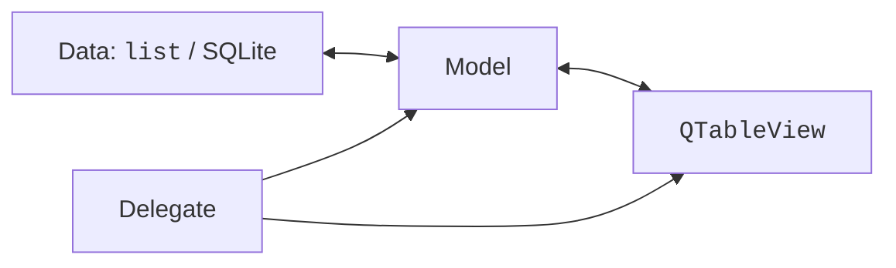
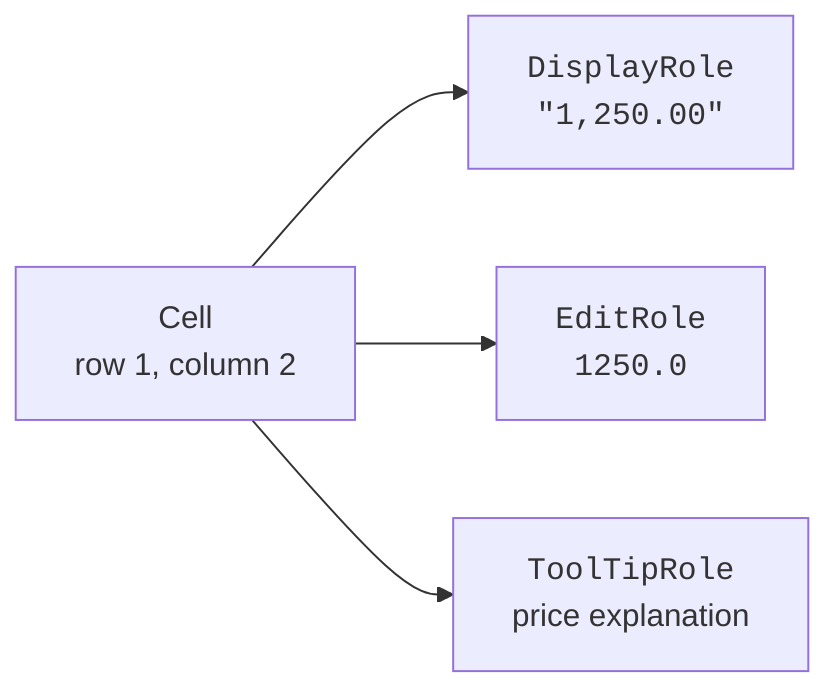

# Models, indexes, and roles

## Why data should not live only in cells

In a small to-do list, it is convenient to add `QListWidgetItem` objects directly to the widget. But with thousands of records, search, several views, and database storage, a question arises: where is the true state? If copies of one record are stored in several tables, it is easy to update them inconsistently. The **Model/View** architecture separates the data and the rules for accessing it from its presentation on the screen. <https://doc.qt.io/qt-6/model-view-programming.html>.

A **model** provides the number of rows and columns and the values at given indexes. A **view** draws a list, a table, or a tree and manages selection. A **delegate** draws individual items and creates editors. The data can be a list of `dataclass` objects, an SQL result, or another source (Fig. 15.1).

Figure 15.1. The model, the view, the delegate, and the data source {.caption}

In classic MVC, the controller is a separate component. Qt Model/View distributes part of the interaction handling between the view and the delegate. There is no need to force every window to be called a "controller": the boundaries of responsibility matter more. A model should not open an error window on every cell request; it returns a value or a refusal, and the interface explains the problem to the user.

`QListWidget`, `QTableWidget`, and `QTreeWidget` manage their items themselves. `QListView`, `QTableView`, and `QTreeView` receive a model through `setModel`. One model can serve several views: an edit in one is immediately shown in the others after a signal. The model must live at least as long as the view; store it in an attribute and, where appropriate, give it a Qt parent object.

## Standard models, indexes, and roles

`QStringListModel` is suitable for a list of strings. `QStandardItemModel` stores items with roles and supports both tables and trees. A `QStandardItem` can have child items, so a category tree does not require a custom model at first. In a table, `QHeaderView` controls column widths: `Stretch` stretches columns, and `ResizeToContents` fits the width to the content. The latter mode can be expensive for very large tables.

A **model index** is a `QModelIndex` with a row, a column, a parent index, and a link to the model. It is not a persistent identifier of a business record. After a removal, reload, or sort, you cannot rely on an old row number. To preserve the selection across reloads, use a stable record `id`.

`QModelIndex()` without arguments is an invalid index; it is often used to denote the root of a flat table. Check `isValid()` before reading. In a table model, `rowCount(parent)` and `columnCount(parent)` return 0 for a valid parent, because cells have no child rows.

Figure 15.2. One cell provides different values for different roles {.caption}

A **role** determines what information the view is requesting. `DisplayRole` is the displayed text or number; `EditRole` is the value for the editor; `ToolTipRole` is an explanation; `ForegroundRole` and `BackgroundRole` control styling; `TextAlignmentRole` controls alignment. `CheckStateRole` returns the checkbox state, and `UserRole` and subsequent values are available for custom data, such as a stable id.

Returning `None` for an unsupported role is correct. If you return text for every role, the view may try to interpret it as a color or a font. For numeric sorting, `EditRole` or a separate role must contain a number, not a string like `"1,250.00 UAH"`.

::: info Screenshot
Create one QStandardItemModel with three rows and two columns; attach QListView, QTableView, QTreeView, edit an item and show all views updated.
:::

Figure 15.3. A shared model in a list, a table, and a tree {.caption}

## A custom model: the contract with the view

A `QAbstractTableModel` subclass implements `rowCount`, `columnCount`, and `data`; `headerData` adds headers. These methods are called frequently, so they must not make network requests, modify data, or run heavy computations. They read prepared state. <https://doc.qt.io/qtforpython-6/PySide6/QtCore/QAbstractTableModel.html>.

For editing, `flags` returns `ItemIsEditable`, and `setData` checks the role, the index, and the new value. After a successful change, `dataChanged(topLeft, bottomRight, roles)` is emitted. An empty list of roles means all roles have changed; an exact list helps avoid unnecessary updates when it is known in advance. A rejected value returns `False` and does not change the record.

Adding rows has three phases: `beginInsertRows`, changing the source, and `endInsertRows`. For removal, use the corresponding `beginRemoveRows`/`endRemoveRows` pair. The range includes both the first and the last row. Validate before `begin...` so as not to leave the model between the start and end of a notification.

`beginResetModel`/`endResetModel` are used to replace the entire dataset. A reset may lose the selection and persistent indexes; it is not a universal way to make up for missing signals when a single cell changes. A single record requires a precise notification.
