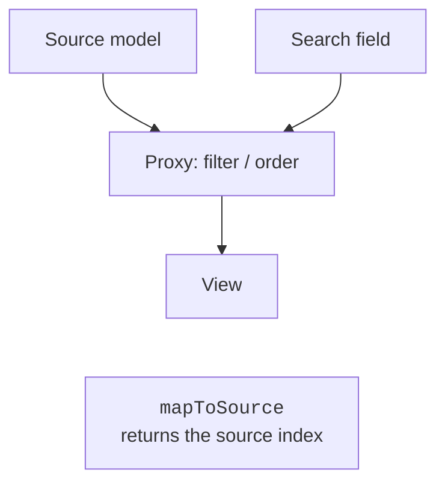
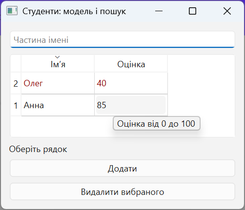

# Proxies, sorting, and delegates

## Proxies, sorting, and selection

`QSortFilterProxyModel` applies ordering and filtering to a source model without copying the business data. The view connects to the proxy, and the proxy connects to the source (Fig. 15.4). <https://doc.qt.io/qt-6/qsortfilterproxymodel.html>.



Figure 15.4. Filtering and index mapping in a proxy {.caption}

`setFilterKeyColumn(0)` sets the search column. `setFilterFixedString(text)` treats the input literally, while `setFilterRegularExpression` treats it as a regular expression. For an ordinary search field, the first option is safer with respect to the unexpected meaning of characters such as `[` or `*`. Case sensitivity is configured with `setFilterCaseSensitivity`.

For several criteria, override `filterAcceptsRow`: the method reads source indexes and returns a bool. Do not modify the model inside the filter. `setSortingEnabled(True)` on a table lets the user click a header; the proxy sorts the data of the corresponding role.

The **selection** is stored by a `QItemSelectionModel`. The `currentChanged` and `selectionChanged` signals differ: there is one current index, but there can be many selected cells. In a master-detail layout, the current record of the main table determines the data in a form or a second table. `doubleClicked` is appropriate for opening an editor or details.

An index from the view belongs to the proxy. Before accessing the source model's list, call `mapToSource`; for the reverse direction, use `mapFromSource`. Without this, after sorting you may delete a completely different record. This is one of the most important checks in this topic.

### Example 1. Students: editing, search, and details

Let us create a model over a list of `Student` objects. The grade is an integer 0–100, and the name is nonempty. The table allows editing; low grades have a distinct color, but the number itself is always visible. Search works on part of a name, and a label at the bottom shows the selected student. The delete button explicitly maps the proxy index to the source index.

```py
import sys
from dataclasses import dataclass
from PySide6.QtCore import (
    QAbstractTableModel, QModelIndex, QSortFilterProxyModel, Qt,
)
from PySide6.QtGui import QColor
from PySide6.QtWidgets import (
    QApplication, QLabel, QLineEdit, QPushButton, QTableView,
    QVBoxLayout, QWidget,
)


@dataclass
class Student:
    name: str
    grade: int


class StudentModel(QAbstractTableModel):
    def __init__(self, rows: list[Student]) -> None:
        super().__init__()
        self.rows = list(rows)

    def rowCount(self, parent: QModelIndex = QModelIndex()) -> int:
        return 0 if parent.isValid() else len(self.rows)

    def columnCount(self, parent: QModelIndex = QModelIndex()) -> int:
        return 0 if parent.isValid() else 2

    def data(self, index: QModelIndex, role: int = 0) -> object:
        if not index.isValid():
            return None
        student = self.rows[index.row()]
        if role in (Qt.ItemDataRole.DisplayRole,
                    Qt.ItemDataRole.EditRole):
            if index.column() == 0:
                return student.name
            return student.grade
        if role == Qt.ItemDataRole.ToolTipRole:
            return "Grade from 0 to 100"
        if (role == Qt.ItemDataRole.ForegroundRole
                and student.grade < 50):
            return QColor("darkred")
        return None

    def headerData(self, section: int, orientation: Qt.Orientation,
                   role: int = 0) -> object:
        if role != Qt.ItemDataRole.DisplayRole:
            return None
        if orientation == Qt.Orientation.Horizontal:
            return ("Name", "Grade")[section]
        return section + 1

    def flags(self, index: QModelIndex) -> Qt.ItemFlag:
        flags = super().flags(index)
        if index.isValid():
            flags |= Qt.ItemFlag.ItemIsEditable
        return flags

    def setData(self, index: QModelIndex, value: object,
                role: int = Qt.ItemDataRole.EditRole) -> bool:
        if not index.isValid() or role != Qt.ItemDataRole.EditRole:
            return False
        student = self.rows[index.row()]
        if index.column() == 0:
            name = str(value).strip()
            if not name:
                return False
            student.name = name
        else:
            text = str(value)
            if not text.isascii() or not text.isdecimal():
                return False
            grade = int(text)
            if not 0 <= grade <= 100:
                return False
            student.grade = grade
        self.dataChanged.emit(index, index, [])
        return True

    def add(self, student: Student) -> None:
        if not student.name.strip() or not 0 <= student.grade <= 100:
            raise ValueError("Invalid student")
        row = len(self.rows)
        self.beginInsertRows(QModelIndex(), row, row)
        self.rows.append(student)
        self.endInsertRows()

    def remove(self, row: int) -> bool:
        if not 0 <= row < len(self.rows):
            return False
        self.beginRemoveRows(QModelIndex(), row, row)
        del self.rows[row]
        self.endRemoveRows()
        return True


class StudentsWindow(QWidget):
    def __init__(self) -> None:
        super().__init__()
        self.setWindowTitle("Students: model and search")
        self.model = StudentModel([Student("Anna", 85),
                                   Student("Oleh", 40)])
        self.proxy = QSortFilterProxyModel(self)
        self.proxy.setSourceModel(self.model)
        self.proxy.setFilterKeyColumn(0)
        self.proxy.setFilterCaseSensitivity(
            Qt.CaseSensitivity.CaseInsensitive
        )
        search = QLineEdit()
        search.setPlaceholderText("Part of a name")
        search.textChanged.connect(self.proxy.setFilterFixedString)
        self.view = QTableView()
        self.view.setModel(self.proxy)
        self.view.setSortingEnabled(True)
        self.details = QLabel("Select a row")
        selection = self.view.selectionModel()
        selection.currentChanged.connect(self.selected)
        add = QPushButton("Add")
        add.clicked.connect(
            lambda: self.model.add(Student("New", 0))
        )
        remove = QPushButton("Remove selected")
        remove.clicked.connect(self.remove_selected)
        layout = QVBoxLayout(self)
        for widget in (search, self.view, self.details, add, remove):
            layout.addWidget(widget)

    def selected(self, current: QModelIndex,
                 previous: QModelIndex) -> None:
        source = self.proxy.mapToSource(current)
        text = "–"
        if source.isValid():
            text = self.model.rows[source.row()].name
        self.details.setText(text)

    def remove_selected(self) -> None:
        source = self.proxy.mapToSource(self.view.currentIndex())
        if source.isValid():
            self.model.remove(source.row())


if __name__ == "__main__":
    app = QApplication(sys.argv)
    window = StudentsWindow()
    window.show()
    raise SystemExit(app.exec())
```

With the filter `ol`, Oleh with a grade of 40 is visible. After sorting and removing this row, Anna remains, not the first row of the original list. Editing a grade to 101 or `2.5` is rejected; the values 0 and 100 are allowed. The "Add" button creates a sample record that can be edited in the table. In a real application, entering a new record is better moved to a dialog, as in the next example.



Figure 15.5. An editable student table {.caption}


Figure 15.6. Filtering and selecting a record through a proxy {.caption}

## Delegates: the editor is not the data source

By default, `QStyledItemDelegate` chooses an editor based on the value type. A custom delegate overrides `createEditor`, `setEditorData`, and `setModelData`. For example, for a date, a `QDateEdit` is created, the initial value is read from `EditRole`, and after editing, the value is written through `model.setData`. The expense log example in the lab contains a complete date delegate.

Do not modify the data list directly from the delegate: the model will then not emit the required signal or perform validation. A delegate simplifies input, but the final rule belongs to the model or a service. For a foreign key, Qt SQL has a ready-made `QSqlRelationalDelegate` with an editor for choosing the related record.
