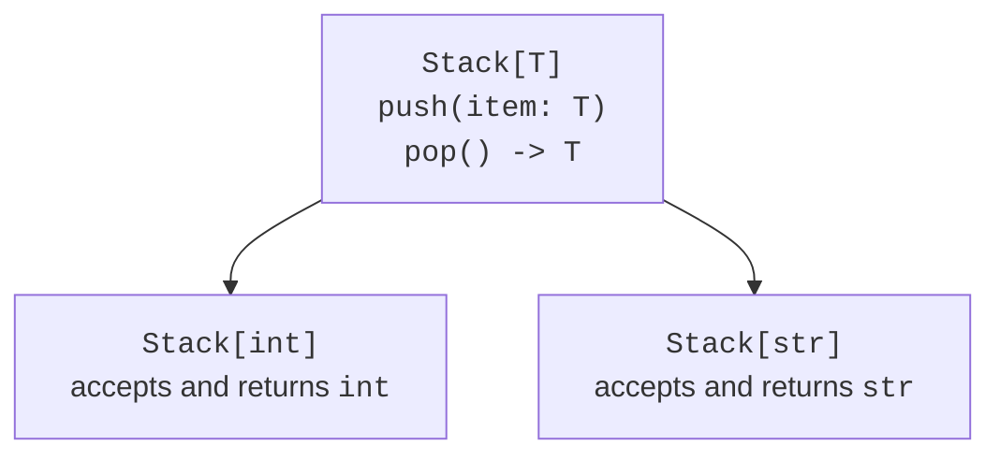

# Generic types and protocols

## Example 2. Generic collections

Generics link the input type to the output type. The function `first[T]` returns exactly the element type, not an arbitrary `object`. A type parameter is not an argument that the user enters in the CLI. The PEP 695 syntax is available in Python 3.12+, and default values for type parameters in Python 3.13+.

```py
from collections.abc import Sequence


type Pair[T] = tuple[T, T]


def first[T](items: Sequence[T]) -> T:
    if not items:
        raise ValueError("Empty sequence")
    return items[0]


class Stack[T = str]:
    def __init__(self) -> None:
        self._items: list[T] = []

    def push(self, item: T) -> None:
        self._items.append(item)

    def pop(self) -> T:
        if not self._items:
            raise IndexError("Empty stack")
        return self._items.pop()


def main() -> None:
    numbers = Stack[int]()
    numbers.push(first([10, 20]))
    numbers.push(30)
    print(numbers.pop(), numbers.pop())
    pair: Pair[str] = ("code", "test")
    print(first(pair))


if __name__ == "__main__":
    main()
```

Output: `30 10`, then `code`. In `Stack[int]`, the `push` method accepts an `int`, and `pop` returns an `int`. An attempt to `push("x")` violates the static contract, but Python itself does not add type checking at run time. The absence of a mypy check cannot be compensated for by a single successful run.



Figure 16.5. A type parameter and a concrete stack {.caption}

The constraint `[T: (int, float)]` means choosing one of the listed types; the bound `[T: SomeProtocol]` allows types that satisfy the contract. This is not a check of a numeric range. Do not add a type parameter if it does not link the result to anything: an ordinary protocol is often sufficient.

Older projects contain `TypeVar` and `Generic[T]`. Keep a consistent style within a single definition. For Python 3.14 course projects, we use the new syntax; the old one is needed primarily for reading dependencies.


Figure 16.6. Checking the argument type of a generic stack {.caption}

## Example 3. A repository as a structural contract

A protocol describes operations, not the storage method. A repository consumer can work with an in-memory or an SQLite implementation as long as both follow the contract. The type `T | None` forces you to handle a missing record before accessing its fields.

```py
from dataclasses import dataclass
from typing import Protocol


class Repository[T](Protocol):
    def get(self, key: int) -> T | None: ...


@dataclass(frozen=True)
class Book:
    title: str


class MemoryBooks:
    def __init__(self) -> None:
        self._books = {1: Book("Python")}

    def get(self, key: int) -> Book | None:
        return self._books.get(key)


def title(repo: Repository[Book], key: int) -> str:
    book = repo.get(key)
    return "not found" if book is None else book.title


def main() -> None:
    repo = MemoryBooks()
    print(title(repo, 1))
    print(title(repo, 2))


if __name__ == "__main__":
    main()
```

Output: `Python`, then `not found`. `MemoryBooks` does not need to inherit from `Repository`: mypy matches the structure of the methods. This does not eliminate the need to test the actual behavior, such as the absence of accidental changes to stored data or correct closing of a connection.
