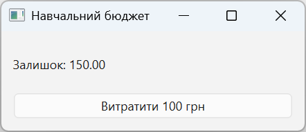

# Practice

## Example 1. Console CSV statistics

Let us create a `csv_stats` package with the `csv-stats` entry point. The input UTF-8 CSV contains only a `value` column and 1–1000 finite numbers from −1000000 to 1000000. We will output the count and the mean. The entire file is validated before the summary is printed.

The file `src/csv_stats/__init__.py` is empty; in `cli.py`:

```py
import argparse
import csv
from math import isfinite
from pathlib import Path
from statistics import mean


def read_values(path: Path) -> list[float]:
    with path.open(encoding="utf-8", newline="") as source:
        reader = csv.DictReader(source)
        if reader.fieldnames != ["value"]:
            raise ValueError("A value column is required")
        values: list[float] = []
        for row in reader:
            if set(row) != {"value"} or row["value"] is None:
                raise ValueError("Invalid row")
            value = float(row["value"])
            if not isfinite(value) or abs(value) > 1e6:
                raise ValueError("Number out of range")
            values.append(value)
            if len(values) > 1000:
                raise ValueError("Too many rows")
    if not values:
        raise ValueError("No data")
    return values


def main() -> int:
    parser = argparse.ArgumentParser(description="CSV mean")
    parser.add_argument("input", type=Path)
    args = parser.parse_args()
    try:
        values = read_values(args.input)
    except (OSError, ValueError) as error:
        parser.error(str(error))
    print(f"n={len(values)}; mean={mean(values):.2f}")
    return 0


if __name__ == "__main__":
    raise SystemExit(main())
```

The parentheses in `except` are required because there is `as error`. Without binding a variable, Python 3.14 allows the form `except OSError, ValueError:`. Do not carry this rule over to older interpreter versions.

The metadata uses the same Hatchling backend:

```toml
[build-system]
requires = ["hatchling"]
build-backend = "hatchling.build"
[project]
name = "course-csv-stats"
version = "0.1.0"
requires-python = ">=3.14"
[project.scripts]
csv-stats = "csv_stats.cli:main"
[tool.hatch.build.targets.wheel]
packages = ["src/csv_stats"]
```

For `value`, `2`, `4`, `6` on separate lines, the result is `n=3; mean=4.00`. Build the wheel and install it into a clean environment outside the sources, as in the lecture. Check `--help`, a missing file, an empty dataset, `nan`, an extra column, and 1001 rows. The corresponding errors must produce exit code 2 without a partial successful summary. To install via uv, use `uv tool install` with the exact path to the local wheel.

## Example 2. A typed LRU cache

The cache holds at most `capacity` pairs. Reading makes a key the most recent, and adding to a full cache evicts the oldest one. A repeated key updates the value and does not increase the number of pairs. The key must be hashable; a missing key raises `KeyError`.

```py
from collections import OrderedDict
from collections.abc import Hashable


class LRU[K: Hashable, V]:
    def __init__(self, capacity: int) -> None:
        if capacity < 1:
            raise ValueError("Capacity must be positive")
        self._capacity = capacity
        self._data: OrderedDict[K, V] = OrderedDict()

    def get(self, key: K) -> V:
        value = self._data[key]
        self._data.move_to_end(key)
        return value

    def put(self, key: K, value: V) -> None:
        self._data[key] = value
        self._data.move_to_end(key)
        if len(self._data) > self._capacity:
            self._data.popitem(last=False)


def main() -> None:
    cache = LRU[str, int](2)
    cache.put("a", 10)
    cache.put("b", 20)
    print(cache.get("a"))
    cache.put("c", 30)
    try:
        cache.get("b")
    except KeyError:
        print("b evicted")


if __name__ == "__main__":
    main()
```

The result is `10`, then `b evicted`. Save it as `lru.py`. The file `test_lru.py` checks behavior, not private fields:

```py
import pytest

from lru import LRU


def test_access_changes_order() -> None:
    cache = LRU[str, int](2)
    cache.put("a", 1)
    cache.put("b", 2)
    assert cache.get("a") == 1
    cache.put("c", 3)
    with pytest.raises(KeyError):
        cache.get("b")


def test_update() -> None:
    cache = LRU[str, int](1)
    cache.put("a", 1)
    cache.put("a", 9)
    assert cache.get("a") == 9


def test_capacity() -> None:
    with pytest.raises(ValueError):
        LRU[str, int](0)
```

Run pytest and `mypy --strict lru.py`. In a separate negative file, pass a `str` instead of an `int` value: static analysis must reject the call. A deliberately negative example is not added to the project's passing set of checks.

## Example 3. A PySide6 budget with a resource

The application shows the balance in integer kopiykas and deducts 100 UAH. The initial value is stored in the file `defaults.json` next to `budget.py`. This is a learning model that does not persist operations between runs. The resource file contains `{"cents": 25000}`.

```py
import json
import sys
from pathlib import Path

from PySide6.QtWidgets import (
    QApplication, QLabel, QPushButton, QVBoxLayout, QWidget,
)


def initial_cents() -> int:
    path = Path(__file__).with_name("defaults.json")
    data = json.loads(path.read_text(encoding="utf-8"))
    if not isinstance(data, dict):
        raise ValueError("An object is required")
    value = data.get("cents")
    if type(value) is not int or not 0 <= value <= 1000000:
        raise ValueError("Invalid balance")
    return value


class Budget(QWidget):
    def __init__(self) -> None:
        super().__init__()
        self.cents = initial_cents()
        self.setWindowTitle("Training budget")
        self.label = QLabel()
        self.button = QPushButton("Spend 100 UAH")
        self.button.clicked.connect(self.spend)
        layout = QVBoxLayout(self)
        layout.addWidget(self.label)
        layout.addWidget(self.button)
        self.refresh()

    def refresh(self) -> None:
        self.label.setText(f"Balance: {self.cents / 100:.2f}")
        self.button.setEnabled(self.cents >= 10000)

    def spend(self) -> None:
        if self.cents >= 10000:
            self.cents -= 10000
        self.refresh()


def main() -> int:
    app = QApplication(sys.argv)
    window = Budget()
    if "--smoke" in sys.argv:
        before = window.cents
        window.spend()
        expected = before - 10000 if before >= 10000 else before
        return 0 if window.cents == expected else 1
    window.show()
    return app.exec()


if __name__ == "__main__":
    raise SystemExit(main())
```

The resource is located relative to `__file__`, not the current directory. Writable user data should be stored separately, for example via `QStandardPaths`; the resource directory is not a database. Validate the JSON before creating the package. For better diagnostics, the initial build has a console:

```powershell
python -m PyInstaller --clean --onedir --name Budget `
  --add-data "defaults.json:." budget.py
dist\Budget\Budget.exe --smoke
```

Build in a separate environment. On Windows, third-party tools in `PATH` sometimes add incompatible Qt or ICU DLLs. While testing this lab, it was precisely a third-party ICU that caused a QtWidgets import error. To isolate the paths, save the `build_budget.py` shown below next to the program and run it with the Python interpreter of the environment where PySide6 and PyInstaller are installed:

```py
import os
import subprocess
import sys
from pathlib import Path

env = os.environ.copy()
system = Path(os.environ["SystemRoot"])
env["PATH"] = os.pathsep.join(map(str, [
    Path(sys.executable).parent, Path(sys.base_prefix),
    system / "System32", system,
]))
for key in ("QT_PLUGIN_PATH", "QT_QPA_PLATFORM_PLUGIN_PATH",
            "PYTHONPATH", "PYTHONHOME"):
    env.pop(key, None)
subprocess.run([
    sys.executable, "-m", "PyInstaller", "--clean",
    "--onedir", "--name", "BudgetClean",
    "--workpath", "build-clean", "--distpath", "dist-clean",
    "--add-data", "defaults.json:.", "budget.py",
], env=env, cwd=Path(__file__).parent, check=True)
```

This helper file is intended for Windows. It changes the environment of the child process only. Check `dist-clean/BudgetClean/BudgetClean.exe --smoke` from a different directory. Changing PATH only at launch will not fix an incorrect DLL that is already bundled; a new build is required.

After a successful check, you can add `--windowed`. Include `defaults.json` at the same relative path as in the code. Run the exe from a different working directory. Separately check the button, the label, the ban on a negative balance, and a missing resource on a copy of the build. `--smoke` is a quick logic check; it does not replace a review of the window and testing on the target computer.



Figure 16.9. The budget launched from a PyInstaller build {.caption}
