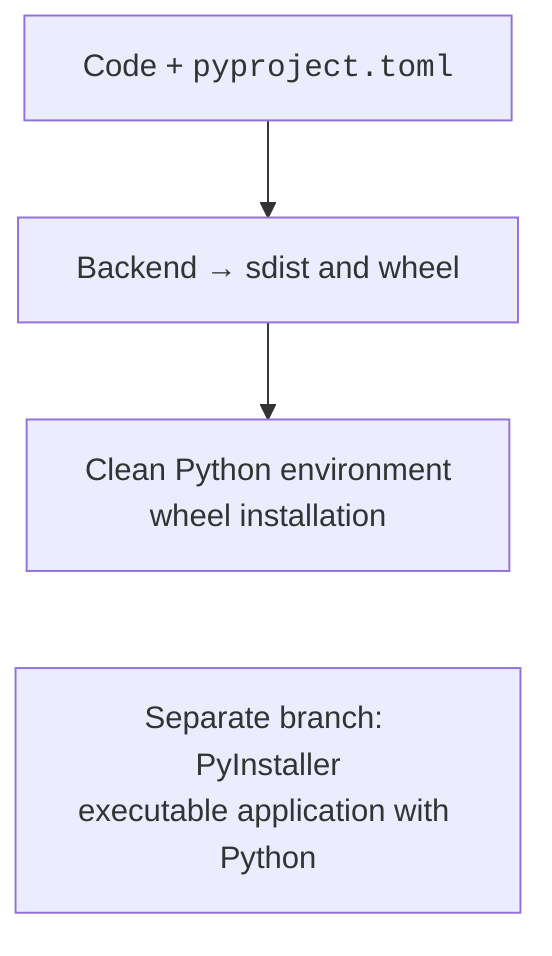
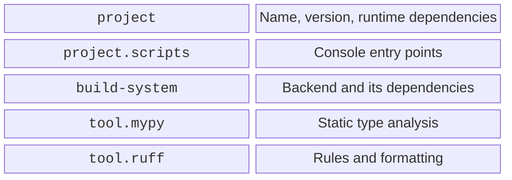

# Packages, distributions, and pyproject.toml

## Import packages and distributions

An import package is a directory of modules, such as `units_converter`. A distribution is a unit of installation with a name and a version; its name may contain a hyphen: `units-converter`. The names do not have to match. One distribution can contain several packages.

An **sdist** contains the sources and metadata needed for building; a **wheel** contains prepared files for installation. A wheel is not a self-contained executable: an ordinary Python package requires a suitable interpreter and its dependencies. The tags in a wheel's name describe the Python version, the ABI, and the platform. A pure Python package can have the tag `py3-none-any`, while a package with machine code has specific tags.



Figure 16.1. Two ways to deliver a program {.caption}

An isolated build installs the backend's dependencies into a temporary environment. This is a different environment from the one where the tests run. Having a library in PyCharm does not guarantee that it is declared in the metadata. Likewise, a local `import` from the repository root does not prove that the required module made it into the wheel.

PyPA guide: <https://packaging.python.org/en/latest/tutorials/packaging-projects/>. In this lab, building and checking a wheel locally is mandatory; an account and publication to an external registry are not required.

## Project structure and pyproject.toml

Placing code in `src/` helps detect installation errors: the current directory does not shadow the installed package. In the example, we will create a converter of a nonnegative finite length from meters to centimeters. The result is rounded only when printed.

```text
units-project/
  pyproject.toml
  README.md
  src/
    units_converter/
      __init__.py
      cli.py
      py.typed
  tests/
    test_units.py
```

An empty `py.typed` file indicates to the package's consumers that it includes annotations. In `README.md`, record the purpose, requirements, installation command, and the example `units-convert 1.25`. The metadata file:

```toml
[build-system]
requires = ["hatchling"]
build-backend = "hatchling.build"

[project]
name = "units-converter"
version = "0.1.0"
description = "A training length converter"
readme = "README.md"
requires-python = ">=3.14"
dependencies = []

[project.scripts]
units-convert = "units_converter.cli:main"

[project.optional-dependencies]
dev = ["pytest", "mypy", "ruff", "build", "hatchling"]

[tool.hatch.build.targets.wheel]
packages = ["src/units_converter"]

[tool.mypy]
python_version = "3.14"
strict = true

[tool.ruff]
target-version = "py314"
line-length = 70

[tool.ruff.lint]
select = ["E4", "E7", "E9", "F", "I", "B", "UP"]
```

`[project]` describes the distribution, and `[build-system]` describes how it is built. The entry point refers to a function without parentheses: the installer creates a command that calls `main()` and passes its result as the exit code. Do not write paths to a local `python.exe` or the author's environment in the metadata.



Figure 16.2. The purpose of the pyproject.toml sections {.caption}

`dependencies` are needed by the user. The `dev` extra is chosen here for a simple `pip install -e ".[dev]"`. An alternative for a uv project is `[dependency-groups]` with a `dev` group; this group does not become a dependency of the user's wheel. Do not duplicate the two schemes without need. The `authors` and `license` fields should be filled in with real data and the chosen license.

## Example 1. A library and a console entry point

The file `src/units_converter/__init__.py`:

```py
from math import isfinite


def to_centimetres(metres: float) -> float:
    if not isfinite(metres) or not 0 <= metres <= 1e6:
        raise ValueError("Length must be from 0 to 1000000 m")
    return metres * 100
```

The file `src/units_converter/cli.py`:

```py
import argparse

from units_converter import to_centimetres


def main() -> int:
    parser = argparse.ArgumentParser(description="Meters → cm")
    parser.add_argument("metres", type=float)
    args = parser.parse_args()
    try:
        result = to_centimetres(args.metres)
    except ValueError as error:
        parser.error(str(error))
    print(f"{result:.2f} cm")
    return 0


if __name__ == "__main__":
    raise SystemExit(main())
```

The module does not read arguments on import. `argparse` generates `--help`, validates the number, and reports invalid input to `stderr` with exit code 2. The contract of the domain function is independent of the CLI, so it is easy to reuse in a GUI application. For `1.25`, the command prints `125.00 cm` and returns exit code 0.

The file `tests/test_units.py`:

```py
import pytest

from units_converter import to_centimetres


def test_conversion() -> None:
    assert to_centimetres(1.25) == pytest.approx(125)
    assert to_centimetres(0) == 0


@pytest.mark.parametrize("value", [-1, float("nan"), 1e7])
def test_invalid(value: float) -> None:
    with pytest.raises(ValueError):
        to_centimetres(value)
```

The upper limit is part of the contract of this training example and prevents excessively large results. The `float` annotation does not check finiteness or the range; that is the job of executable code.
