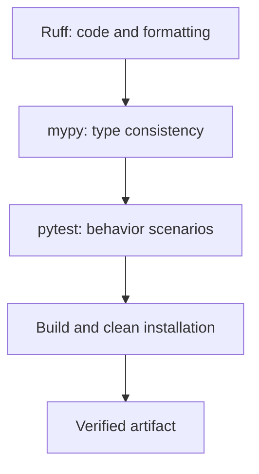

# Static analysis and releases

## More precise annotations and the limits of static checking

`TypedDict` describes the keys of a dictionary; `Literal` a finite set of values; `Final` a ban on reassignment for the type checker; and `Self` the type of the current class in methods that return the object. They do not make JSON data automatically reliable. The result of external reading is validated before a typed model is built.

```py
from typing import Final, Literal, TypedDict


class Options(TypedDict):
    mode: Literal["short", "full"]
    limit: int


MAX_LIMIT: Final = 100


def describe(options: Options) -> str:
    if not 1 <= options["limit"] <= MAX_LIMIT:
        raise ValueError("Limit out of range")
    return f"{options['mode']}: {options['limit']}"


print(describe({"mode": "short", "limit": 5}))
```

The result is `short: 5`. `@overload` describes several static signatures, but a single implementation is still required after them. `TypeIs` lets a predicate function narrow the type in both branches; the predicate's body must actually check the corresponding property. `cast` merely tells the type checker the author's assumption and converts nothing. Do not use it instead of validation.

A decorator can preserve a function's parameters with `ParamSpec`, written in the new syntax as `**P`:

```py
from collections.abc import Callable
from functools import wraps


def logged[**P, T](func: Callable[P, T]) -> Callable[P, T]:
    @wraps(func)
    def wrapper(*args: P.args, **kwargs: P.kwargs) -> T:
        print("Calling", func.__name__)
        return func(*args, **kwargs)

    return wrapper


@logged
def square(value: int) -> int:
    return value * value


print(square(4))
```

Output: `Calling square`, then `16`. `Callable[..., Any]` would lose argument checking, whereas here the call `square("x")` remains statically invalid. The complexity of the annotation is justified by preserving the real contract.

## Example 4. Pre-release checks

Tests check selected execution scenarios. mypy checks type consistency without running the program. Ruff finds selected style and logic problems; the formatter stabilizes the code layout. No tool proves that a domain formula is correct.

For a controlled experiment, create a separate `bad.py`:

```py
value: int = "10"
print(value + 1)
```

`python -m mypy --strict bad.py` must exit with a nonzero code and report an incompatible assignment. This is a deliberately wrong example: it is not included in the package. The fix `value: int = 10` removes the cause; `Any` or disabling the analysis entirely would only hide it.

::: info Screenshot
An illustration will be added.
:::

Figure 16.7. mypy diagnostics and successful package checks {.caption}

`ruff check --fix` modifies files, so review the diff after running it. Unsafe automatic fixes should not be enabled without analysis. `ruff format --check` only checks the formatting, while `ruff format` applies it. The selected rules `E4,E7,E9,F,I,B,UP` cover errors, imports, and modernization; the width of printed listings is additionally checked in the PDF.

When adopting mypy gradually, start with the domain layer, then type the boundaries of the CLI, files, and database. If an exception is necessary, use a specific `type: ignore[code]` with an explanation. PyCharm, pyright, and other analyzers may have different sets of checks. For a reproducible defense, one main tool and its version are defined: mypy in the project environment.

## Automation and the final check

pre-commit hooks run checks before a local commit, but they can be skipped. CI repeats them in a clean environment. A green status applies to a specific commit and set of checks; it is not permission to publish or a guarantee that there are no errors.



Figure 16.8. The sequence of artifact checks {.caption}

For the project shown, the file `.github/workflows/ci.yml` can contain the following minimal workflow. The example requires no secrets and does not publish artifacts to a registry.

```yaml
name: Python checks
on: [push, pull_request]
permissions:
  contents: read
jobs:
  check:
    runs-on: windows-latest
    steps:
      - uses: actions/checkout@v7
      - uses: actions/setup-python@v7
        with:
          python-version: '3.14'
      - run: python -m pip install -e ".[dev]"
      - run: python -m ruff check .
      - run: python -m ruff format --check .
      - run: python -m mypy src
      - run: python -m pytest -q
      - run: python -m build
```

In a uv project, the installation can be replaced with `uv sync --locked`, and running the tools with `uv run --locked ...`; uv itself must also be installed in CI. For strict reproducibility, pin the tool versions and action revisions. The major tags shown were checked against the official repositories as of the date this material was prepared.

The README must explain installation, units, examples, errors, and how to verify the program. `.gitignore` excludes environments, caches, `build/`, `dist/`, and local settings. Artifacts are delivered separately from the code. A release is verified from a clean installation, and an executable is also verified from a different working directory.
