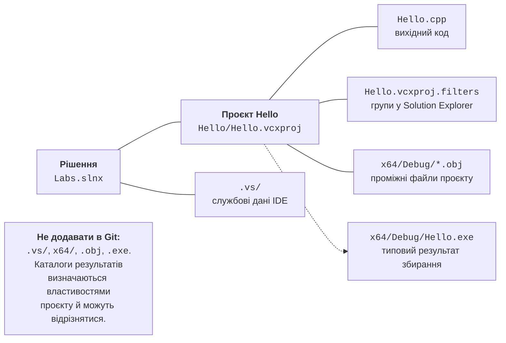
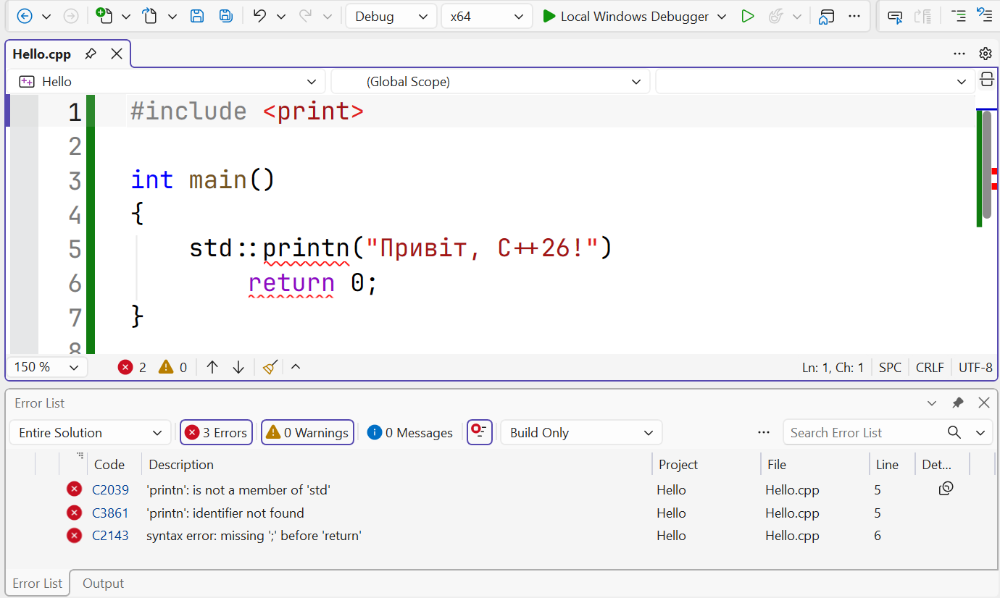

# Збирання та налагодження

## Рішення, проєкт і файли на диску

**Рішення** (*solution*) групує проєкти; **проєкт** (*project*) визначає список
початкових файлів і правила отримання результату. Наприклад, рішення `Labs`
може містити `Hello` і майбутні лабораторні проєкти. Рішення має файл `.slnx`
або `.sln`, залежно від формату збереження. Файл `.vcxproj` зберігає параметри
C++-проєкту, а `.vcxproj.filters` – логічне групування файлів у
*Solution Explorer*. Папка *Source Files* в IDE не обов’язково є окремою
папкою на диску (рис. 1.13).



Рис. 1.13. Рішення, початкові та згенеровані файли {.caption}

Папка `.vs` містить локальні службові дані IDE. Каталоги на зразок
`x64/Debug` і `x64/Release` містять результати збирання; точні шляхи задають
властивості *Output Directory* та *Intermediate Directory*. Об’єктний файл
`.obj` може бути в іншій папці, ніж готовий `.exe`. Не переміщуйте їх вручну,
щоб «виправити» проєкт: після наступного збирання система знову використає
налаштовані каталоги. Початкові `.cpp`, проєкт і рішення слід зберігати в Git,
а згенеровані результати й `.vs` – ігнорувати.

### Приклад 2. Візитка з вирівнюванням

У цьому прикладі дані задані в коді; введення з клавіатури не потрібне.
Створіть окремий консольний проєкт або замініть вміст наявного файла.
В одному виконуваному проєкті залишайте лише одну функцію `main`.

```cpp
#include <print>

int main()
{
    std::println("+------------------------------+");
    std::println("| {:<28} |", "Студент: Олена Коваль");
    std::println("| {:<28} |", "Група: КН-24");
    std::println("| {:<28} |", "Курс: C++26");
    std::println("+------------------------------+");
    return 0;
}
```

`{}` є місцем підстановки наступного аргументу. Після двокрапки можна
вказати правила форматування: `<` вирівнює ліворуч, а `28` задає мінімальну
ширину поля. Пробіл до та після поля формує відступ від рамки. Ширина
не обрізає довший текст: якщо назва не вміщується, рамку слід розширити.
Результат для наведених даних:

```text
+------------------------------+
| Студент: Олена Коваль        |
| Група: КН-24                 |
| Курс: C++26                  |
+------------------------------+
```

Кількість полів і типи аргументів повинні узгоджуватися з форматом.
Щоб вивести саму фігурну дужку, подвоюють її в рядку формату: <code v-pre></code>.
Для вирівнювання таблиць використовуйте моноширинний шрифт. Складні символи
Unicode можуть мати особливу ширину відображення, тому перевіряйте фактичний
вигляд рамки в терміналі, а не рахуйте лише байти UTF-8.

### Приклад 3. Площа кімнати та вартість ремонту

Нехай довжина кімнати дорівнює 5 м, ширина – 4 м, а вартість обробки
квадратного метра – 250 грн. Програма обчислює площу, периметр і вартість
обробки підлоги. Значення задані в коді, тому всі запуски з тими самими
даними дають однаковий результат.

```cpp
#include <print>

int main()
{
    const double length = 5.0;
    const double width = 4.0;
    const double price = 250.0;
    const double area = length * width;
    const double perimeter = 2.0 * (length + width);
    const double total = area * price;

    std::println("Площа: {:.2f} м²", area);
    std::println("Периметр: {:.2f} м", perimeter);
    std::println("Вартість: {:.2f} грн", total);
    return 0;
}
```

`double` зберігає числа з дробовою частиною; `const` забороняє змінювати
значення після початкового присвоєння. Імена `length`, `width` і `price`
роблять формулу зрозумілішою за набір чисел. Операція `*` означає множення,
а круглі дужки задають порядок обчислень. `{:.2f}` друкує число у фіксованому
форматі з двома цифрами після крапки. Це змінює подання результату, а не
точність усіх попередніх обчислень.

```text
Площа: 20.00 м²
Периметр: 18.00 м
Вартість: 5000.00 грн
```

Для навчальної геометрії `double` зручний. Для точного грошового обліку
потрібно окремо визначати подання сум і правила округлення: більшість
десяткових дробів не подаються точно двійковим числом з рухомою крапкою.
Наведені цілі значення не демонструють усіх таких похибок. Зміна виведення
на три знаки після крапки сама по собі не робить фінансовий алгоритм точним.

::: tip Самоперевірка
Змініть ширину на 3.5 м. Спочатку обчисліть результат вручну, потім
перебудуйте програму. Поясніть, які рядки результату мають змінитися.
Якщо результат залишився старим, перевірте збереження файла і журнал збирання.
:::

## Помилки, попередження та налагодження

**Помилка компіляції** означає, що компілятор не може прийняти програму.
Наприклад, запис `std::printn` замість `std::println` містить невідоме
ім’я члена простору `std` (типова діагностика C2039). C2065 повідомляє про
неоголошений ідентифікатор, а C2143 – про синтаксичну помилку на зразок
пропущеного символу. Номер рядка часто показує місце, де помилку помітили,
а не місце її справжньої причини. Відсутня `;` може проявитися на наступному рядку.



Рис. 1.14. Повідомлення компілятора у вікні Error List {.caption}

**Помилка компонування** виникає після компіляції. Наприклад, функцію
оголошено й викликано, але її визначення не потрапило до збірки. MSVC може
повідомити LNK2019 (*unresolved external symbol*). Додавання крапки з комою
не розв’яже проблему відсутньої реалізації. Перевірте, чи потрібний `.cpp`
належить проєкту, чи не виключений зі збирання і чи правильно записане ім’я.

**Попередження** (*warning*) не завжди зупиняє збирання, але вказує на
можливий дефект. Не вимикайте `/W4`, щоб отримати порожній список:
прочитайте повідомлення й виправте причину. Підказки **IntelliSense** під час
редагування корисні, проте остаточним свідченням є результат реального
збирання. У *Error List* можна обрати джерело *Build*, а в *Output* –
переглянути повний протокол, включно з командою та шляхами.

Практичний порядок виправлення: збережіть файл, запустіть збирання,
прочитайте першу змістовну помилку, відкрийте її рядок подвійним клацанням,
перевірте також попередні рядки, зробіть одну зрозумілу зміну і перебудуйте.
Десятки повідомлень часто є наслідком однієї пропущеної дужки. Якщо IDE
пропонує запустити останню успішну збірку після невдалого збирання, відмовтеся:
її результат не перевіряє щойно змінений текст.

**Логічна помилка** не порушує синтаксису, але дає неправильну відповідь.
Наприклад, `length + width` замість `length * width` правильно компілюється,
проте не обчислює площу. Поставте точку зупинки (**F9**) перед виведенням
прикладу 3, запустіть **F5** і перегляньте `area` у *Locals*. **F10** виконує
наступний рядок, **F5** продовжує, а **Shift+F5** завершує налагодження.
Ручний розрахунок для простих даних є незалежною перевіркою формули.

## Збирання з командного рядка

IDE приховує багато деталей, але викликає окремі інструменти. **Developer
PowerShell for VS 2026** налаштовує змінні середовища так, щоб знаходилися
`cl.exe`, компонувальник, заголовки й бібліотеки. Відкрийте його через меню
*Tools → Command Line → Developer PowerShell* або відповідний ярлик.
Звичайний PowerShell без цього налаштування може не знати команду `cl`.
Документація: <https://learn.microsoft.com/cpp/build/building-on-the-command-line>.

### Приклад 4. Та сама програма без проєкту IDE

Створіть папку `D:\Labs\cli` та збережіть у ній файл `hello.cpp` з повним
кодом прикладу 1, включно з `#include <print>`. Перейдіть до цієї папки
й виконайте команди. Тут використовується форма із заголовком;
для `import std;` потрібне окреме збирання модулів, описане в документації.

```powershell
Set-Location D:\Labs\cli
cl /std:c++latest /EHsc /utf-8 /W4 /permissive- hello.cpp
.\hello.exe
$LASTEXITCODE
```

`cl` без `/c` виконує також компонування. Ключі починаються з `/`, а останній
аргумент є початковим файлом. Запуск `.\hello.exe` означає файл із поточної
папки; PowerShell не зобов’язаний шукати виконувані файли тут без явного
префікса. Після повідомлень компілятора результат запуску і код завершення:

```text
Привіт, C++26!
0
```


Рис. 1.15. Компіляція та запуск у Developer PowerShell {.caption}

Перевіряйте `$LASTEXITCODE` одразу після потрібної зовнішньої команди:
наступний виклик може змінити значення. Якщо `cl` завершився невдало,
не запускайте залишений від попередньої збірки `hello.exe`. Для лабораторної
роботи збережіть команду в README разом із версією компілятора, яку видно
в його заголовку. Не переписуйте чужий номер версії як результат власної
перевірки. Командний рядок і IDE повинні використовувати узгоджені ключі.
