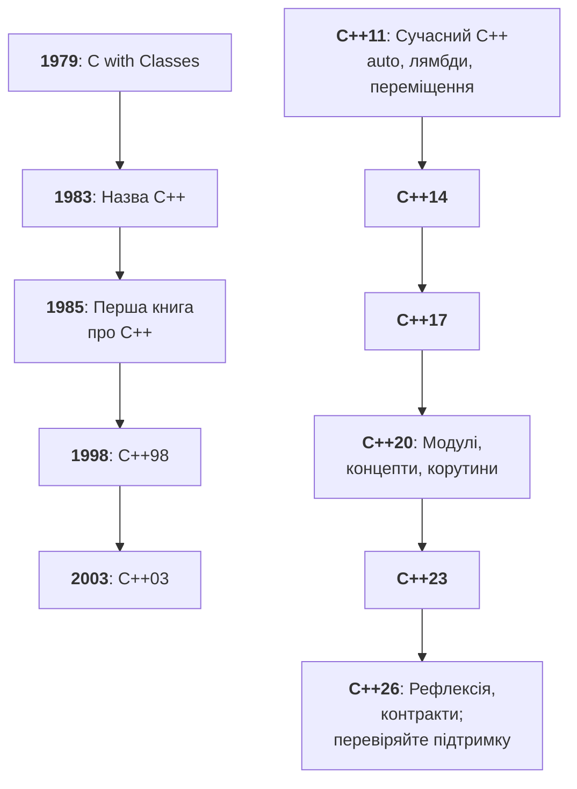
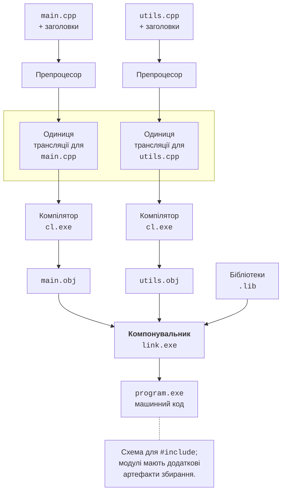

# Мова C++ і стандарти

## Мова C++: призначення та історія

**C++** (вимовляють «сі-плюс-плюс») – мова програмування загального призначення
зі статичною типізацією. **Тип** визначає, які значення може зберігати об’єкт і які
операції дозволені над ним. Компілятор перевіряє значну частину цих правил до
запуску програми. Наприклад, число можна помножити на інше число, але текстова
назва кімнати не є числовою довжиною. Такі відмінності потрібно виражати в коді.

Б’ярне Страуструп розпочав роботу над *C with Classes* у 1979 році. Він поєднав
можливість працювати близько до апаратури, властиву C, з класами для опису
складних систем. Назва C++ з’явилася у 1983 році; у 1985 році вийшла перша
редакція книги *The C++ Programming Language*. Знак `++` у мові означає
збільшення значення на одиницю. Історію та матеріали автора наведено на
<https://www.stroustrup.com/>, а розвиток стандартів показано на рис. 1.1.

Рис. 1.1. Етапи розвитку C++ та стандартів мови {.caption}

C++ підтримує кілька способів організації програми. **Процедурне програмування**
розкладає задачу на функції; **об’єктно-орієнтоване** поєднує дані та операції
у класи; **узагальнене** дає змогу писати алгоритми для різних типів. Тому перша
програма може складатися лише з функції `main`: оголошувати власний клас для
кожного консольного прикладу не потрібно. До класів курс переходить після
засвоєння змінних, функцій, посилань і керування пам’яттю.

Мову застосовують у системному програмному забезпеченні, ігрових рушіях,
вбудованих пристроях, обробці зображень і високопродуктивних обчисленнях.
Спільна вимога цих задач – контроль витрат пам’яті та часу. Водночас швидкість
не виникає автоматично від вибору мови: невдалий алгоритм залишиться повільним.
Контроль ресурсів потребує дисципліни, перевірок та використання бібліотек.

Таблиця 1.1. C++ у порівнянні з іншими мовами {.caption}

| Мова | Відмінність, важлива на початку навчання |
| --- | --- |
| C | Має спільне з C++ синтаксичне походження, але є окремою мовою. Не кожна програма C є коректною програмою C++. |
| C++ | Звичайна збірка утворює машинний код для обраної платформи. Час життя об’єктів і володіння ресурсами є частиною проєктування. |
| C# | Застосунки часто працюють у середовищі .NET зі збирачем сміття; існує також завчасна компіляція Native AOT. |
| Java | Типовий шлях передбачає байткод і JVM; синтаксична схожість не означає однакових правил пам’яті або бібліотек. |

Переносимим може бути початковий текст, якщо він не залежить від особливостей
операційної системи. Готовий файл Windows `.exe` не стає застосунком Linux
після копіювання: потрібні відповідний компілятор, бібліотеки й нове збирання.
Однаковий текст також може виявити помилки на іншому компіляторі, якщо він
спирався на нестандартне розширення. У курсі основною перевіреною платформою
є Windows 11, Visual Studio 2026 і MSVC для x64.

## Стандарти мови та підтримка компіляторами

**Стандарт** описує правила мови і стандартної бібліотеки. Над C++ працює
комітет ISO/IEC JTC1/SC22/WG21. Стандарт не є програмою, яку встановлюють:
його правила реалізують компілятори та бібліотеки. **MSVC** постачається із
засобами Microsoft; **GCC** і **Clang** – інші реалізації. Їхні номери версій
не збігаються з роком у назві C++.

Перший міжнародний стандарт – C++98; C++03 уточнив його. C++11 приніс
значне оновлення мови, а наступні редакції виходять приблизно раз на три роки.
Стислий огляд наведено в табл. 1.2. Назва стандарту позначає редакцію,
а не мінімальну дату появи всіх засобів у кожному продукті.

Таблиця 1.2. Редакції стандарту C++ {.caption}

| Редакція | Приклади можливостей |
| --- | --- |
| C++98/03 | Класи, шаблони, контейнери й алгоритми стандартної бібліотеки. |
| C++11 | `auto`, лямбда-вирази, семантика переміщення, розумні вказівники. |
| C++14/17 | Уточнення C++11, структуровані прив’язки, `std::optional`, файлові шляхи. |
| C++20 | Концепти, діапазони, корутини, модулі, `std::format`. |
| C++23 | `std::print`, `std::println`, `std::expected`, бібліотечний модуль `std`. |
| C++26 | Наступна редакція; доступність кожної можливості перевіряють за реалізацією та конкретною версією компілятора. |

Курс орієнтується на **C++26**, але це не обіцянка повної реалізації всіх його
можливостей у MSVC. Сторінка стану стандартизації
<https://isocpp.org/std/status> під час перевірки описувала C++26 як
редакцію в роботі; дату остаточної публікації ISO тут не припускаємо.
Затвердження технічного змісту, публікація ISO і випуск підтримки в MSVC –
різні події. Зокрема, `std::println` належить до **C++23**, хоча використовується
в нашому курсі C++26. Контракти й рефлексію не потрібно вмикати для цієї теми.

Ключ `/std:c++latest` обирає нові реалізовані можливості, зокрема можливості
проєкту наступного стандарту. Після оновлення засобів зміст цього режиму може
змінитися. Для відтворюваної роботи записуйте версію Visual Studio, номер
MSVC із виведення `cl` і параметри збирання. Таблицю відповідності Microsoft
публікує тут: <https://learn.microsoft.com/cpp/overview/visual-cpp-language-conformance>.

::: tip Стандарт і реалізація
Якщо компілятор не знає певного заголовка або конструкції, спочатку перевірте
версію набору засобів та обраний стандарт. Заміна назви C++23 на C++26 у
повідомленні програми не додає підтримки нових можливостей.
:::

## Як початковий текст стає програмою

Розробник зберігає **початковий текст** (*source code*) у файлі `.cpp`. Для
запуску текст необхідно перетворити на машинні інструкції. **Збирання**
(*build*) охоплює кілька етапів, які IDE запускає автоматично (рис. 1.2).
Розрізняти їх важливо: повідомлення про невідоме ім’я і про відсутнє
визначення функції виникають на різних етапах та мають різні причини.

Рис. 1.2. Від початкових файлів до виконуваної програми {.caption}

1. **Препроцесор** (*preprocessor*) обробляє директиви на зразок
  `#include <print>`. Заголовки надають оголошення та інші необхідні частини
  бібліотеки. Це не завантаження файла з інтернету під час запуску.
1. **Компілятор** (*compiler*) аналізує отриманий текст, перевіряє типи і створює
  об’єктний файл `.obj`. Один файл `.cpp` із включеним вмістом заголовків після
  препроцесування утворює **одиницю трансляції** (*translation unit*).
1. **Компонувальник** (*linker*) поєднує об’єктні файли та потрібні бібліотеки,
  узгоджує посилання між ними і створює виконуваний файл `.exe`.
1. Операційна система завантажує виконуваний файл, а стартовий код середовища
  виконання викликає функцію `main`.

Файл `.h` або `.hpp` зазвичай містить оголошення, які використовують кілька
початкових файлів. Заголовок не слід вважати окремою програмою. Наприклад,
два файли `.cpp` можуть включати спільний заголовок і компілюватися окремо,
після чого їхні `.obj` об’єднуються. Помилка в одному заголовку здатна
спричинити діагностику одразу в кількох одиницях трансляції.

Звичайній нативній програмі C++ не потрібна JVM або CLR для виконання
машинного коду. Проте їй можуть бути потрібні динамічні бібліотеки Windows
та Visual C++ Runtime. Отже, «машинний код» не означає «один файл без жодних
залежностей». Debug-збірку не використовують як спосіб розповсюдження
готового продукту; вимоги до встановлення Release-програми перевіряють окремо.
