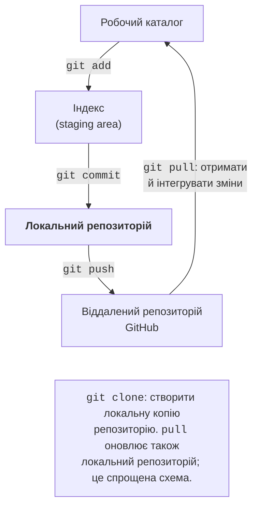
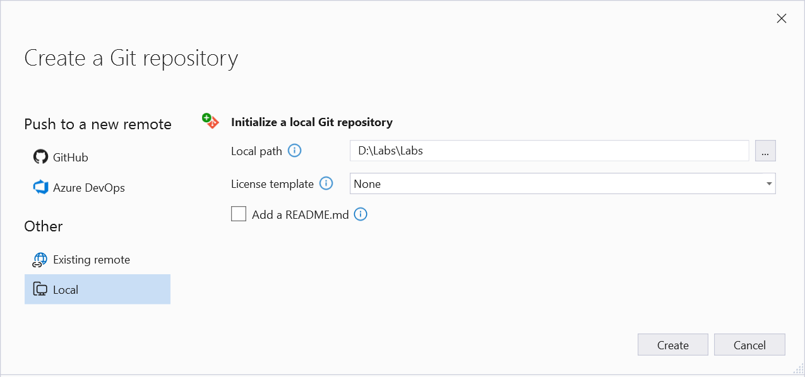
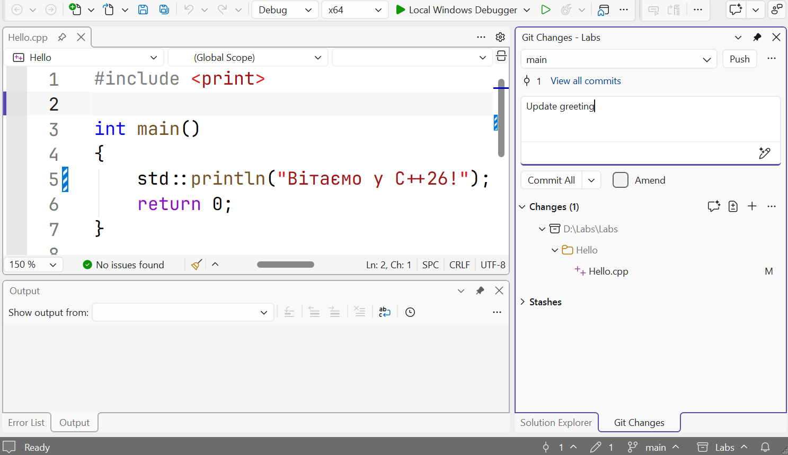
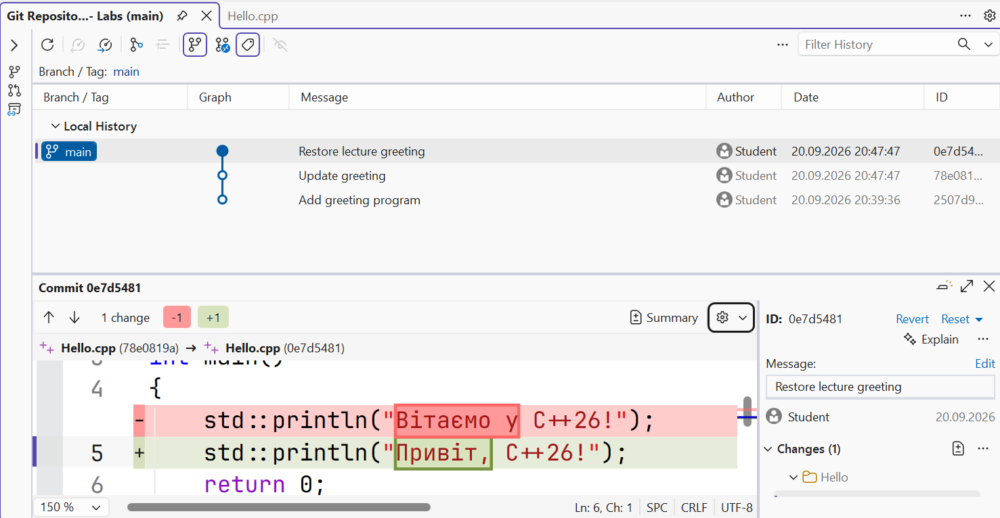

# Керування версіями Git

## Керування версіями Git

**Система керування версіями** зберігає історію змін. **Git**
(<https://git-scm.com/>) працює з локальним репозиторієм: для створення
коміту не потрібен інтернет. **GitHub** – сервіс розміщення репозиторіїв;
це не інша назва Git. Локальної історії достатньо для початку, а віддалений
репозиторій допомагає передавати роботу й співпрацювати.

**Коміт** (*commit*) зберігає підготовлений стан файлів і метадані: автора,
повідомлення та зв’язок з попередньою історією. **Індекс** (*staging area*)
дає змогу обрати зміни для наступного коміту. Збереження файла в редакторі,
додавання до індексу та створення коміту є трьома окремими діями
(рис. 1.16). Якщо змінити файл після `git add`, його потрібно додати
ще раз, щоб нова зміна також увійшла в коміт.



Рис. 1.16. Робочий каталог, індекс та репозиторії Git {.caption}

### Встановлення та початкове налаштування

Завантажте Git for Windows з <https://git-scm.com/downloads/win>.
Інсталятор дозволяє обрати редактор повідомлень і початкову назву гілки
(рис. 1.17). Для курсу використовуємо `main`. Після встановлення відкрийте
новий термінал і виконайте `git --version`. Якщо команду не знайдено,
перевірте встановлення та `PATH`, а не змінюйте початковий код C++.


Рис. 1.17. Початкові параметри Git for Windows {.caption}

Один раз налаштуйте ім’я й адресу автора. Наведені навчальні значення
замініть власними або адресою приватності, яку надає сервіс. Вони потрапляють
до історії комітів; це не пароль і не спосіб входу до GitHub.

```powershell
git config --global user.name "Student Name"
git config --global user.email "student@example.com"
git config --global init.defaultBranch main
```

`--global` поширює параметр на поточного користувача комп’ютера. На спільному
робочому місці доречне налаштування всередині репозиторію без `--global`,
щоб не підписувати роботи інших людей своїм ім’ям. Перевірити конкретне
значення можна командою `git config user.name`.

### Файл .gitignore та перший коміт

У корені рішення створіть `.gitignore` до першого `git add`. Для простого
навчального рішення достатньо таких правил:

```text
.vs/
x64/
Debug/
Release/
*.obj
*.exe
*.pdb
*.ilk
*.user
```

Файл `.gitignore` також зберігають у Git. Він визначає, які **невідстежувані**
файли не пропонувати до додавання. Якщо файл уже потрапив у коміт, нове
правило не вилучає його з історії. Файли `.cpp`, `.h`, `.vcxproj`,
`.vcxproj.filters`, `.slnx` або `.sln` є потрібними вихідними матеріалами.
Для прикладу 4 з окремим `.cpp` ці самі правила приберуть результати `cl`.

Перейдіть у корінь свого рішення, де має бути `.gitignore`. Не створюйте
репозиторій у кожній службовій підпапці. Виконайте:

```powershell
git init -b main
git status
git add .
git diff --cached
git commit -m "Add greeting program"
git log --oneline
git status
```

`git status` показує поточний стан, `git add .` готує зміни з поточної папки,
а `git diff --cached` дозволяє переглянути підготовлену різницю перед
комітом. `git log --oneline` показує стислу історію. Ідентифікатор коміту
залежить від його вмісту й метаданих, тому він не має збігатися з чужим
знімком. Після успішного коміту й за відсутності нових змін Git повідомляє
`nothing to commit, working tree clean`.


Рис. 1.18. Перший коміт у терміналі {.caption}

Змініть текст привітання, збережіть файл і виконайте `git diff`.
Команда покаже ще не підготовлені зміни. Після перевірки додайте файл і
створіть новий коміт зі змістовним повідомленням. Один коміт має відповідати
одній зрозумілій зміні, наприклад «Add formatted student card».
Повідомлення «робота» або «123» не допомагає зрозуміти історію.

### Робота з Git у Visual Studio

Для нового рішення без репозиторію виберіть *Git → Create Git Repository…*
(рис. 1.19), перевірте локальний шлях і шаблон ігнорування Visual Studio.
Локальний репозиторій можна створити без публікації. Якщо вже виконано
`git init` у цій папці, відкрийте наявний репозиторій, а не створюйте вкладений.
Публікація на GitHub є окремим рішенням користувача.



Рис. 1.19. Створення локального репозиторію в IDE {.caption}

У вікні *Git Changes* видно змінені файли й поле повідомлення
(рис. 1.20). Перегляньте різницю перед комітом. Дія *Commit All* може
включити всі зміни, тому для вибраних файлів спочатку підготуйте саме їх.
Після коміту змініть лише один рядок і порівняйте новий стан з попереднім:
це наочно показує, чим історія відрізняється від копій `final2.cpp`.



Рис. 1.20. Перегляд змін перед комітом {.caption}

Через *Git → View Branch History* відкрийте історію у *Git Repository*
(рис. 1.21). Оберіть коміт, прочитайте повідомлення й подивіться
відмінності. Не плутайте перегляд старого стану з вилученням нової роботи.
Перед командами відкидання змін перевіряйте `git status`; незакомічений
текст, який було відкинуто, може бути втрачений. У цій темі достатньо
вміти прочитати історію та пояснити кожний власний коміт.



Рис. 1.21. Історія комітів і різниця файлів {.caption}

### Віддалений репозиторій

Для добровільної публікації створіть порожній репозиторій на GitHub,
оберіть видимість і скопіюйте його адресу. Після перевірки списку файлів
додайте адресу як `origin` та відправте гілку. У прикладі нижче `USER`
та `REPOSITORY` є місцями для власних значень, а не готовим призначенням:

```powershell
git remote add origin https://github.com/USER/REPOSITORY.git
git push -u origin main
```

`push` передає коміти, а не будь-який незбережений текст редактора.
Параметр `-u` пов’язує локальну гілку з віддаленою. Автентифікацію виконуйте
через підтримуваний GitHub спосіб; не вставляйте пароль або токен у `.cpp`,
README чи адресу в команді. `git clone` створює локальну копію наявного
репозиторію, а `git pull` отримує та інтегрує віддалені зміни. Якщо сервер
відхилив `push`, спочатку прочитайте причину; примусове перезаписування
історії не є універсальним виправленням.

### Невеликий експеримент у гілці

**Гілка** (*branch*) є рухомим посиланням на коміт. Вона дозволяє розвивати
окрему зміну, не переміщуючи одразу основну гілку `main`. Перед перемиканням
збережіть поточну роботу комітом і переконайтеся, що `git status` чистий.
Для додавання нового рядка до візитки можна виконати такий цикл:

```powershell
git switch -c card-details
# Edit Hello.cpp, build and run the program.
git add Hello.cpp
git commit -m "Add card details"
git switch main
git merge card-details
git tag v1.0
```

Шлях у `git add` має відповідати розташуванню файла у вашому рішенні.
`switch -c` створює гілку й переходить у неї; `merge` інтегрує її історію
в поточну гілку. Якщо `main` не змінювалася, Git часто просто пересуває
її вказівник уперед (*fast-forward*). Якщо обидві гілки змінювали однакові
рядки, може виникнути конфлікт: його потрібно прочитати й узгодити перед
завершенням злиття. Для першої вправи робіть незалежну просту зміну.
**Тег** (*tag*) `v1.0` позначає вибраний перевірений коміт і не пересувається
автоматично з новими комітами. Звичайний `push` гілки не означає публікації
всіх локальних тегів. Деталі команд наведено в
<https://git-scm.com/docs/git-switch> та
<https://git-scm.com/docs/git-merge>.

Щоб відмовитися від **незакоміченої** зміни одного файла, спочатку перегляньте
`git diff -- Hello.cpp`. Якщо цю зміну справді не потрібно зберігати,
`git restore -- Hello.cpp` відновить робочий файл зі стану індексу.
Це відкидає незбережену в Git роботу; команда не створює страхової копії.
Для скасування вже опублікованого коміту використовують інший підхід –
новий коміт з протилежною зміною, а не стирання спільної історії.

### Як записати версію засобів у звіті

Окрім заголовка `cl`, MSVC надає наперед визначені макроси. `_MSC_VER`
позначає основну й додаткову версії компілятора, а `_MSVC_LANG` – значення
для обраного режиму стандарту. Стандартний `__cplusplus` у MSVC відображає
актуальний режим, якщо додано `/Zc:__cplusplus`; без цього ключа його
значення може зберігати історичне `199711L`. Це причина, чому одного
рядка з `__cplusplus` недостатньо для висновку про встановлений MSVC.
Документація: <https://learn.microsoft.com/cpp/preprocessor/predefined-macros>.

У програмі з `<print>` всередині `main` можна додати
`std::println("MSVC: {}", _MSC_VER);` і аналогічні рядки для інших макросів.
Запишіть фактичні значення після збирання з `/Zc:__cplusplus` у README.
Числовий макрос не замінює перевірку конкретної можливості: повноту
підтримки бібліотеки визначають за документацією та компіляцією прикладу.

## Типові проблеми початківців

Таблиця 1.3. Діагностика першої програми та репозиторію {.caption}

| Симптом | Що перевірити |
| --- | --- |
| Немає шаблону C++ | Навантаження Desktop development with C++ в Installer і фільтр мови у вікні створення проєкту. |
| `cl` не знайдено | Відкрити Developer PowerShell після встановлення MSVC; перевірити, який набір засобів активований. |
| Не знайдено `<print>` | Версію бібліотеки й набору засобів. Оновити MSVC; перевірити стандарт у потрібній конфігурації. |
| Не знайдено модуль `std` | Параметр збирання ISO C++23 modules і стандарт; для простого CLI-прикладу використати заголовок `<print>`. |
| Після зміни друкується старий текст | Збереження файла, успішність збірки, стартовий проєкт і шлях до виконуваного файла. |
| Дві функції `main` | Розмістити приклади в окремих проєктах або замінювати код одного файла; не компонувати всі приклади разом. |
| Український текст пошкоджено | UTF-8 файла, `/utf-8`, шрифт і спосіб перегляду результату; не змішувати вузькі й широкі API навмання. |
| Git просить ім’я автора | Налаштувати `user.name` та `user.email`; це окремо від входу на GitHub. |
| У Git потрапляють `.exe` і `.obj` | Правила `.gitignore` та чи не були результати збирання вже додані до відстеження. |
