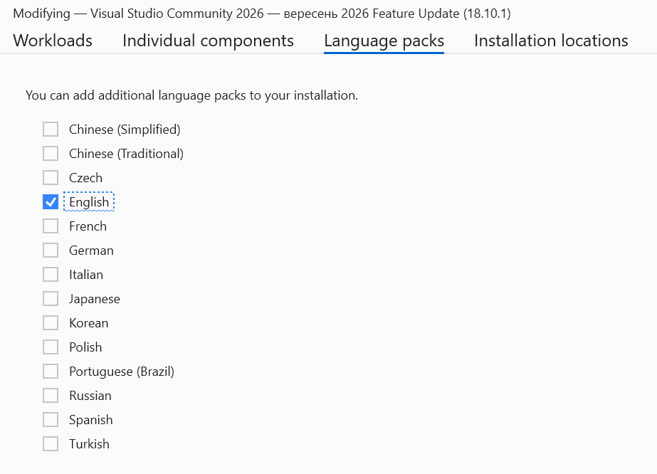
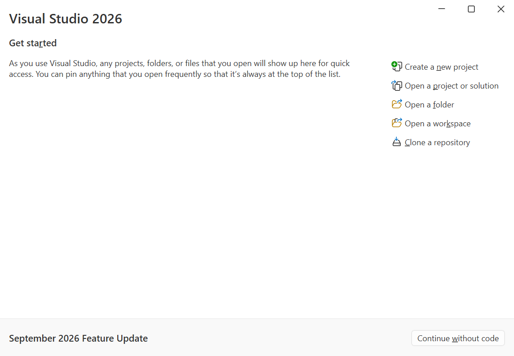
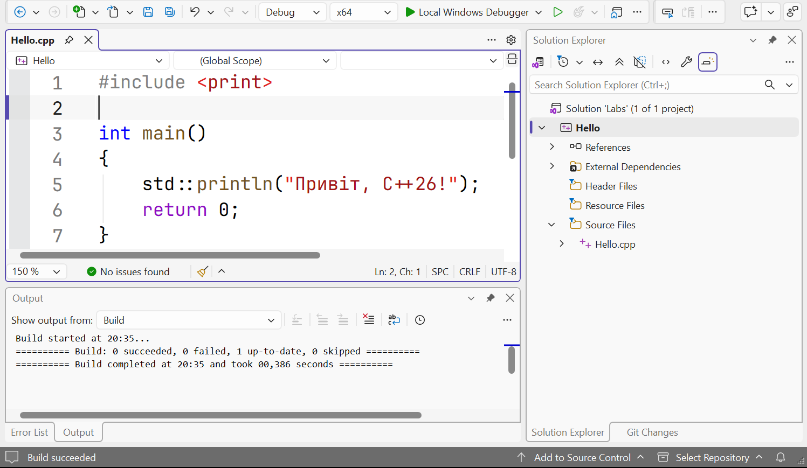
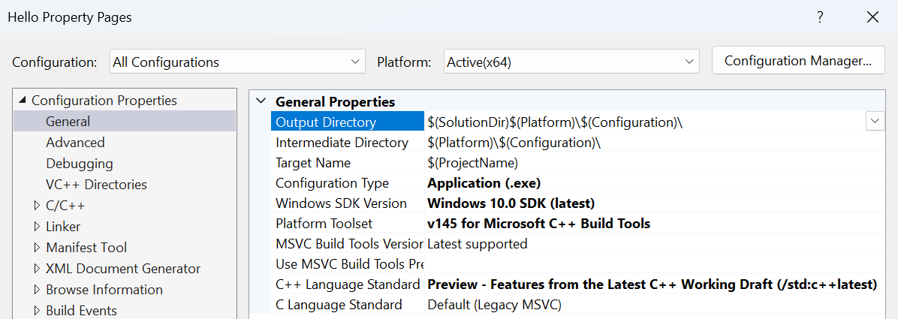
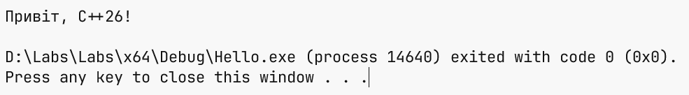

# Visual Studio і перший проєкт

## Встановлення Visual Studio 2026

**Інтегроване середовище розробки** (*Integrated Development Environment*, IDE)
поєднує редактор, засоби збирання, налагоджувач і роботу з Git. У курсі це
**Visual Studio 2026**: <https://visualstudio.microsoft.com/downloads/>.
Редакції Community, Professional та Enterprise мають різні умови ліцензування
й набори можливостей. Для навчальних вправ достатньо Community; право
використання визначають чинні умови
<https://visualstudio.microsoft.com/license-terms/>.
Для навчання в аудиторії передбачені дозволені сценарії, але безкоштовність
Community не означає необмежене використання будь-якою організацією.


Рис. 1.3. Завантаження Visual Studio {.caption}

Для матеріалів курсу обираємо Windows 11 x64. За перевіреними вимогами
Microsoft мінімум становить 4 ГБ оперативної пам’яті, а для типових професійних
рішень рекомендують 16 ГБ. Типове встановлення займає 20–50 ГБ; фактичний
обсяг залежить від компонентів. Мінімальна роздільна здатність – 1366×768
за масштабу 100 %. SSD прискорює роботу. Сторінка вимог:
<https://learn.microsoft.com/visualstudio/releases/2026/vs-system-requirements>.
Перед встановленням перевірте доступний простір і підтримку саме своєї версії ОС.

Запустіть інсталятор, завантажений з офіційного сайта. **Робоче навантаження**
(*workload*) – набір компонентів для певного виду розробки. На вкладці
*Workloads* виберіть *Desktop development with C++* (рис. 1.4).
Без цього навантаження сама наявність Visual Studio ще не означає наявності
компілятора C++. Докладна інструкція:
<https://learn.microsoft.com/cpp/build/vscpp-step-0-installation>.


Рис. 1.4. Вибір навантаження для настільної розробки C++ {.caption}

У правій панелі *Installation details* перевірте засоби MSVC для x64/x86 та
Windows SDK. **SDK** (*Software Development Kit*) містить заголовки, бібліотеки
й інструменти роботи з платформою. CMake tools потрібні для CMake-проєктів,
AddressSanitizer – для пошуку частини помилок пам’яті, а vcpkg допомагає
керувати сторонніми бібліотеками. Для першої програми головними є MSVC і SDK;
інші засоби використовуватимемо за потреби. Точні суфікси версій компонентів
залежать від оновлення Installer, тому обирайте актуальні компоненти
встановленої Visual Studio, а не шукайте застарілий номер із чужого знімка.


Рис. 1.5. Компоненти середовища C++ {.caption}

На вкладці *Language packs* позначте *English* (рис. 1.6), щоб назви меню
збігалися з матеріалами. Натисніть *Install* і дочекайтеся завершення.
Змінити склад установленого середовища можна через
*Tools → Get Tools and Features…* та кнопку *Modify* в Installer.
Git для командного рядка встановимо окремо з офіційного сайта: не варто
вважати, що кожен варіант інсталяції IDE автоматично додає `git` до `PATH`.



Рис. 1.6. Вибір англійського мовного пакета {.caption}

## Перший консольний проєкт

**Консольний застосунок** працює з текстовим введенням і виведенням. Він
зручний для навчання: можна зосередитися на поведінці програми, не створюючи
графічного інтерфейсу. На стартовому екрані Visual Studio виберіть
*Create a new project* (рис. 1.7). Уже наявне рішення відкривають через
*Open a project or solution*, а репозиторій з сервера копіюють через
*Clone a repository*. Це різні початкові дії.



Рис. 1.7. Стартове вікно Visual Studio {.caption}

У списку шаблонів встановіть фільтр мови *C++* і виберіть *Console App*
з позначками C++, Windows, Console (рис. 1.8). Шаблон з аналогічною
назвою для C# створить інший тип проєкту. Натисніть *Next*. Якщо потрібного
шаблону немає, поверніться до Installer та перевірте навантаження C++.


Рис. 1.8. Шаблон консольного застосунку C++ {.caption}

У *Configure your new project* задайте *Project name* `Hello`,
*Location* `D:\Labs` та *Solution name* `Labs` (рис. 1.9). Можна використати
іншу папку, доступну для запису; запам’ятайте її повний шлях. Назва проєкту
не є текстом привітання: вона визначає назви службових файлів і зазвичай
виконуваного файла. Натисніть *Create*.


Рис. 1.9. Назва проєкту та розташування рішення {.caption}

У головному вікні редактор показує `Hello.cpp`, а *Solution Explorer* –
структуру рішення (рис. 1.10). Вікно *Output* містить протокол збирання,
*Error List* – список діагностичних повідомлень. Панель угорі визначає
конфігурацію, платформу і проєкт запуску. Відкрита вкладка редактора сама
по собі не змінює стартовий проєкт, якщо в рішенні їх декілька.



Рис. 1.10. Редактор і структура проєкту Hello {.caption}

### Налаштування стандарту і діагностики

Відкрийте властивості **проєкту**, а не рішення: у *Solution Explorer*
клацніть правою кнопкою `Hello` та виберіть *Properties*. Угорі виберіть
*Configuration: All Configurations*, *Platform: x64*. У
*Configuration Properties → General* знайдіть *C++ Language Standard*
і встановіть режим `/std:c++latest` (рис. 1.11). Саме тут розташовано
цю властивість у Visual Studio 2026 18.10.1; в інших версіях вона може бути
на сторінці *C/C++ → Language*. Орієнтуйтеся на назву властивості та ключ,
який потрапляє до командного рядка компілятора.



Рис. 1.11. Обрання режиму стандарту C++ {.caption}

У *C/C++ → General* виберіть *Warning Level* `/W4`. У
*C/C++ → Language* установіть *Conformance mode* `/permissive-`.
У *C/C++ → Command Line → Additional Options* додайте `/utf-8`.
Ключі означають відповідно докладніші попередження, суворішу відповідність
стандарту та UTF-8 для початкового тексту і звичайних рядкових літералів.
Для обробки винятків у цьому курсі використовуємо `/EHsc`; цей параметр
зазвичай уже встановлений у шаблоні консольного проєкту.

**Debug** містить інформацію, корисну для налагодження, і за типовими
налаштуваннями вимикає оптимізацію. **Release** зазвичай оптимізує код.
Це набори параметрів, а не різні мови. Платформа **x64** визначає цільову
архітектуру 64-бітного процесу. Якщо налаштувати лише Debug, Release може
залишитися з іншим стандартом; саме тому на початку обирали
*All Configurations*. Після зміни параметрів натисніть *Apply* та *OK*.

## Структура першої програми

Замініть початковий вміст `Hello.cpp` повною програмою нижче. Це приклад 1,
«Привіт, C++26!». Збережіть файл у UTF-8 та виконайте
*Build → Build Solution* або натисніть **Ctrl+Shift+B**.

```cpp
#include <print>

int main()
{
    std::println("Привіт, C++26!");
    return 0;
}
```

Директива `#include <print>` надає засоби стандартної бібліотеки для
форматованого виведення. Кутові дужки означають пошук заголовка в
налаштованих системних каталогах. Після директиви `#include` не ставлять
крапку з комою. Функція `main` є точкою входу програми; `int` указує тип
її результату, а порожні круглі дужки означають відсутність параметрів
у цій формі запису. Фігурні дужки обмежують тіло функції.

`std` – **простір імен** (*namespace*) стандартної бібліотеки. Оператор `::`
уточнює, де шукати ім’я: `std::println` є бібліотечною функцією, а не
довільним словом автора. Вона виводить текст і додає перехід на новий рядок.
`std::print` виконує форматоване виведення без автоматичного переходу.
Текст у подвійних лапках є **рядковим літералом** (*string literal*).
Кожний оператор виклику завершується `;`.

`return 0;` завершує `main` і передає середовищу код успіху. Цей нуль
не друкується в консолі. Для `main` досягнення кінцевої дужки також означає
успішне завершення, проте явний запис допомагає побачити різницю між
виведенням і поверненням значення. Ненульові коди використовують, щоб
повідомити про невдачу; конкретне значення встановлює програма.

Натисніть **Ctrl+F5**, щоб запустити без налагодження. Результат програми:

```text
Привіт, C++26!
```

Додатковий рядок про завершення процесу або натискання клавіші виводить
середовище, а не наведена функція. Клавіша **F5** запускає з налагоджувачем.
Не додавайте `system("pause")`: це запуск окремої системної команди,
не потрібний для логіки програми. Поза IDE запускайте `.exe` у вже
відкритому терміналі, щоб бачити результат після завершення.



Рис. 1.12. Результат запуску першої програми {.caption}

### UTF-8, коментарі та стандартний модуль

Кодування описує, як символи подано байтами. Для українського тексту
зберігайте `.cpp` у UTF-8 і передавайте `/utf-8`. Сучасна реалізація
`std::println` у MSVC має підтримку Unicode-виведення в консоль Windows.
Не змішуйте це з довільними рецептами `_setmode` для широких потоків:
це інші API. Якщо текст перенаправлено до файла, його також потрібно
відкривати як UTF-8. Здатність шрифту показати літеру й кодування файла –
окремі умови. Для звичайних чисел формат без локалі використовує крапку,
наприклад `12.50`, незалежно від українського регіонального формату.

**Коментар** (*comment*) пояснює намір і не виконується. `//` починає
коментар до кінця рядка, а `/* ... */` обмежує багаторядковий коментар.
Не коментуйте очевидне на зразок «друкує текст» перед кожним виведенням;
пояснюйте одиниці вимірювання, прийняті припущення та нетривіальні формули.
Назви в C++ чутливі до регістру: `Main` і `main` є різними іменами.

Стандарт C++23 також запровадив бібліотечний модуль `std`. Замість
включення заголовка перша програма може мати такий повний вигляд:

```cpp
import std;

int main()
{
    std::println("Привіт, C++26!");
    return 0;
}
```

Для цієї форми недостатньо механічно замінити перший рядок. У властивостях
MSVC-проєкту в *C/C++ → Language* увімкніть
*Build ISO C++23 Standard Library Modules* та режим `/std:c++latest`.
Система збирання повинна побудувати модуль і надати його компілятору.
Інструкція Microsoft: <https://learn.microsoft.com/cpp/cpp/tutorial-import-stl-named-module>.
Не додавайте одночасно `import std;` та заголовки лише для виправлення
помилки налаштування. Основні приклади теми використовують `#include <print>`:
це робить шлях збирання однаковим в IDE та в простій команді `cl`.
