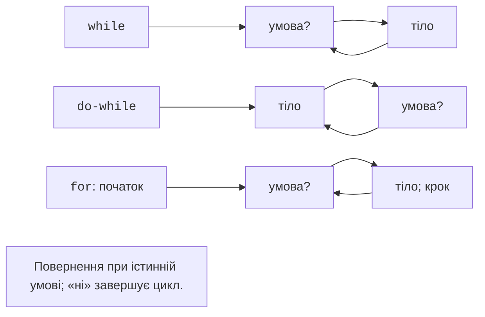

# Розгалуження та цикли

## Розгалуження

`if` обирає дію за логічною умовою. `else` задає альтернативу, а
послідовність `else if` перевіряє наступні умови лише коли попередні
хибні. Для оцінок діапазони потрібно впорядкувати так, щоб кожне допустиме
значення потрапляло рівно в одну категорію. Перевірку належності до
діапазону записують `0 <= value && value <= 100`, а не математичним
ланцюжком `0 <= value <= 100`: другий запис порівнює вже отриманий `bool`.

Форма `if (int value = expression; value > 0)` поєднує ініціалізацію та
умову; ім’я доступне в обох гілках. Це допомагає звузити область
видимості, але не потрібне для кожного простого порівняння. Завжди
перевіряйте, до якого `if` належить `else`; фігурні дужки усувають
двозначність вкладених розгалужень.

`switch` порівнює ціле значення або перелік з мітками `case`. Кожна
самостійна гілка зазвичай закінчується `break`; без нього виконання
переходить до наступної гілки. Свідомий перехід позначають
`[[fallthrough]];`, щоб відрізнити його від забутого `break`.
`default` обробляє непередбачене значення. Для меню це може бути
повідомлення «невідома команда», а не мовчазне завершення.

**Перелік** `enum class Signal { red, yellow, green };` задає іменовані
стани. Пишуть `Signal::red`, а не магічне число 0. Значення такого
переліку не перетворюються на довільні цілі автоматично. Введений номер
меню спочатку перевіряють, а вже тоді пов’язують зі станом. Детальне
проєктування типів буде пізніше; зараз перелік потрібний для виразного
позначення невеликої множини альтернатив.

## Цикли та випадкові числа

**Цикл** повторює блок дій. `while` перевіряє умову перед кожною ітерацією
і може не виконатися жодного разу. `do ... while` перевіряє її після
тіла і виконується хоча б раз. `for` зручно об’єднує ініціалізацію,
умову продовження й крок. Порядок дій показано на рис. 2.6.
Перш ніж писати цикл, визначте початковий стан, умову завершення
та дію, яка наближає до завершення.



Рис. 2.6. Перевірка умови в різних циклах {.caption}

`break` негайно завершує найближчий цикл, а `continue` переходить до
наступної ітерації. У `for` після `continue` виконується крок; у `while`
потрібно переконатися, що необхідне оновлення не пропущено. Якщо
лічильник беззнаковий, цикл `i >= 0` ніколи не закінчується через
від’ємне значення. Для зворотного обходу використовуйте умову `i > 0`
і звернення до `i - 1`, або відповідний знаковий тип у відомих межах.

Заголовок `<random>` відділяє **генератор** послідовності від
**розподілу** значень. `std::mt19937` є детермінованим генератором, а
`std::uniform_int_distribution<int>` відображає його результати на
цілий інтервал включно з обома межами. Фіксоване початкове зерно
допомагає відтворювати тести. Відповідність розподілу конкретним
значенням може залежати від стандартної бібліотеки, тому між різними
реалізаціями не обіцяють однакової послідовності результатів розподілу.

### Приклад 3. Вгадай число

Програма обирає число 1–10; введення 0 завершує гру. Для тестування
зерно зафіксоване. Помилковий токен завершує програму з кодом 1.

```cpp
#include <print>
#include <iostream>
#include <random>

int main()
{
    std::mt19937 engine{42};
    std::uniform_int_distribution<int> pick{1, 10};
    const int secret = pick(engine);
    int guess{}, attempts{};
    do
    {
        std::println("Guess 1..10, or 0 to exit:");
        if (!(std::cin >> guess)) return 1;
        if (guess == 0) return 0;
        if (guess < 1 || guess > 10)
        {
            std::println("Out of range");
            continue;
        }
        ++attempts;
        if (guess < secret) std::println("Higher");
        else if (guess > secret) std::println("Lower");
        else std::println("Correct; attempts: {}", attempts);
    } while (guess != secret);
}
```

Спроби поза діапазоном не збільшують лічильник. Для відтворюваної
перевірки можна ввести всі числа від 1 до 10: програма обов’язково
завершить гру на правильному значенні. Окремо перевірте 0, 11 і
нечисловий токен. Не створюйте генератор заново в кожній ітерації
з тим самим зерном, інакше щоразу отримуватимете початок послідовності.

### Приклад 4. Таблиця множення

Вкладений цикл виконується повністю для кожної ітерації зовнішнього.
Програма друкує таблицю 4×4; загальна кількість добутків дорівнює 16.

```cpp
#include <print>

int main()
{
    for (int row = 1; row <= 4; ++row)
    {
        for (int column = 1; column <= 4; ++column)
            std::print("{:4}", row * column);
        std::println();
    }
}
```

```text
   1   2   3   4
   2   4   6   8
   3   6   9  12
   4   8  12  16
```

Новий рядок знаходиться після внутрішнього циклу, тому завершує
рядок таблиці, а не кожну клітинку. Ширина 4 достатня для цих добутків;
для більших меж її потрібно переглянути. Якщо замість сталої межі
читати число з клавіатури, обмежте його, щоб користувач випадково
не створив мільйони рядків виведення.
