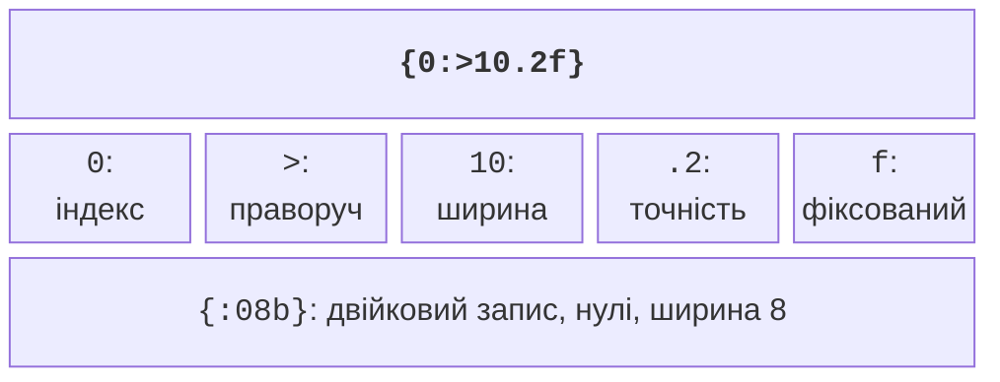

# Операції, виведення та введення

## Операції та числові обмеження

Арифметичні операції `+`, `-`, `*`, `/` працюють над числовими значеннями.
Якщо обидва операнди ділення цілі, результат також цілий: `7 / 2` дає 3,
а `7.0 / 2` – 3.5. `%` повертає остачу від цілого ділення. Для
невід’ємного часу це дає зручну пару формул: `hours = seconds / 3600`
та `rest = seconds % 3600`. Для від’ємних даних спочатку визначте правила
задачі, а не очікуйте автоматичного календарного перенесення.

Оператори `==`, `!=`, `<`, `<=`, `>`, `>=` порівнюють значення та дають
`bool`. `=` виконує присвоєння. Вираз `if (x = 5)` змінює `x`, а
`if (x == 5)` перевіряє його. Логічні `&&`, `||`, `!` поєднують умови.
Перші два виконують скорочене обчислення: у `x != 0 && y / x > 2`
ділення не виконується, коли `x` дорівнює нулю.

Побітові `&`, `|`, `^`, `~`, `<<`, `>>` обробляють біти цілих значень.
Для навчальних масок використовуйте беззнакові числа і перевіряйте,
що зсув менший за кількість бітів типу. Не замінюйте `&&` на `&` у
перевірці введення: це різні операції. Тристороннє порівняння `<=>`
повертає категорію впорядкування; воно корисне для власних типів і
детально розглядатиметься разом із перевантаженням операцій.

Скорочений запис `sum += value` додає до накопичувача; `++i` збільшує
лічильник. Тернарний вираз `condition ? first : second` обирає одне з
двох значень. Не приховуйте у великому виразі багато змін стану:
кілька простих операторів легше перевірити в налагоджувачі. За сумніву
щодо пріоритету додайте дужки. Таблиця пріоритетів:
<https://learn.microsoft.com/cpp/cpp/cpp-built-in-operators-precedence-and-associativity>.

### Перетворення та переповнення

`static_cast<double>(sum) / count` перетворює перший операнд **до**
ділення. Запис `static_cast<double>(sum / count)` лише перетворить
уже округлений цілий результат. `static_cast` робить намір явним, але
не доводить, що значення вміщується у новий тип. Перед перетворенням
перевіряйте діапазон і вимоги до втрати дробової частини.

Переповнення знакового цілого під час арифметики є невизначеною поведінкою.
Беззнакова арифметика працює за модулем степеня двійки, але це також
може порушити зміст задачі. Перед додаванням невід’ємних `a` і `b`
перевіряйте `a <= max - b`; перед множенням ненульових – `a <= max / b`.
Обчислити переповнену суму, а потім перевірити її вже запізно.

Для дробових чисел перевіряйте область визначення: знаменник має бути
ненульовим, аргумент квадратного кореня – невід’ємним. Заголовок
`<cmath>` надає `std::sqrt`, `std::pow`, `std::abs`, `std::isfinite`.
`<numbers>` надає `std::numbers::pi`. Не використовуйте приблизне `3.14`,
якщо бібліотека вже має потрібну константу. Порівняння обчислених
дробових значень часто потребує допуску, який визначається задачею,
а не довільної константи, скопійованої з іншої програми.

У C++26 арифметика з насиченням включає `std::add_sat` із `<numeric>`:
замість виходу за діапазон вона повертає найближчу межу типу. Це не
звичайне додавання та не автоматичний режим усіх цілих операцій.
Перед використанням перевіряйте підтримку своєї стандартної бібліотеки;
ручна перевірка меж у вправах потрібна незалежно від наявності цієї функції.
У перевіреній бібліотеці MSVC 19.51 `std::add_sat` ще відсутня, тому
виконувані приклади цієї теми її не використовують.

## Форматоване виведення

`std::print` і `std::println` з `<print>` приймають рядок формату та
аргументи. Перша функція не додає новий рядок, друга додає. Поле `{}`
виводить наступний аргумент у типовому поданні. У `{0:>10.2f}` число 0
обирає перший аргумент, `>` вирівнює праворуч, 10 задає мінімальну ширину,
`.2` – точність, а `f` – фіксований дробовий формат (рис. 2.4).



Рис. 2.4. Частини специфікації формату {.caption}

Ширина не обрізає текст і не обмежує значення. Для цілих `{:.2f}` не є
допустимим способом додати нулі після крапки: специфікація має
відповідати типу аргументу. `{:x}` виводить шістнадцятковий запис,
`{:b}` – двійковий, а `{:08b}` доповнює його нулями до восьми позицій.
`{:08.3f}` форматує дробове число із загальною мінімальною шириною 8.
Саму дужку в тексті формату записують <code v-pre></code>.

Помилки в сталому рядку формату часто виявляються під час компіляції.
Не «виправляйте» діагностику перетворенням усіх значень на текст:
спочатку узгодьте формат і тип. На відміну від регіональних установок
табличного редактора, типовий формат C++ друкує десяткову крапку.
Форматування не змінює значення змінної і не усуває похибок обчислення.

Альтернативний інтерфейс `std::cout << value` використовує оператор
вставлення в потік. Він потрібний для читання чужого коду, але в цьому
курсі основним засобом виведення є `std::println`. Для повідомлень
про помилки зручно застосовувати `std::cerr`, щоб відокремити їх від
корисного результату при перенаправленні потоків.

## Введення і стан потоку

`std::cin >> value` з `<iostream>` намагається прочитати значення потрібного
типу. Це операція, яка може завершитися невдало: користувач здатен ввести
літери, завелике число або завершити введення. Перевірка
`if (!(std::cin >> value))` виявляє помилку вилучення. Вона не перевіряє
предметний зміст: від’ємна маса синтаксично є числом, але недопустима.

Після невдалого читання `clear()` скидає прапорці помилки, а
`ignore(std::numeric_limits<std::streamsize>::max(), '\n')` відкидає
залишок рядка. Потрібні обидві дії: лише скидання стану залишить ті самі
некоректні символи для наступної спроби. Проте кінець файла `eof()`
не треба лікувати нескінченним повторенням запиту – програму завершують.
Документація потоку: <https://learn.microsoft.com/cpp/standard-library/basic-istream-class>.

Оператор `>>` читає числовий префікс: після `12abc` число 12 може бути
вже зчитане, а `abc` залишиться в потоці. Якщо потрібна сувора перевірка
цілого рядка, використовуйте `std::getline` і розбір повного тексту;
це буде розглянуто в темі рядків. Тут у прикладі з повторенням залишок
рядка явно відкидається, тому політика введення – одне значення на рядок.

### Приклад 2. Індекс маси тіла як навчальна формула

Програма читає додатні масу в кілограмах і зріст у метрах. Вона демонструє
перевірку числового введення, а не надає медичного висновку: результатом
є лише значення формули `mass / (height * height)`. Межі 300 кг і 3 м
є обмеженнями навчального прикладу.

```cpp
#include <print>
#include <iostream>
#include <limits>
#include <cmath>

int main()
{
    double mass{}, height{};
    while (true)
    {
        std::println("Mass kg (0 < value <= 300):");
        if (std::cin >> mass)
        {
            std::cin.ignore(
                std::numeric_limits<std::streamsize>::max(), '\n');
            if (std::isfinite(mass) && mass > 0 && mass <= 300)
                break;
        }
        else if (std::cin.eof()) return 1;
        else
        {
            std::cin.clear();
            std::cin.ignore(
                std::numeric_limits<std::streamsize>::max(), '\n');
        }
        std::println("Invalid mass");
    }
    std::println("Height m (0 < value <= 3):");
    if (!(std::cin >> height) || !std::isfinite(height)
        || height <= 0 || height > 3)
    {
        std::cerr << "Invalid height\n";
        return 1;
    }
    const double bmi = mass / (height * height);
    std::println("BMI = {:.2f}", bmi);
}
```

За послідовності `abc`, `72`, `1.8` програма повідомляє про помилку,
повторює перший запит і друкує `BMI = 22.22`. Нульовий зріст відхиляється
до ділення. Перевірка `std::isfinite` не допускає нескінченності або NaN.
Англійські короткі підказки спрощують відтворення тестів незалежно від
кодування терміналу; українські рядки також допустимі з `/utf-8`.


Рис. 2.5. Повторення введення після помилки {.caption}
