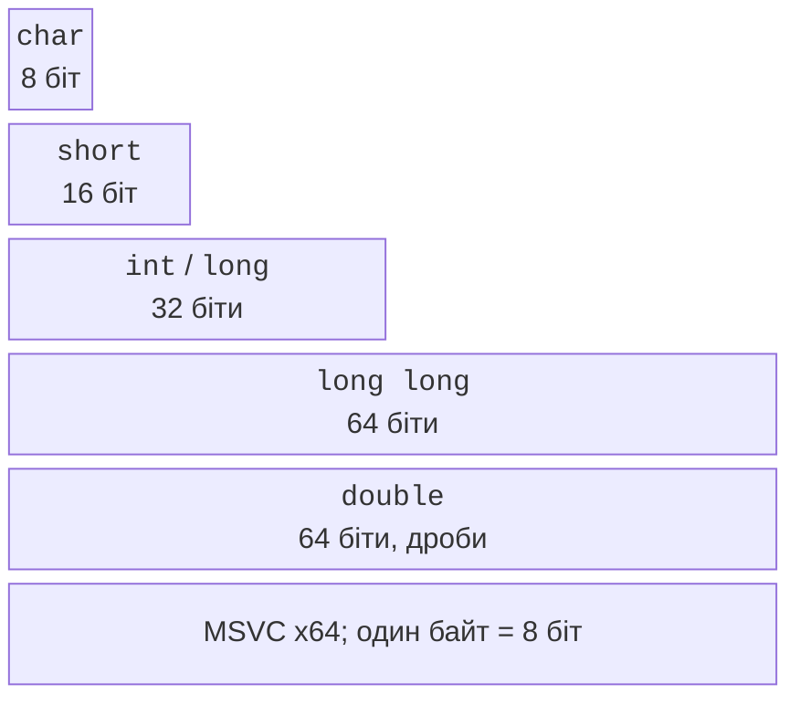

# Типи, змінні та константи

## Тип як набір значень і дозволених операцій

**Змінна** (*variable*) пов’язує ім’я з об’єктом, що зберігає значення.
**Тип** визначає допустимі значення, їх подання та операції над ними.
Наприклад, кількість студентів доцільно зберігати цілим числом, температуру –
числом із дробовою частиною, а відповідь на питання «чи завершено роботу?» –
логічним значенням. Вибір типу починається зі змісту даних, а не з бажання
всюди використати найбільший доступний тип.

`bool` має значення `true` і `false`. `char` зберігає одну кодову одиницю
звичайного рядка, а не довільну літеру Unicode. `short`, `int`, `long` та
`long long` – цілі типи різних мінімальних діапазонів. Слово `unsigned`
обирає беззнаковий тип; воно не є універсальним засобом заборони від’ємного
введення. `float`, `double` і `long double` – типи з рухомою крапкою.
Їхні значення мають скінченну точність, навіть якщо друкується багато цифр.

У MSVC x64 `int` і `long` мають 4 байти, `long long` – 8, а `long double`
має те саме подання, що й `double`. Це властивості реалізації: не слід
переносити висновок «long завжди 8 байтів» із Linux до Windows.
Стандарт установлює мінімальні гарантії, а фактичні розміри перевіряють
оператором `sizeof` (рис. 2.1). Документація:
<https://learn.microsoft.com/cpp/cpp/fundamental-types-cpp>.



Рис. 2.1. Типові розміри типів у MSVC x64 {.caption}

Результат `sizeof` має тип `std::size_t`, беззнаковий тип для розмірів.
Він вимірює кількість байтів C++, причому `sizeof(char)` завжди дорівнює 1.
Для формату даних, де потрібна саме 32-бітна ціла величина, заголовок
`<cstdint>` надає `std::int32_t`, якщо реалізація має відповідний тип.
Для меж використовують `<limits>` і `std::numeric_limits<T>`.
Для цілих `min()` є найменшим значенням; для дробових найменше від’ємне
скінченне значення повертає `lowest()`, а `min()` – найменше додатне
нормалізоване. Плутанина цих функцій спотворює перевірку діапазону.

### Приклад 1. Характеристики типів

Програма не зчитує даних, а повідомляє властивості реалізації, якою її
зібрано. Виведення потрібно порівнювати для конкретної платформи.

```cpp
#include <print>
#include <limits>

int main()
{
    std::println("int: {} bytes, {} .. {}", sizeof(int),
        std::numeric_limits<int>::min(),
        std::numeric_limits<int>::max());
    std::println("long: {} bytes", sizeof(long));
    std::println("long long: {} bytes", sizeof(long long));
    std::println("double: {} bytes, {} digits", sizeof(double),
        std::numeric_limits<double>::digits10);
}
```

```text
int: 4 bytes, -2147483648 .. 2147483647
long: 4 bytes
long long: 8 bytes
double: 8 bytes, 15 digits
```

`digits10` характеризує десяткову точність типу, а не кількість цифр, які
обов’язково потрібно показувати користувачеві. Розмір змінної також не
дорівнює довжині її надрукованого значення: число `7` і число `1000000`
типу `int` займають однаковий обсяг пам’яті.


Рис. 2.2. Підказка типу і значення константного виразу {.caption}

## Ініціалізація, імена та константи

**Ініціалізація** (*initialization*) задає початкове значення в момент
створення об’єкта. Записи `int count = 3;`, `int count(3);` і
`int count{3};` у простому випадку дають однакове значення, але фігурні
дужки забороняють небезпечне **звуження** (*narrowing*). Тому `int n{3.7};`
є помилкою: дробова частина втратилася б. Запис `int n = 3.7;` може
компілюватися з попередженням і дати 3, що не робить його правильним.

Локальний `int count;` без ініціалізації не отримує автоматично нуль.
Читання невизначеного початкового стану не дає коректного результату.
Звичка писати `int count{};` створює відоме початкове значення 0.
Оголошуйте змінну поблизу першого використання й називайте за змістом:
`minutes`, `attempts`, `massKg` пояснюють дані краще за `a`, `b`, `c`.

`auto value = 3.5;` просить компілятор вивести тип з ініціалізатора;
у цьому випадку це `double`. `auto` не є динамічним типом: після
оголошення тип не змінюється. `const` забороняє наступне присвоєння,
а `constexpr` вимагає придатності початкового значення до обчислення
під час компіляції. Наприклад, `constexpr int days = 7;` є константою
компіляції; `const double mass` із введення користувача – ні.


Рис. 2.3. Діагностика звуження типу {.caption}

**Область видимості** (*scope*) визначає, де ім’я доступне. Локальна змінна
всередині `{ ... }` недоступна після кінцевої дужки. Однакове ім’я у
внутрішньому блоці може приховати зовнішнє, але для початківця це
ускладнює пошук помилок. Лічильник `for (int i = 0; ...)` належить циклу.
Не створюйте глобальні змінні лише для того, щоб уникнути продуманого
передавання даних: функції та параметри вивчатимемо в наступній темі.

### Літерали та їх типи

Цілий літерал можна записати десятково `42`, шістнадцятково `0x2A` або
двійково `0b101010`. Розділювач цифр `1'000'000` полегшує читання і не
змінює значення. Суфікс `LL` задає цілий тип `long long`; `3.0f` є
`float`, тоді як `3.0` – `double`. Одинарні лапки означають символьний
літерал `'A'`, подвійні – рядок `"A"`, що містить також завершальний нуль.

`u8"text"` має кодові одиниці `char8_t`, тому не є звичайним `const char*`.
Не додавайте префікс `u8` до всіх аргументів `std::println` механічно.
Для прикладів курсу звичайні рядки компілюються з `/utf-8`.
Кирилична літера в UTF-8 зазвичай займає кілька байтів; робота з окремими
байтами ще не є коректною обробкою окремих літер.
