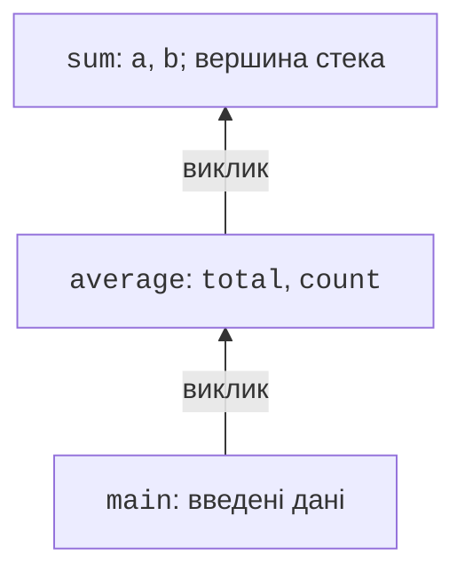
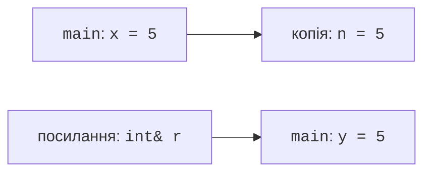

# Функції та передавання параметрів

## Функція як окрема завершена дія

**Функція** (*function*) іменує дію, яку можна викликати з різними даними.
Наприклад, обчислення площі потрібно і для кімнати, і для ділянки.
Замість копіювання формули в кілька місць створюють функцію, передають
їй довжину та ширину й отримують результат. Так помилку у формулі
виправляють в одному місці. Проте функція має об’єднувати змістовну
дію, а не довільний фрагмент із п’яти сусідніх рядків.

**Параметри** (*parameters*) – імена входів у визначенні функції.
**Аргументи** (*arguments*) – конкретні вирази у виклику. У
`area(5.0, 4.0)` числа є аргументами; у
`double area(double length, double width)` імена `length` і `width`
є параметрами. Порядок аргументів має значення, навіть якщо всі вони
мають однаковий тип. Назва та документація повинні пояснювати одиниці.

Тип перед іменем визначає **тип результату**. Оператор `return expression;`
завершує поточний виклик і повертає значення. Результат можна присвоїти
змінній, використати в умові або передати іншій функції. Сам `return`
не друкує значення. Функція `void` не повертає значення; у ній можна
застосувати `return;` для раннього виходу. Досягнення кінця звичайної
функції, що має повернути значення, без результату є помилкою проєктування.

Документація мови: <https://learn.microsoft.com/cpp/cpp/functions-cpp>.
Коротку функцію часто визначають до `main`. Для великого файла це
незручно, тому перед використанням можна подати **оголошення**
(*declaration*), а реалізацію розмістити нижче. Оголошення
`double area(double length, double width);` повідомляє типи та ім’я,
але не містить тіла. Визначення містить тіло і не закінчується
крапкою з комою після зовнішньої фігурної дужки.

Компілятор використовує оголошення для перевірки виклику; компонувальник
має знайти відповідне визначення. Якщо переплутати тип параметра в
оголошенні й визначенні, можна випадково створити іншу функцію, а
потрібне визначення залишиться відсутнім. Зручна звичка – включати
в реалізацію той самий заголовок, який використовують клієнти функції.

## Передавання за значенням

Параметр `int value` створює окремий об’єкт із переданого значення.
Зміна параметра не змінює змінну в місці виклику. Це **передавання
за значенням** (*pass by value*). Для невеликих числових типів воно
природне: функція отримує власні робочі дані й не може випадково
перезаписати значення користувача. Результат потрібно явно повернути.

Під час виклику створюється контекст виконання з параметрами,
локальними змінними та місцем повернення. Вкладені виклики
утворюють **стек викликів** (*call stack*, рис. 3.1).
Коли `main` викликає `average`, а та викликає `sum`, активним є
внутрішній виклик. Після його завершення виконання продовжується
в `average`, а не починається заново з початку `main`.



Рис. 3.1. Вкладені виклики та їхні локальні дані {.caption}

Уявімо `void increase(int x) { ++x; }`. Після `increase(count)`
зовнішній `count` залишиться незмінним. Це не «непрацюючий оператор
інкременту», а наслідок копії. Для обчислення нового значення краще
`int increased(int x) { return x + 1; }` і явне присвоєння результату.
Передавання за посиланням доцільне тоді, коли зміна зовнішнього
об’єкта справді є частиною інтерфейсу.

Не покладайтеся на порядок обчислення різних аргументів функції.
Вирази на зразок виклику з кількома інкрементами того самого
лічильника ускладнюють читання й можуть мати неочевидний порядок.
Спочатку обчисліть окремі значення в окремих операторах, потім
передайте їх функції. Прозорий потік даних важливіший за стислість.

## Посилання та константні посилання

**Посилання** (*reference*) є іншим іменем уже наявного об’єкта.
Параметр `int& value` дозволяє змінювати оригінал. Під час виклику
синтаксис залишається звичайним, тому назва функції повинна
підказувати зміну: `normalize`, `swap_values`, `sort_three`.
Посилання потрібно пов’язати з об’єктом відразу; присвоєння через
нього змінює об’єкт, а не перепризначає саме посилання.



Рис. 3.2. Копія аргументу і посилання на оригінал {.caption}

`const T&` надає доступ без зміни через це посилання. Для великих
рядків і контейнерів це дозволяє уникнути копії. Для `int` або `double`
звичайне передавання за значенням часто простіше. Слово `const`
у параметрі є обіцянкою інтерфейсу, а не твердженням, що об’єкт
ніде у програмі не може змінитися через інший доступ.

Вихідний параметр – посилання, через яке функція записує результат.
Він корисний для нормалізації кількох компонентів часу, але ускладнює
виклик: читач має знати, які аргументи є входами, а які зміняться.
Для незалежного обчислення кількох результатів часто краще
повернути маленьку структуру з іменованими полями.

Якщо два параметри-посилання посилаються на той самий об’єкт,
зміна через перший видима через другий. Наприклад,
`swap_values(x, x)` має залишити `x` незмінним. Перевіряйте такі
випадки для функцій, що змінюють дані. Не вважайте, що різні
імена параметрів автоматично означають різні об’єкти.

### Приклад 1. Упорядкування трьох чисел

Програма читає три цілі числа, упорядковує їх невеликим набором
порівнянь і виводить результат. Функція обміну явно змінює два
об’єкти, а `sort_three` збирає три такі кроки в окрему дію.

```cpp
#include <print>
#include <iostream>

void swap_values(int& a, int& b)
{
    const int temporary = a;
    a = b;
    b = temporary;
}

void sort_three(int& a, int& b, int& c)
{
    if (a > b) swap_values(a, b);
    if (b > c) swap_values(b, c);
    if (a > b) swap_values(a, b);
}

int main()
{
    int a{}, b{}, c{};
    if (!(std::cin >> a >> b >> c)) return 1;
    sort_three(a, b, c);
    std::println("{} {} {}", a, b, c);
}
```

Введення `9 2 5` дає `2 5 9`; `3 3 3` залишається незмінним.
Після першого порівняння `a <= b`. Після другого найбільше із
трьох чисел стоїть у `c`, але обмін міг порушити порядок `a,b`;
тому потрібний третій крок. Таке пояснення є доказом для трьох
чисел, а не загальним алгоритмом сортування довільної колекції.
