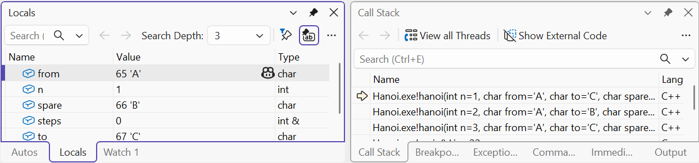
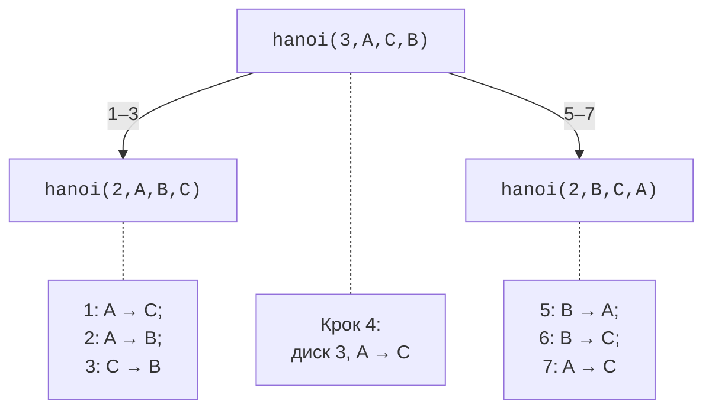
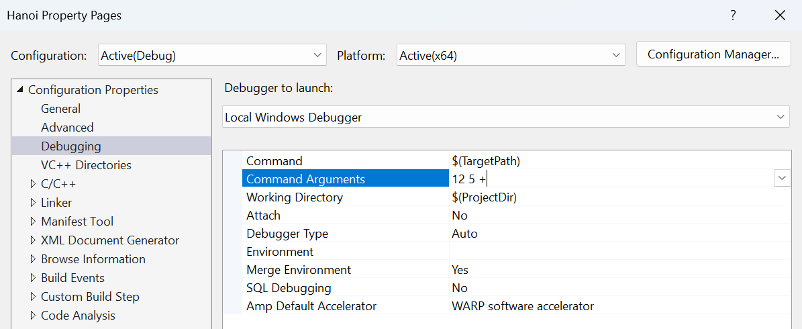

# Рекурсія та організація програми

## Рекурсія та стек викликів

**Рекурсія** (*recursion*) виникає, коли функція викликає себе
безпосередньо або через інші функції. Вона природна для
задач, які зводяться до менших задач того самого виду.
Кожний коректний рекурсивний алгоритм має **базовий випадок**
і крок, який наближає до нього. Для факторіала базою є
0!=1, а кроком – n!=n·(n−1)! для додатного n.

Базова умова не допоможе, якщо рекурсивний аргумент не
зменшується або введення не належить допустимій області.
Для факторіала від’ємного числа виклик з n−1 віддаляється
від нуля. Потрібно перевірити n до першого виклику.
Так само математична визначеність не гарантує, що результат
поміститься в машинний тип: 21! не вміщується в 64-бітний
беззнаковий цілий тип.

Кожний активний виклик має власні параметри та локальні
змінні. У *Call Stack* видно послідовність цих викликів,
а вибір кадру дозволяє переглянути його контекст.
Надмірна глибина може вичерпати стек. Перетворення хвостової
рекурсії на цикл не гарантоване стандартом, тому його
не можна вважати захистом від переповнення стека.



Рис. 3.4. Стек рекурсивних викликів {.caption}

### Приклад 4. Ханойські вежі

Три стрижні A,B,C і n дисків різного розміру. Потрібно
перенести всі диски з A на C, переміщуючи по одному;
більший диск не можна класти на менший. Перенесення
n дисків зводиться до перенесення n−1 на допоміжний
стрижень, одного найбільшого на цільовий, а потім
n−1 з допоміжного на цільовий (рис. 3.5).



Рис. 3.5. Поділ задачі Ханойських веж для трьох дисків {.caption}

```cpp
#include <print>
#include <iostream>

void hanoi(int n, char from, char to, char spare, int& steps)
{
    if (n == 0) return;
    hanoi(n - 1, from, spare, to, steps);
    std::println("{}: {} -> {}", ++steps, from, to);
    hanoi(n - 1, spare, to, from, steps);
}

int main()
{
    int n{};
    if (!(std::cin >> n) || n < 0 || n > 10)
    {
        std::cerr << "Expected disk count 0..10\n";
        return 1;
    }
    int steps{};
    hanoi(n, 'A', 'C', 'B', steps);
    std::println("Total: {}", steps);
}
```

```text
1: A -> C
2: A -> B
3: C -> B
4: A -> C
5: B -> A
6: B -> C
7: A -> C
Total: 7
```

Це результат для n=3. Для n=0 кроків немає; для n=1
потрібен один. Лічильник передано за посиланням, щоб
усі виклики змінювали спільне число, а `n`, `from`, `to`
і `spare` – за значенням, щоб кожний виклик мав свій
опис підзадачі. Межа 10 обмежує виведення 1023 кроками.

Кількість кроків T(n)=2T(n−1)+1, звідки T(n)=2ⁿ−1.
Глибина стека натомість лінійна за n. Ці дві величини
не слід плутати: невелика глибина ще не означає мало
обчислень. Рекурсивний факторіал має іншу форму дерева:
кожний виклик породжує лише один наступний виклик.

## Організація функцій та аргументи програми

Поки програма мала, визначення функцій у одному `.cpp`
достатньо. Надалі оголошення виносять до `.h`, а
визначення – до `.cpp`. Директива `#pragma once` у
заголовку MSVC запобігає повторному включенню його
вмісту в одну одиницю трансляції. Вона не замінює
правил визначень між різними `.cpp`. Не включайте
файл реалізації `.cpp` замість додавання його до проєкту.

Для функції доцільно записати передумови, результат
і побічні ефекти. Наприклад: «приймає три скінченні
додатні сторони; повертає площу; не змінює аргументи
і не друкує». Виведення відокремлюють від обчислення,
щоб тест міг порівняти число без аналізу тексту консолі.
Перевірку клавіатурного потоку зазвичай залишають
на межі програми, а математична функція працює з уже
розібраними типізованими значеннями.

Форма `int main(int argc, char* argv[])` отримує
аргументи командного рядка. `argc` – їх кількість
разом із службовим елементом `argv[0]`; введені
аргументи починаються з `argv[1]`. Кожний елемент
є текстом. Запис `12` у команді сам по собі не
перетворюється на `int`: потрібен розбір і перевірка.
Механізм вказівників пояснюється в темі 5; тут
достатньо правила «перевірити кількість перед доступом».



Рис. 3.6. Передавання аргументів у Visual Studio {.caption}

У Visual Studio аргументи задають через
*Project Properties → Configuration Properties → Debugging → Command Arguments*.
У терміналі їх записують після імені `.exe`; пробіли
розділяють аргументи, лапки об’єднують текст із пробілами.
Програма має вивести зрозумілий короткий опис при
`--help` і повідомити про неправильну кількість аргументів,
а не звертатися за межами масиву `argv`.

### Тестування функцій

Невелика функція дає змогу перевіряти обчислення
без повного діалогу програми. Для `sort_three`
потрібні всі шість порядків різних чисел,
повтори й від’ємні значення. Для рекурсії –
база, перший нетривіальний випадок і найбільший
дозволений аргумент. Для `area` – відомі геометричні
значення і правило поводження з недопустимими розмірами.

Не підміняйте незалежну очікувану відповідь тією
самою формулою в тесті. Для трьох чисел результат
можна перевірити умовою впорядкування та збереженням
початкових значень. Для Ханоя перевірте не лише
кількість кроків, а й законність переміщень у
невеликому прикладі. Така перевірка знаходить
помилку переплутаних стрижнів, навіть коли лічильник
все одно дорівнює 2ⁿ−1.
