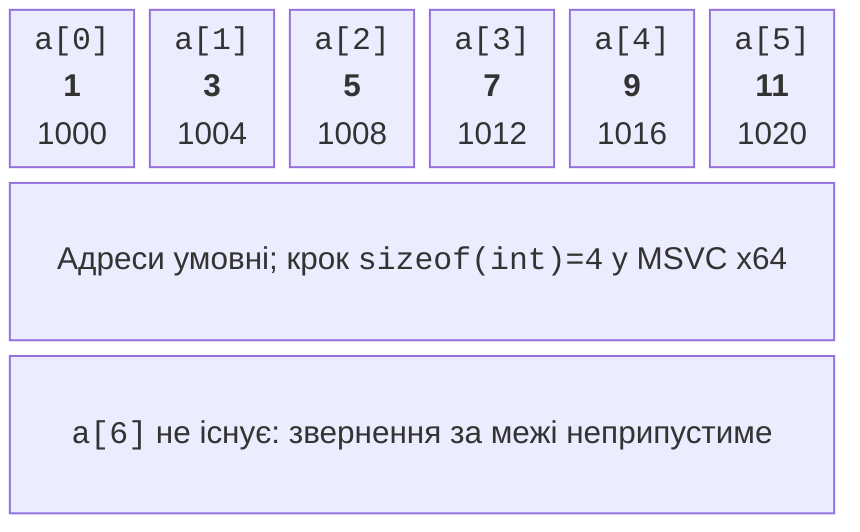
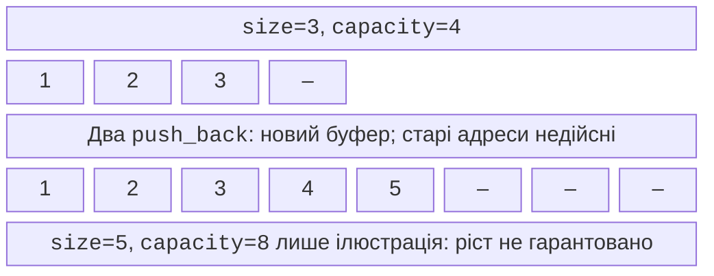

# std::array і std::vector

## Коли потрібна колекція

Для трьох температур можна оголосити три змінні,
але для місяця це незручно: формула середнього
міститиме десятки імен, а кількість даних буде
жорстко зашита в коді. **Колекція** об’єднує
значення за спільним правилом. **Масив** (*array*)
зберігає елементи одного типу в послідовних
комірках; **індекс** (*index*) визначає позицію.
У C++ індексація починається з нуля.

Для шести елементів допустимі індекси 0–5.
Число 6 є кількістю, а не останнім індексом.
Саме ця різниця спричиняє типову помилку
`i <= size` замість `i < size`. Перед
доступом потрібно довести належність індексу
діапазону, особливо якщо номер введений
користувачем у звичній формі від 1.



Рис. 4.1. Послідовні елементи та межа масиву {.caption}

Оголошення `int values[6]{1,3,5,7,9,11};`
створює вбудований масив. Запис `int values[6]{};`
нуль-ініціалізує всі елементи. Розмір такого
локального масиву має бути відомий під час
компіляції; масив змінного розміру, який
деякі компілятори приймають як розширення,
не є переносимим стандартним C++.

`std::size(values)` з `<iterator>` повертає
кількість елементів справжнього масиву.
Проте у параметрі `void f(int a[])` запис
масиву перетворюється на параметр-вказівник:
сама довжина не передається. Така
**деградація** (*array-to-pointer conversion*)
є причиною, чому `sizeof(a)` всередині
такої функції не відновлює довжину масиву.
Вказівники детально розглядаються наступними.

## std::array та обхід елементів

`std::array<int,6>` з `<array>` також має
сталий розмір, але поводиться як повноцінний
об’єкт: його можна копіювати, присвоювати й
передавати за посиланням без втрати довжини.
Метод `size()` повертає 6, а `fill(value)`
заповнює всі комірки. Різні довжини є
різними типами: `array<int,3>` не можна
підставити замість `array<int,4>`.

Оператор `[]` не виконує обов’язкової
перевірки меж. `at(index)` перевіряє індекс
і за помилки кидає `std::out_of_range`.
Механізм винятків буде в темі 6, але вже
зараз важливо розуміти: перевірений доступ
повідомляє про дефект, а не робить будь-який
індекс допустимим. Не покладайтеся на те,
що Debug завжди покаже діалог при кожному
порушенні меж; невизначена поведінка не
має обов’язкової видимої ознаки.

Цикл `for (auto value : values)` створює
копію кожного елемента. `auto&` дозволяє
змінювати елементи, а `const auto&` читає
без копіювання. Для маленьких чисел копія
зручна; для рядків і великих структур
константне посилання уникає зайвої роботи.
Якщо потрібний номер позиції, використовуйте
індексний цикл і тип, узгоджений із `size()`.

### Приклад 1. Температури тижня

Програма читає рівно сім скінченних значень
від−100 до 100 і обчислює статистику. Початкові
мінімум і максимум беруться з першого елемента,
тому від’ємний тиждень обробляється правильно.

```cpp
#include <array>
#include <iostream>
#include <print>
#include <cmath>

int main()
{
    std::array<double, 7> days{};
    for (auto& value : days)
    {
        if (!(std::cin >> value) || !std::isfinite(value)
            || value < -100 || value > 100) return 1;
    }
    double low = days[0], high = days[0], sum{};
    for (double value : days)
    {
        if (value < low) low = value;
        if (value > high) high = value;
        sum += value;
    }
    std::println("min={:.1f}, max={:.1f}, mean={:.1f}",
        low, high, sum / days.size());
}
```

Для `1 2 3 4 5 6 7` результат
`min=1.0, max=7.0, mean=4.0`.
У першому циклі потрібне `auto&`, інакше
введення змінюватиме тільки локальну копію.
У другому достатньо значення. Масив завжди
має сім елементів, тому `days[0]` існує;
для динамічної порожньої колекції потрібна
була б окрема перевірка.

## std::vector: кількість і місткість

**Вектор** `std::vector<T>` із `<vector>`
володіє динамічним масивом і сам керує
виділенням та звільненням пам’яті.
`vector<int> values;` спочатку порожній,
а `vector<int> values(5);` має п’ять
нульових елементів. `vector<int>{5}`
натомість містить один елемент зі значенням 5.
Дужки тут виражають різні наміри.

`size()` – кількість наявних елементів;
`capacity()` – місткість уже виділеного
буфера. `reserve(100)` просить місце
принаймні для 100 елементів, але не
створює їх. Після `reserve` порожній
вектор усе ще не має елемента 0.
`resize(100)` натомість змінює
кількість наявних елементів.



Рис. 4.2. Розмір, місткість і перерозподіл {.caption}

`push_back(value)` додає елемент у кінець.
`emplace_back(arguments...)` конструює
елемент із аргументів безпосередньо у
векторі; це не обіцянка прискорення
кожної операції. `pop_back()` видаляє
останній елемент, але не повертає його
значення і потребує непорожнього вектора.
`clear()` видаляє всі елементи, зазвичай
зберігаючи буфер. `shrink_to_fit()` є
необов’язковим запитом зменшити місткість,
а не гарантією точного розміру буфера.

Якщо додавання перевищує місткість,
вектор виділяє новий буфер і переносить
елементи. Раніше збережені адреси,
посилання та ітератори на старі елементи
стають недійсними. Точний коефіцієнт
зростання не визначений стандартом:
діаграма з подвоєнням є ілюстрацією,
а не правилом для всіх реалізацій.
Документація: <https://learn.microsoft.com/cpp/standard-library/vector-class>.


Рис. 4.3. Елементи вектора в налагоджувачі {.caption}

Вставлення за позицією `i` можна записати
`values.insert(values.begin() + i, value)`,
а вилучення – `values.erase(values.begin() + i)`.
Тут `begin()+i` лише спосіб позначити
позицію; повна теорія ітераторів буде
пізніше. Для вставлення дозволено i=size,
для вилучення потрібно `i < size`. Зсув
наступних елементів змінює позиції;
індекс не є постійним ідентифікатором запису.
