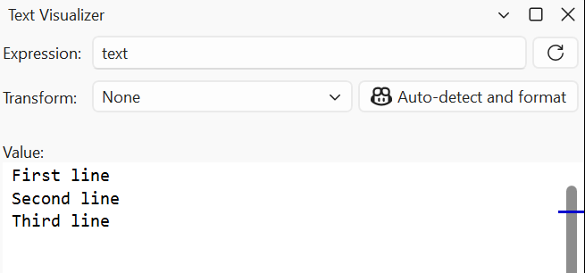
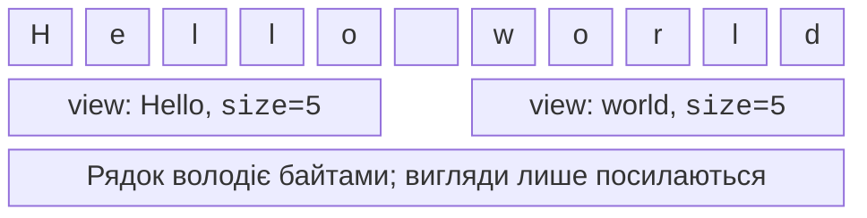

# Рядки та string_view

## Рядок як послідовність байтів

`std::string` із `<string>` володіє
послідовністю `char`. Він підтримує
додавання `+`, дописування `+=`,
порівняння та зміну розміру. Метод
`size()` рахує кодові одиниці, а
для UTF-8 це байти, не літери й
не видимі символи. Тому всі вправи
з індексацією символів у цій темі
використовують ASCII. Українські
рядки можна зберігати й друкувати
цілими без посимвольного втручання.

`std::getline(std::cin, text)`
зчитує рядок разом із пробілами
до нового рядка, який відкидає.
Після попереднього `>>` у потоці
може залишитися `\n`, і перший
`getline` поверне порожній рядок.
Потрібно свідомо відкинути залишок
попереднього рядка або читати всі
дані рядками. `std::ws` пропускає
усі початкові пробіли, тому не
підходить, якщо вони значущі.

Метод `find` повертає позицію або
`std::string::npos`. Не порівнюйте
результат лише з нулем: збіг на
позиції 0 є успішним. `substr(pos,count)`
створює новий рядок, а `replace`,
`insert`, `erase` змінюють існуючий.
Після зміни позиції решти символів
можуть зсунутися. Для пошуку
кількох збігів завжди визначайте,
як рухатиметься позиція, особливо
коли заміна знову містить шуканий текст.

`starts_with`, `ends_with` і
`contains` читаються як конкретні
перевірки; останній метод належить
до C++23. Порівняння рядків
лексикографічне за кодовими одиницями,
а не за правилами українського
словникового порядку. Рядок `"10"`
передує `"2"` лексикографічно,
хоча число 10 більше за 2.



Рис. 4.4. Перегляд довгого рядка {.caption}

Заголовок `<cctype>` має `std::isdigit`,
`std::toupper` та інші класифікатори.
Перед передаванням довільного `char`
його перетворюють на `unsigned char`;
від’ємне значення знакового `char`
не є допустимим звичайним аргументом.
Ці функції не декодують UTF-8.
Перетворення кожного байта кириличної
літери через `toupper` не створить
коректну велику літеру Unicode.

## Перетворення чисел і тексту

`std::to_string` створює рядок із
числа; для контрольованого оформлення
корисніший `std::format` із `<format>`.
На відміну від `println`, він
повертає текст і не друкує його.
`std::stoi` і `std::stod` читають
число з рядка, можуть кидати винятки
і без перевірки позиції дозволяють
невикористаний суфікс. Тому успішний
розбір ще не доводить, що весь
рядок був коректним числом.

`std::from_chars` із `<charconv>`
повертає пару: вказівник на перший
необроблений символ і код помилки.
Для повного числа потрібно одночасно
перевірити `ec == std::errc{}` та
`ptr == end`. Некоректний синтаксис
і вихід за діапазон є різними
причинами відмови. Функція не
пропускає початкові пробіли й не
залежить від поточної локалі; це
зручно для машинного формату.

Якщо програма очікує введений
цілий рядок, спочатку прочитайте
його, визначте політику пробілів,
потім розбирайте. Не застосовуйте
`atoi`, якщо потрібно розрізняти
справжній нуль та невдалий розбір.
Документація: <https://learn.microsoft.com/cpp/standard-library/charconv-functions>.

## string_view і час життя

`std::string_view` із `<string_view>`
є невласницьким виглядом: він
запам’ятовує початок і довжину
вже наявного тексту. Він не
копіює символи й не подовжує
життя власника. Це зручно для
параметра функції читання або
для частини довгого незмінного
рядка (рис. 4.5).



Рис. 4.5. Два вигляди на спільний буфер {.caption}

`string_view view = std::string{"temporary"};`
створює висячий вигляд після
завершення оператора: тимчасовий
рядок уже знищений. Аналогічно
перерозподіл буфера власного
рядка може зробити його старі
вигляди недійсними. Безпечний
принцип: власник живе довше за
всі вигляди і не змінює буфер,
поки вони використовуються.

`view.substr` повертає ще один
вигляд, тоді як `string.substr`
повертає новий власний рядок.
Цю різницю потрібно пам’ятати
при поверненні результату з
функції. Крім того, вигляд
частини рядка не обов’язково
закінчується нульовим байтом.
Передавати `view.data()` старому
C API, що очікує нуль-термінований
рядок, без забезпечення цієї
умови небезпечно.

### Приклад 4. Статистика ASCII-тексту

Програма ділить один рядок на
слова за пробілами й табуляціями,
рахує їх і знаходить найдовше.
Пунктуація залишається частиною
слова. За однакової довжини
обирається перше слово.

```cpp
#include <string>
#include <string_view>
#include <iostream>
#include <print>

int main()
{
    std::string line;
    if (!std::getline(std::cin, line)) return 1;
    for (unsigned char c : line)
        if (c > 127) return 1;
    const std::string_view text{line};
    std::string_view longest;
    std::size_t count{}, position{};
    while (position < text.size())
    {
        position = text.find_first_not_of(" \t", position);
        if (position == text.npos) break;
        auto end = text.find_first_of(" \t", position);
        if (end == text.npos) end = text.size();
        const auto word = text.substr(position, end - position);
        ++count;
        if (word.size() > longest.size()) longest = word;
        position = end;
    }
    std::println("words={}; longest={}", count, longest);
}
```

Для `one three two` відповідь
`words=3; longest=three`. Для
порожнього рядка кількість 0 і
найдовше слово порожнє. Власник
`line` існує до кінця `main`
і не змінюється після створення
виглядів, тому результат безпечний.
Якби функція повертала вигляд
на свій локальний рядок,
ця ж ідея стала б помилковою.
