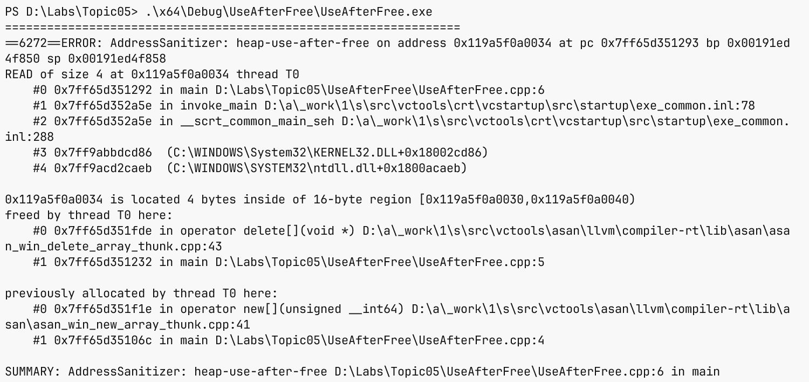
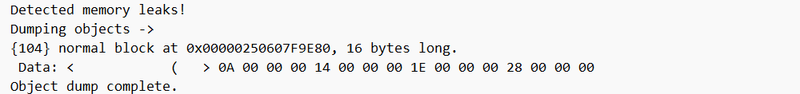

# Динамічна пам’ять і її помилки

## Ручна динамічна пам’ять

`new int{5}` виділяє пам’ять і
створює int зі значенням 5.
`delete p` знищує та звільняє
один об’єкт, створений відповідним
new. Для масиву `new int[n]{}`
потрібен `delete[] p`.
Змішування цих пар неприпустиме,
навіть якщо елементи прості.
`delete nullptr` безпечний,
але повторний delete того
самого ненульового власного
ресурсу – помилка.

Звичайний new повідомляє про
невдале виділення винятком
`std::bad_alloc`. Форма
`new (std::nothrow)` з `<new>`
повертає nullptr замість
цього винятку. Вона не
робить подальшу роботу
безпечною автоматично:
результат треба перевірити
до запису. У сучасному
коді перевагу надають
контейнерам і розумним
вказівникам, які відразу
захоплюють володіння.

### Приклад 2. Збільшення масиву вручну

Програма показує механізм,
який контейнер приховує.
Спочатку існує буфер на
два значення. Новий
буфер створюється до
звільнення старого;
дані копіюються, старий
звільняється, адреса
власника оновлюється.

```cpp
#include <print>
#include <new>

int main()
{
    int* values = new (std::nothrow) int[2]{10, 20};
    if (!values) return 1;
    int* larger = new (std::nothrow) int[4]{};
    if (!larger)
    {
        delete[] values;
        return 1;
    }
    for (int i = 0; i < 2; ++i) larger[i] = values[i];
    delete[] values;
    values = larger;
    larger = nullptr;
    values[2] = 30;
    values[3] = 40;
    for (int i = 0; i < 4; ++i) std::print("{} ", values[i]);
    std::println();
    delete[] values;
    values = nullptr;
}
```

Результат: `10 20 30 40`.
Перевірка другого виділення
має звільнити перший буфер
при невдачі. Ця додаткова
гілка ілюструє складність
ручного володіння.
При винятку з подальшого
виведення ручний cleanup
може не виконатися;
робоче рішення повинно
використати vector або
unique_ptr. Приклад
навмисно демонструє
механіку, не універсальний
контейнер.

Збережений раніше вказівник
на values[0] після delete
стає висячим, навіть
коли новий буфер містить
те саме число. Присвоєння
nullptr змінює лише одну
змінну, а не всі копії
адреси. Тому «після
delete зануляю p»
не є повним розв’язанням
проблеми часу життя.

## Помилки пам’яті та діагностика

**Витік** (*leak*) виникає,
коли ресурс ще виділений,
але програма втратила
спосіб його коректно
звільнити. **Висячий
вказівник** (*dangling
pointer*) зберігає адресу
об’єкта, який уже
знищено. **Подвійне
звільнення** означає
повторне звільнення
того самого ресурсу.
Усі три ситуації
мають різні причини,
тому однієї перевірки
на nullptr недостатньо.

AddressSanitizer додає
перевірки доступу до
пам’яті та може виявити
вихід за межі й доступ
після звільнення. У
MSVC його вмикають
`/fsanitize=address`.
Для налагоджувальної
інформації використовуйте
`/Zi`, а не `/ZI`.
Несумісні `/RTC`,
Edit and Continue та
інкрементне компонування
потрібно вимкнути.
Документація:
<https://learn.microsoft.com/cpp/sanitizers/asan>.

Звіт санітайзера читають
від першого неправильного
доступу: тип помилки,
рядок читання або запису,
місце виділення та
місце звільнення.
Не змінюйте довільні
числа в коді, щоб
звіт зник. Потрібно
виправити межу або
правило володіння.
Відсутність звіту на
одному запуску не
доводить відсутність
усіх дефектів.



Рис. 5.4. Діагностика доступу після звільнення {.caption}

CRT Debug Heap у
Debug-конфігурації MSVC
може повідомляти про
незвільнені виділення
через `_CrtDumpMemoryLeaks()`
із `<crtdbg.h>`.
Це засіб конкретної
реалізації, а не
стандартна функція C++.
Звіт потрібно отримувати
після знищення власників,
інакше живий запланований
об’єкт можна помилково
назвати витоком.



Рис. 5.5. Звіт CRT про незвільнену пам’ять {.caption}
