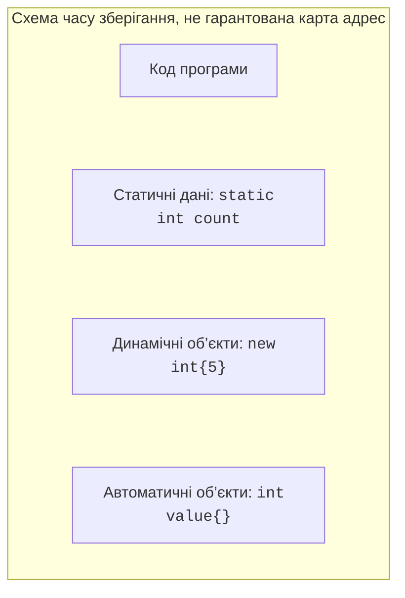
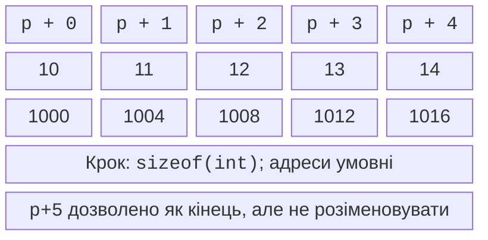
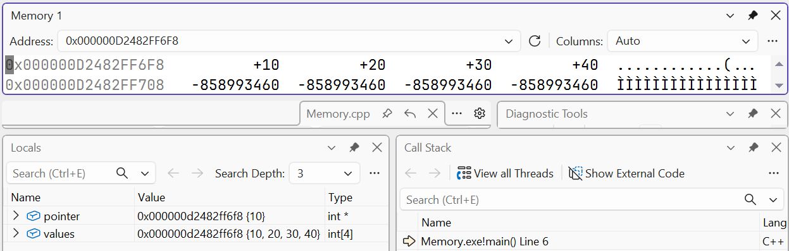

# Пам’ять і вказівники

## Пам’ять, об’єкт і час зберігання

Об’єкт програми займає певну область пам’яті й має час життя.
Значення, адреса та власник – різні характеристики. Значенням
цілого об’єкта може бути 5, адресою – місце його розташування,
а власником – об’єкт або область, відповідальна за завершення
його життя. Вказівник зберігає адресу, але сам факт зберігання
адреси не пояснює, хто має звільнити ресурс.

Автоматичні локальні об’єкти живуть у межах відповідного
виклику або блока. Реалізація часто розміщує їх у стеку,
але стандарт описує час зберігання, а не обов’язкове фізичне
розташування кожної змінної. Статичні об’єкти існують
протягом тривалого періоду роботи програми. Динамічні
об’єкти створюються окремою операцією і потребують
визначеного механізму звільнення (рис. 5.1).



Рис. 5.1. Основні категорії пам’яті програми {.caption}

У популярних схемах стек і купа ростуть назустріч,
але реальний віртуальний адресний простір сучасної ОС
складніший. Не використовуйте таку схему для
арифметичного порівняння адрес незалежних об’єктів.
Операційна система й засоби захисту можуть змінювати
адреси між запусками. Тест має перевіряти поведінку,
а не конкретне шістнадцяткове число адреси.

**Володіння** (*ownership*) – відповідальність за ресурс.
Власник повинен завершити його життя рівно один раз
і не раніше, ніж закінчилися дозволені доступи.
Сучасний C++ виражає це через об’єкти-власники:
vector володіє буфером, string – текстом,
unique_ptr – одним динамічним ресурсом.
Саме ці об’єкти зазвичай замінюють ручне new/delete.

## Вказівники та операції доступу

**Вказівник** (*pointer*) типу `int*` може зберігати
адресу int або нульове значення `nullptr`.
Операція `&value` отримує адресу, а `*pointer`
**розіменовує** (*dereference*) вказівник, тобто
звертається до об’єкта за адресою. Однаковий
символ `*` у різних контекстах може означати
частину типу, розіменування або множення.

Нульовий вказівник не позначає об’єкт. Перед
доступом перевіряйте його, якщо відсутність
об’єкта є допустимою частиною інтерфейсу.
Ненульове значення саме по собі не доводить
чинність: вказівник може посилатися на вже
знищений об’єкт. Ініціалізуйте вказівники,
не покладайтеся на випадкові біти локальної пам’яті.

`const int* p` дозволяє змінити саму адресу,
але не число через p. `int* const p = &x`
фіксує адресу, проте дозволяє змінювати x.
`const int* const p` обмежує обидві дії.
У читанні типу запитуйте окремо: що можна
змінити через доступ і чи можна перепризначити
сам вказівник. Для структури `p->field`
є коротким записом `(*p).field`.

### Приклад 1. Адреса і розіменування

```cpp
#include <print>

int main()
{
    int value = 5;
    int* pointer = &value;
    int& reference = value;
    *pointer = 8;
    reference += 2;
    std::println("value={}, pointed={}", value, *pointer);
    std::println("same address: {}", pointer == &reference);
    pointer = nullptr;
    std::println("empty: {}", pointer == nullptr);
}
```

```text
value=10, pointed=10
same address: true
empty: true
```

Об’єкт один; pointer і reference надають різні
форми доступу до нього. Присвоєння nullptr
не знищує value: вказівник у цьому прикладі
не є власником. Для показу адреси у println
використовують `static_cast<void*>(pointer)`;
адресу char-вказівника не слід плутати з
виведенням тексту нуль-термінованого рядка.

Посилання на звичайний об’єкт має бути
пов’язане з ним під час створення і
не перепризначається. Вказівник зручний,
коли допустима відсутність або зміна
об’єкта спостереження. Посилання зручне,
коли об’єкт обов’язково існує протягом
виклику. Обидві форми можуть стати
висячими, якщо час життя порушено.

## Масиви й арифметика вказівників

Для масиву `int values[5]` значення
`values` у багатьох виразах перетворюється
на адресу першого елемента. Якщо p
вказує на нього, `p+1` позначає
наступний елемент, а не наступний байт.
Крок дорівнює `sizeof(int)`.
`p[i]` еквівалентне `*(p+i)` у
межах допустимого масиву (рис. 5.2).



Рис. 5.2. Кроки вказівника в межах одного масиву {.caption}

Дозволено утворити адресу відразу
після останнього елемента як маркер
кінця. Розіменовувати її не можна.
Віднімати вказівники осмислено лише
в межах того самого масиву або
його кінця; результат має знаковий
тип `std::ptrdiff_t` з `<cstddef>`.
Арифметика між незалежними виділеннями
не є способом знайти відстань між
двома довільними об’єктами.

Рядок C є послідовністю char,
завершеною нульовим байтом `\0`.
`const char*` не містить довжини.
Функція повинна мати гарантію,
що завершальний нуль доступний,
або окремий розмір буфера.
Пошук нуля за межами доступної
пам’яті є помилкою. Аргументи
argv надають нуль-терміновані
рядки середовища запуску;
це не дозвіл довільно
збільшувати їхні буфери.



Рис. 5.3. Перегляд елементів за адресою {.caption}
