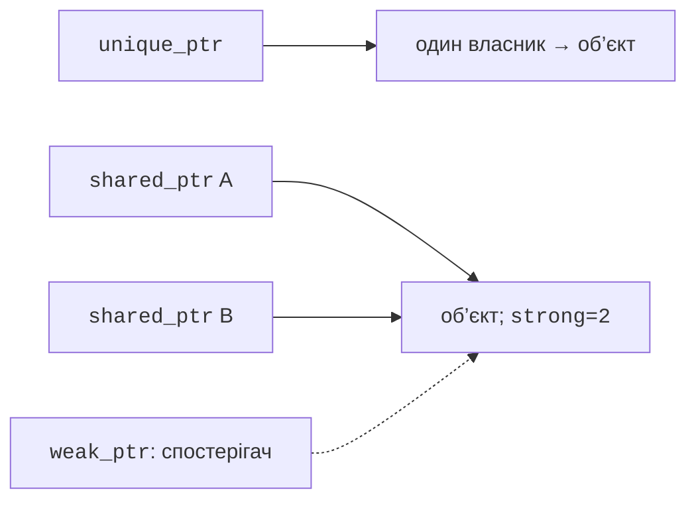
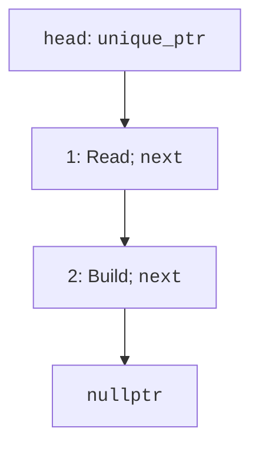

# Розумні вказівники

## unique_ptr: один відповідальний власник

`std::unique_ptr<T>` з
`<memory>` виражає
виключне володіння.
Після завершення життя
власника ресурс автоматично
звільняється. Створення
`std::make_unique<T>(args)`
поєднує виділення і
передавання власності
без відкритого проміжного
сирого вказівника.
Копіювати unique_ptr
заборонено, бо два
незалежні виключні
власники одного ресурсу
суперечили б моделі.

Передавання володіння
виражається `std::move`.
Для unique_ptr після
такого переміщення
джерело порожнє, а
одержувач керує ресурсом.
Тут move означає
намір передачі; детальну
семантику переміщення
вивчатимемо в темі 8.
Не розіменовуйте старе
джерело після передачі.

`get()` дає невласницьку
адресу для короткого
використання; її не
потрібно звільняти.
`reset()` звільняє
поточний ресурс і
може прийняти інший.
`release()` віддає
сиру адресу й
припиняє володіння
**без звільнення**.
Саме release часто
створює витік у
коді, де його
помилково розуміють
як delete.

Масивна форма
`unique_ptr<T[]>`
використовує delete[];
`make_unique<int[]>(n)`
створює нульові елементи.
Проте розмір та
зручні операції додавання
вона не надає, тому
для послідовності
зазвичай потрібний vector.
Розумний вказівник не
є заміною всіх
контейнерів.

## shared_ptr та weak_ptr

`std::shared_ptr<T>`
дозволяє кільком
власникам спільно
утримувати об’єкт.
Копіювання збільшує
число сильних власників;
об’єкт знищується
після зникнення останнього.
`make_shared` створює
об’єкт і керівні
дані. `use_count()`
показує поточну
кількість власників,
але не є механізмом
синхронізації бізнес-логіки.



Рис. 5.6. Виключне, спільне володіння та спостереження {.caption}

Не створюйте два
shared_ptr незалежно
з однієї сирої
адреси. Вони матимуть
окремі керівні блоки
і спробують двічі
звільнити ресурс.
Для спільного володіння
копіюють уже наявний
shared_ptr. Лічильник
і керівний блок
мають накладні витрати,
тому спільне володіння
обирають за потребою,
а не «про всяк випадок».

Якщо A утримує B
через shared_ptr, а B
утримує A, сильні
лічильники не стануть
нулем навіть після
втрати зовнішнього доступу.
`std::weak_ptr<T>`
виражає спостереження
без утримання об’єкта.
`lock()` повертає
тимчасового сильного
власника або порожній
shared_ptr. Перевірте
отриманий результат
і користуйтеся саме
ним, а не окремою
послідовністю expired
та припущенням про
майбутній стан.

### Приклад 3. Пісня у двох плейлистах

```cpp
#include <memory>
#include <vector>
#include <string>
#include <print>

struct Song { std::string title; };

int main()
{
    auto song = std::make_shared<Song>(Song{"Morning"});
    std::weak_ptr<Song> recent = song;
    std::vector<std::shared_ptr<Song>> first{song};
    std::vector<std::shared_ptr<Song>> second{song};
    std::println("Owners: {}", song.use_count());
    song.reset();
    first.clear();
    if (auto active = recent.lock())
        std::println("Available: {}", active->title);
    second.clear();
    std::println("Expired: {}", recent.expired());
}
```

```text
Owners: 3
Available: Morning
Expired: true
```

Початковий власник і
два вектори пояснюють
лічильник 3. Тимчасовий
`active` живе лише
всередині if, тому
після нього очищення
другого плейлиста
знищує пісню.
Weak-вигляд залишається,
але більше не
може надати об’єкт.


Рис. 5.7. Спільні власники у налагоджувачі {.caption}

## Зв’язний список із виключним володінням

Вузол списку містить
дані та власника
наступного вузла.
Голова володіє першим,
перший – другим тощо.
Останній next порожній.
Це однозначний ланцюг
відповідальності без
сильного циклу
(рис. 5.8).



Рис. 5.8. Ланцюжок володіння вузлами {.caption}

### Приклад 4. Список задач

```cpp
#include <memory>
#include <string>
#include <print>
#include <utility>

struct Node
{
    std::string task;
    std::unique_ptr<Node> next;
};

void push(std::unique_ptr<Node>& head, std::string task)
{
    auto node = std::make_unique<Node>();
    node->task = std::move(task);
    node->next = std::move(head);
    head = std::move(node);
}

int main()
{
    std::unique_ptr<Node> head;
    push(head, "Build");
    push(head, "Read");
    for (const Node* p = head.get(); p; p = p->next.get())
        std::println("{}", p->task);
    if (head)
    {
        auto removed = std::move(head);
        head = std::move(removed->next);
    }
    std::println("First now: {}", head->task);
}
```

```text
Read
Build
First now: Build
```

Сирий p в обході
не є власником.
Він лише читає
вузли, поки head
утримує ланцюг.
Вилучення спочатку
переносить голову
до окремого власника,
потім переносить next
на її місце.
Після блока removed
знищує лише вилучений
вузол, бо наступник
уже має нового власника.

Для дуже довгого
ланцюга рекурсивне
знищення вкладених
unique_ptr може
створити глибокий
стек. У виробничому
контейнері використовують
ітеративне очищення.
Навчальний приклад
має лише два
вузли, але обмеження
важливо знати перед
масштабуванням.
