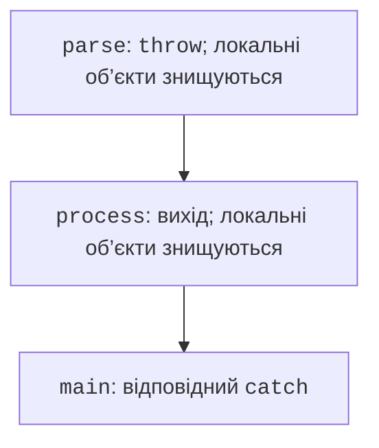
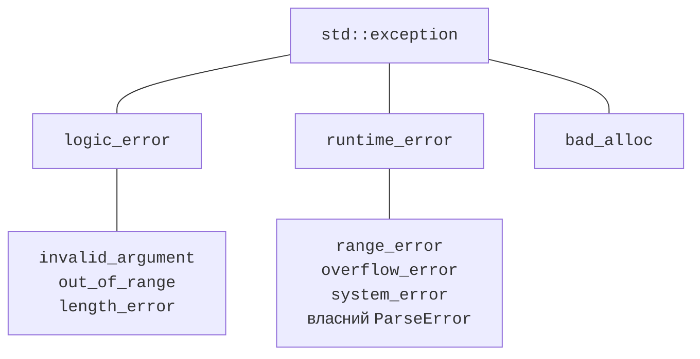
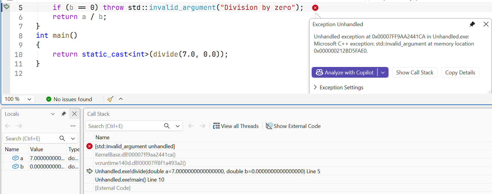

# assert і винятки

## assert, static_assert та контекст

`assert(condition)` з `<cassert>`
перевіряє внутрішню умову
в конфігураціях, де не
визначено `NDEBUG`.
При хибі програма
аварійно припиняє
виконання з діагностикою.
Це засіб пошуку
порушень інваріантів,
а не заміна перевірки
користувацького вводу.
У Release assert
часто вимкнений.

Не пишіть `assert(++count > 0)`:
побічний ефект зникне разом
із перевіркою. Операція
повинна бути окремою,
а assertion лише
спостерігати стан.
`static_assert` працює
під час компіляції
і перевіряє сталий
вираз; введений з
клавіатури індекс
так перевірити не можна.

`std::source_location` з
`<source_location>` дозволяє
передати ім’я файла,
рядок і функцію до
журналу. Типовий
параметр із `current()`
зберігає місце виклику,
а не просто один
рядок усередині
функції логування.
`std::stacktrace` із
`<stacktrace>` у C++23
може надати стек;
деталі символізації
залежать від збірки
і доступних символів.
Адреси та текст
не є сталими
між усіма запусками.

У перевіреному наборі
MSVC заголовок
`<debugging>` з
C++26 відсутній.
Тому `std::breakpoint`
не використовується
у виконуваних
прикладах. Наявність
схожого засобу
налагодження IDE
не означає підтримки
стандартної бібліотечної
функції.

## Виняток як передавання відмови

**Виняток** (*exception*) передає
інформацію про неможливість
виконати операцію до
відповідного обробника.
`throw value;` створює
ситуацію відмови,
`try` обмежує код,
а `catch` описує
реакцію. Після throw
звичайне виконання
поточної функції не
продовжується з
наступного рядка.

Під час пошуку
обробника виконується
**розкручування стека**
(*stack unwinding*):
знищуються повністю
створені автоматичні
об’єкти покинутих
областей. Саме тому
RAII-власники пам’яті,
файлів і блокувань
важливі для правильного
прибирання (рис. 6.5).
Сирий pointer не
звільнить ресурс
автоматично лише
через вихід із блока.



Рис. 6.5. Поширення винятку і знищення локальних об’єктів {.caption}

Стандартні винятки
успадковуються від
`std::exception`.
`what()` дає
діагностичне повідомлення.
`std::invalid_argument`
доречний для
недопустимого аргументу,
`std::out_of_range` –
для виходу за
допустимий діапазон,
`std::runtime_error` –
для відмови під
час виконання.
Ієрархія дозволяє
мати спеціальні
і загальні
обробники.



Рис. 6.6. Частина ієрархії стандартних винятків {.caption}

Перехоплюйте за
`const std::exception&`,
щоб не копіювати
і не зрізати
похідну частину
об’єкта. Конкретні
catch ставлять
перед загальними.
`catch (...)`
перехоплює будь-який
C++-виняток, але
не надає його
типізованих даних.
Не використовуйте
порожній catch,
який мовчки
вдає успіх.

### Приклад 2. Ділення з перевіркою

```cpp
#include <print>
#include <iostream>
#include <stdexcept>
#include <cmath>

double divide(double a, double b)
{
    if (!std::isfinite(a) || !std::isfinite(b))
        throw std::invalid_argument("Finite operands required");
    if (b == 0) throw std::invalid_argument("Zero divisor");
    const double result = a / b;
    if (!std::isfinite(result))
        throw std::overflow_error("Result is not finite");
    return result;
}

int main()
{
    try
    {
        double a{}, b{};
        if (!(std::cin >> a >> b))
            throw std::invalid_argument("Two numbers required");
        std::println("{:.3f}", divide(a, b));
    }
    catch (const std::invalid_argument& error)
    {
        std::cerr << "Input: " << error.what() << '\n';
        return 1;
    }
    catch (const std::exception& error)
    {
        std::cerr << "Failure: " << error.what() << '\n';
        return 2;
    }
}
```

Введення `7 2` дає `3.500`.
`7 0` дає повідомлення
`Input: Zero divisor` і
код 1. Переповнення
результату потрапляє
до загального catch
з кодом 2. Функція
обчислення не друкує
помилку сама: рішення
про користувацький
інтерфейс приймає main.



Рис. 6.7. Зупинка на необробленому винятку {.caption}

Повторне кидання
`throw;` усередині
catch зберігає
поточний виняток.
Запис `throw error;`
може створити копію
зі статичним типом
змінної і втратити
похідну інформацію.
Обробник, який лише
додає контекст до
журналу, може
виконати throw;
для вищого рівня.

У *Exception Settings*
можна зупинятися в
момент кидання C++-винятку,
навіть якщо його
пізніше перехоплять.
Це допомагає бачити
початковий стан.
Наявність зупинки
налагоджувача ще
не означає,
що програма
не має catch.


Рис. 6.8. Політика зупинки на C++-винятках {.caption}
