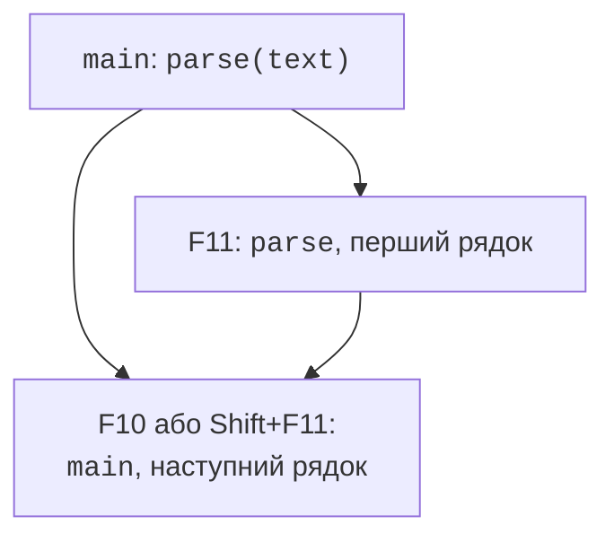

# Помилки та налагоджувач

## Помилка як порушення очікуваної поведінки

Налагодження починається не з випадкової зміни коду,
а з точного опису розбіжності. Запишіть вхід,
очікуваний результат і фактичний результат.
Відтворюваний приклад дозволяє перевірити гіпотезу
про причину. Якщо помилка виникає лише інколи,
збережіть послідовність дій, версію збірки, конфігурацію
та потрібні зовнішні дані. Без цього виправлення
важко відрізнити від випадкового успішного запуску.

Синтаксична помилка перешкоджає компіляції,
помилка компонування – створенню готового файла.
Логічна помилка дозволяє програмі працювати,
але відповідь неправильна. Помилка виконання
може проявитися винятком, завершенням процесу
або повідомленням санітайзера. Невизначена
поведінка не зобов’язана проявлятися жодним
із цих способів: наприклад, вихід за межі
масиву може пошкодити чужі дані без негайної аварії.

Не кожна відмова є дефектом програми.
Відсутній файл, неправильний формат рядка
або недостатній баланс можуть бути
очікуваними ситуаціями, які інтерфейс
повинен описувати. Водночас неправильний
індекс, створений власним алгоритмом,
може означати порушення внутрішнього
інваріанта. Для цих випадків потрібні
різні способи діагностики та відновлення.

### Приклад 1. Середній бал і ціле ділення

Програма навмисно показує неправильний і
виправлений вираз. Значення sum дорівнює 11,
count – 3. Перетворення після ділення
не відновлює втрачену дробову частину.

```cpp
#include <vector>
#include <print>

int main()
{
    const std::vector<int> grades{2, 4, 5};
    int total{};
    for (int grade : grades) total += grade;
    const int count = static_cast<int>(grades.size());
    const double wrong = total / count;
    const double correct = static_cast<double>(total) / count;
    std::println("Wrong: {:.2f}", wrong);
    std::println("Correct: {:.2f}", correct);
}
```

```text
Wrong: 3.00
Correct: 3.67
```

Установіть точку зупинки перед обчисленням
wrong. Перевірте total і count, потім
тип виразу `total / count`. Вхід
правильний і сума правильна; перша
розбіжність виникає саме в діленні.
Виправлення повинне змінити тип
операнда до операції, а не формат
друку. Для порожнього вектора
потрібна також окрема перевірка
count, якої цей сталий приклад не потребує.

## Робота з налагоджувачем Visual Studio

**Точка зупинки** (*breakpoint*) призупиняє
виконання перед відповідним рядком.
У редакторі її встановлюють **F9**,
запускають програму **F5**. Стрілка
поточної інструкції не означає,
що оператор уже виконався. Це
важливо при читанні значень до
присвоєння. Відкрити вікна можна
через *Debug → Windows* під час
зупиненого налагодження.

**F10** (*Step Over*) виконує поточний
рядок, не заходячи покроково всередину
звичайного виклику. **F11** (*Step Into*)
переходить до функції, якщо доступні
її код і налагоджувальна інформація.
**Shift+F11** (*Step Out*) завершує
поточний виклик і зупиняється у
викликача. *Run to Cursor* дозволяє
дійти до вибраного рядка. Ці дії
змінюють спосіб спостереження, а не
математичний зміст програми.



Рис. 6.1. Переходи при покроковому виконанні {.caption}

*Autos* показує автоматично обрані
вирази поблизу поточного рядка,
*Locals* – локальні змінні поточного
контексту,*Watch* – задані вами
вирази. *Call Stack* показує
активні виклики; вибір іншого
кадру змінює контекст перегляду.
DataTip з’являється при наведенні
на змінну. Документація:
<https://learn.microsoft.com/visualstudio/debugger/getting-started-with-the-debugger-cpp>.


Рис. 6.2. Точка зупинки та значення обчислення {.caption}

Умовна точка зупинки дозволяє
перервати цикл лише коли
`i == 7` або виникає інша
потрібна умова. У контекстному
меню точки виберіть *Conditions…*.
**Tracepoint** виконує дію на
зразок друку повідомлення без
обов’язкової зупинки. Це корисно
для довгої послідовності, але
надмірне логування змінює час
виконання і створює шум.


Рис. 6.3. Умовна точка зупинки та дія трасування {.caption}

*Immediate* дозволяє обчислювати
вирази в контексті зупинки.
Не викликайте там функції з
побічними ефектами без розуміння:
налагоджувальний вираз може
змінити стан і приховати
початкову причину дефекту.
Тимчасова зміна змінної
корисна для експерименту,
але не є виправленням
початкового тексту.


Рис. 6.4. Власні вирази у Watch та Immediate {.caption}

У Release оптимізатор може
усунути змінну, переставити
інструкції або вбудувати
функцію. Тому покроковий
рух не завжди відповідає
кожному вихідному рядку.
Налагоджувати Release
можливо з відповідними
символами, але для першого
аналізу зручніша Debug.
Якщо дефект існує лише
в Release, перевірте UB
та залежність від
неініціалізованих значень.

*Diagnostic Tools* допомагають
спостерігати ресурсні показники.
Вони не доводять правильність
алгоритму лише тим, що графік
пам’яті рівний. Hot Reload
і Edit and Continue можуть
застосовувати частину змін
під час налагодження, але
не підтримують будь-яку
зміну C++-програми.
Якщо редагування не
підтримується, зупиніть,
перебудуйте й повторіть
тест. Збірка ASan має
окремі обмеження, описані
в темі 5.
