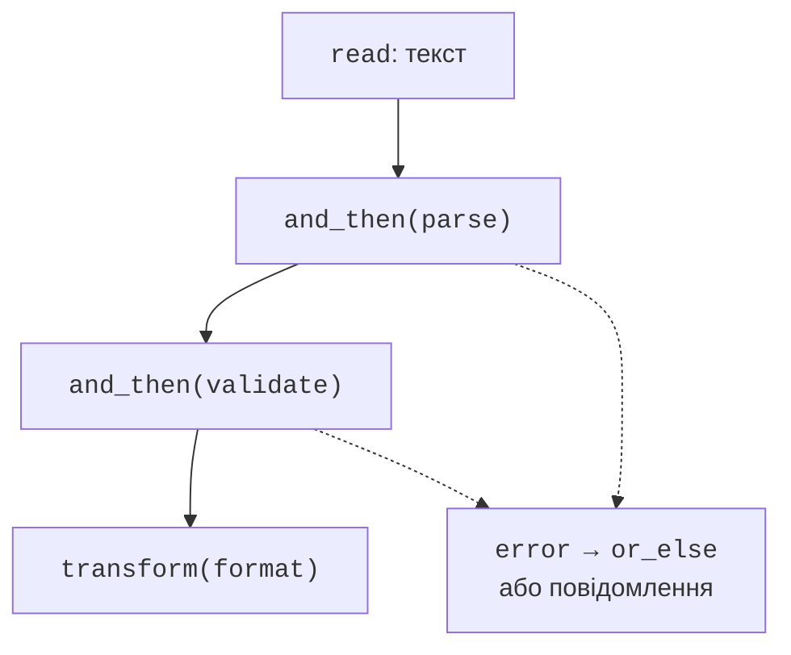

# noexcept, optional та expected

## noexcept і гарантії безпеки

`noexcept` обіцяє, що
виняток не вийде
з функції. Якщо
все ж вийде,
буде викликано
`std::terminate`,
а не звичайне
поширення до
зовнішнього catch.
Не ставте noexcept
на функцію тільки
для приховування
попередження або
в надії прискорити
довільний код.

**Базова гарантія**
означає збереження
інваріантів і
відсутність витоків,
але стан може
змінитися. **Строга
гарантія** означає,
що невдала операція
не змінює спостережуваний
стан. **Гарантія
без відмови**
означає успішне
виконання без
винятку. Noexcept
сам по собі
не доводить
логічного успіху:
функція може
повернути код
помилки.

Для строгої гарантії
зручно працювати з
тимчасовим станом,
а потім виконати
короткий безпечний
обмін. Якщо просто
змінити першу з
двох колекцій,
а друга операція
кине виняток,
дані можуть
розійтися.

### Приклад 3. Узгоджене додавання до двох векторів

```cpp
#include <vector>
#include <print>
#include <stdexcept>

void append_pair(std::vector<int>& ids,
    std::vector<int>& scores, int id, int score)
{
    if (ids.size() != scores.size() || score < 0 || score > 100)
        throw std::invalid_argument("Invalid state or score");
    auto new_ids = ids;
    auto new_scores = scores;
    new_ids.push_back(id);
    new_scores.push_back(score);
    ids.swap(new_ids);
    scores.swap(new_scores);
}

int main()
{
    std::vector<int> ids{1}, scores{80};
    append_pair(ids, scores, 2, 95);
    try { append_pair(ids, scores, 3, 120); }
    catch (const std::invalid_argument&) {}
    std::println("sizes: {}, {}; last: {}, {}", ids.size(),
        scores.size(), ids.back(), scores.back());
}
```

```text
sizes: 2, 2; last: 2, 95
```

До завершення обох
push_back початкові
вектори не змінені.
Для цих vector
зі стандартним
алокатором swap
не кидає винятків.
Порожній catch тут
є лише контрольованою
частиною демонстрації
відхиленого тесту;
у користувацькій
програмі потрібно
повідомити відмову.
Ціна строгої
гарантії – копії
двох векторів.

## optional та expected

`std::optional<T>`
із `<optional>`
означає значення
або його відсутність.
Він зручний для
пошуку, де «не
знайдено» є
звичайним результатом.
Він не пояснює
причину відсутності.
Коли причина
важлива, у C++23
є `std::expected<T,E>`
із `<expected>`:
або успішне T,
або помилка E.

`std::unexpected(error)`
створює помилковий
результат. `has_value()`
або логічна перевірка
визначає стан.
`value()` повертає
значення або кидає
bad_expected_access,
якщо його немає.
`error()` потребує
стану помилки.
`value_or(default)`
дозволяє запасне
значення, але може
приховати важливу
причину відмови.

`and_then` викликає
наступну функцію,
що сама повертає
expected, тільки
при успіху.
`transform` перетворює
успішне значення
звичайною функцією.
`or_else` обробляє
помилку й може
повернути відновлений
результат. Це
**монадні операції**;
для практичного
використання достатньо
розуміти маршрут
значення та помилки.



Рис. 6.9. Поширення успіху і помилки в ланцюжку {.caption}

### Приклад 4. Дата з явною причиною відмови

Вхід – один токен у
форматі YYYY-MM-DD.
Розбір відділений
від перевірки
календарних меж.
Leap-year правило
використовує
Григоріанський календар.

```cpp
#include <expected>
#include <string_view>
#include <string>
#include <iostream>
#include <print>

struct Date { int year, month, day; };
enum class Error { syntax, range };
using Result = std::expected<Date, Error>;

Result parse(std::string_view text)
{
    if (text.size() != 10 || text[4] != '-' || text[7] != '-')
        return std::unexpected(Error::syntax);
    for (std::size_t i = 0; i < text.size(); ++i)
        if (i != 4 && i != 7 && (text[i] < '0' || text[i] > '9'))
            return std::unexpected(Error::syntax);
    auto number = [&](std::size_t start, std::size_t count)
    {
        int value{};
        for (std::size_t i = start; i < start + count; ++i)
            value = value * 10 + text[i] - '0';
        return value;
    };
    return Date{number(0, 4), number(5, 2), number(8, 2)};
}

Result validate(Date date)
{
    if (date.year < 1 || date.month < 1 || date.month > 12)
        return std::unexpected(Error::range);
    const bool leap = date.year % 400 == 0
        || (date.year % 4 == 0 && date.year % 100 != 0);
    const int days[]{31, 28, 31, 30, 31, 30,
        31, 31, 30, 31, 30, 31};
    const int limit = days[date.month - 1]
        + (date.month == 2 && leap ? 1 : 0);
    if (date.day < 1 || date.day > limit)
        return std::unexpected(Error::range);
    return date;
}

int main()
{
    std::string text;
    if (!std::getline(std::cin, text)) return 1;
    const auto result = parse(text).and_then(validate);
    if (!result)
    {
        std::println("Error: {}", result.error() == Error::syntax
            ? "syntax" : "range");
        return 1;
    }
    std::println("Valid: {:04}-{:02}-{:02}", result->year,
        result->month, result->day);
}
```

`2024-02-29` дає
`Valid: 2024-02-29`,
`2023-02-29` –
`Error: range`,
а `2024/02/29` –
`Error: syntax`.
Лямбда number є
короткою локальною
функцією, що читає
вже перевірені
цифри; повна
теорія лямбд
буде пізніше.
