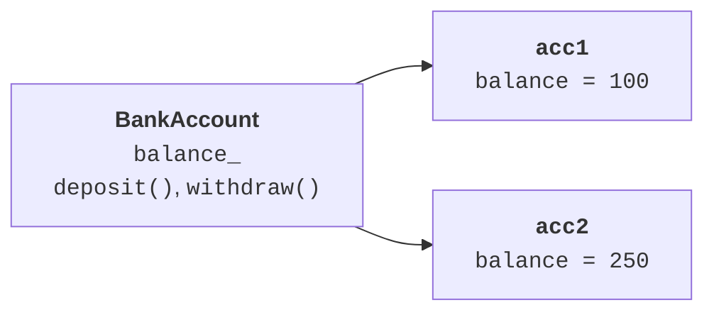
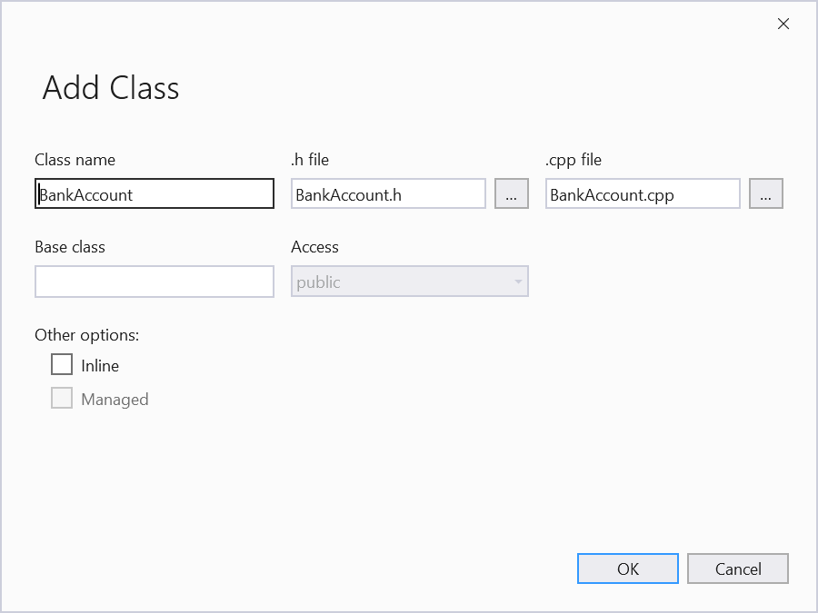
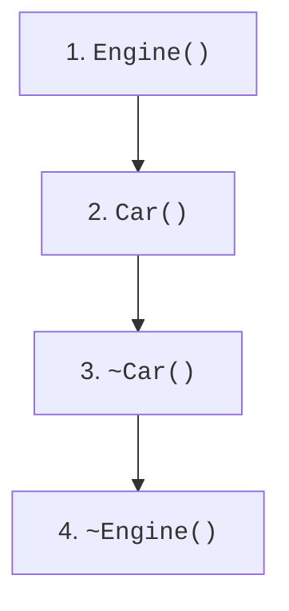
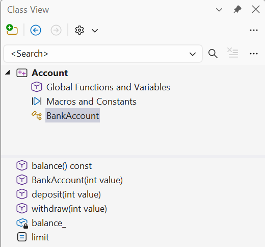

# Клас, інваріант і конструктори

## Стан, поведінка та інваріант класу

**Клас** (*class*) описує тип об’єктів: допустимі дані та операції над ними.
**Об’єкт** (*object*) є конкретним екземпляром із власним станом. Два рахунки
мають однаковий набір методів, але різні залишки. Абстракція відкидає зайве:
для навчального рахунку важливі баланс і перекази, а не колір картки.

**Інваріант** (*invariant*) – твердження, яке справджується після створення
та після кожної успішної публічної операції. Для нашого рахунку баланс
лежить між нулем і мільйоном умовних одиниць. Межа зверху потрібна не лише
для предметної області: вона дає змогу перевірити додавання до виконання
операції та не допустити переповнення цілого числа.

Закриті поля забороняють сторонньому коду обходити правила. Однак сам
модифікатор `private` ще не створює інваріанта: метод `setBalance`, який
приймає будь-яке число, так само зруйнує обмеження. Краще надати операції
предметної області: поповнення та зняття. Помилковий запит має залишати
попередній баланс. З цієї причини всі перевірки виконуються до зміни поля.

`class` і `struct` мають однакові мовні можливості. Відрізняється типовий
доступ: у `class` він закритий, у `struct` відкритий; це також стосується
типового виду наслідування. Для простої пари координат зручна структура,
для рахунку з поведінкою – клас. Це домовленість про намір, а не заборона.

Побудову показано на рис. 7.1.



Рис. 7.1. Клас та незалежні стани його екземплярів {.caption}

### Приклад 1. Банківський рахунок

**Умова.** Створити рахунок з невід’ємним балансом, виконати поповнення та зняття, перевірити відмову без зміни залишку.

```cpp
#include <cassert>
#include <print>
#include <stdexcept>

class BankAccount {
    int balance_;
public:
    static constexpr int limit = 1'000'000;

    explicit BankAccount(int value) : balance_(value) {
        if (value < 0 || value > limit)
            throw std::invalid_argument("balance");
    }

    int balance() const { return balance_; }

    void deposit(int value) {
        if (value <= 0 || value > limit - balance_)
            throw std::invalid_argument("deposit");
        balance_ += value;
    }

    void withdraw(int value) {
        if (value <= 0 || value > balance_)
            throw std::invalid_argument("withdraw");
        balance_ -= value;
    }
};

int main() {
    BankAccount account{100};
    account.deposit(50);
    account.withdraw(20);
    try { account.withdraw(131); }
    catch (const std::invalid_argument&) {
        std::println("Відмовлено");
    }
    assert(account.balance() == 130);
    account.withdraw(130);
    assert(account.balance() == 0);
    try { BankAccount bad{-1}; assert(false); }
    catch (const std::invalid_argument&) {}
    try { account.deposit(0); assert(false); }
    catch (const std::invalid_argument&) {}
    std::println("Залишок: {}", account.balance());
}
```

Усі відмови передують зміні поля. Перевірка `limit - balance_` не виконує потенційно небезпечне додавання. Грошові одиниці тут цілі й навчальні.

Результат виконання:

```text
Відмовлено
Залишок: 0
```



Рис. 7.2. Додавання класу до проєкту {.caption}

## Конструктори та список ініціалізації

**Конструктор** (*constructor*) створює коректний початковий стан. Його ім’я
збігається з ім’ям класу, а тип результату не записується. Конструктор із
параметрами не є звичайним методом, який можна викликати вдруге для
«перезапуску» готового об’єкта. Для повторного використання стану потрібна
окрема операція з визначеним контрактом.

Список після двокрапки ініціалізує члени до входу в тіло конструктора.
Запис `hour_(hour)` одразу створює потрібне значення. Присвоєння в тілі
виконується пізніше; для `const`-поля чи посилання воно взагалі не може
замінити ініціалізацію. Члени ініціалізуються в порядку оголошення в класі,
а не в порядку запису списку. Підтримуйте однаковий порядок у двох місцях.

**Делегування** (*delegating constructor*) дозволяє одному конструктору
викликати інший конструктор того самого класу. Тоді перевірка є в одному
місці. `explicit` забороняє небажане неявне перетворення з аргументу на
об’єкт; пряме створення `ClockTime{90}` залишається доступним.

Ініціалізатор поля, наприклад `int value_ = 0`, задає резервне початкове
значення. Якщо конструктор явно ініціалізує це поле, використовується його
список. `= default` просить компілятор визначити спеціальну функцію за
мовними правилами; це не обіцянка, що кожен можливий набір полів допускає
конструктор без аргументів. Поле без доступного типового конструктора
може зробити такий конструктор видаленим.

Побудову показано на рис. 7.3.



Рис. 7.3. Порядок конструювання й знищення композиції {.caption}

### Приклад 2. Час доби

**Умова.** Задати час кількістю хвилин або годинами й хвилинами; нормалізувати невід’ємні хвилини в межах доби.

```cpp
#include <cassert>
#include <print>
#include <stdexcept>

class ClockTime {
    int minutes_;
public:
    ClockTime() : ClockTime(0) {}

    explicit ClockTime(int total) : minutes_(total % 1440) {
        if (total < 0) throw std::invalid_argument("time");
    }

    ClockTime(int hour, int minute) : ClockTime(0) {
        if (hour < 0 || hour > 23 || minute < 0 || minute > 59)
            throw std::invalid_argument("clock fields");
        minutes_ = hour * 60 + minute;
    }

    int hour() const { return minutes_ / 60; }
    int minute() const { return minutes_ % 60; }
};

int main() {
    const ClockTime t{1501};
    std::println("{:02}:{:02}", t.hour(), t.minute());
    assert(t.hour() == 1 && t.minute() == 1);
    assert(ClockTime{}.hour() == 0);
    assert(ClockTime{1440}.minute() == 0);
    try { ClockTime bad{24, 0}; assert(false); }
    catch (const std::invalid_argument&) {}
    try { ClockTime bad{-1}; assert(false); }
    catch (const std::invalid_argument&) {}
}
```

Конструктори мають різні контракти: кількість хвилин допускає кілька діб, а пара годин і хвилин описує вже коректний час доби. Константний об’єкт читають через `const`-методи.

Результат виконання:

```text
01:01
```



Рис. 7.4. Члени класу у Class View {.caption}
