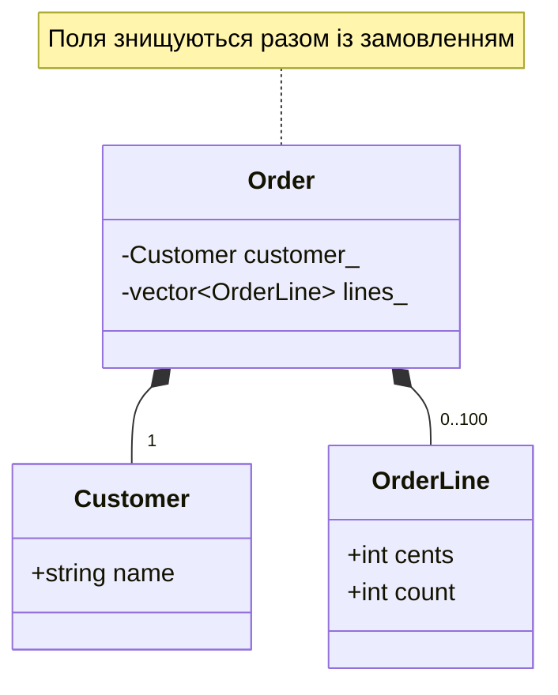
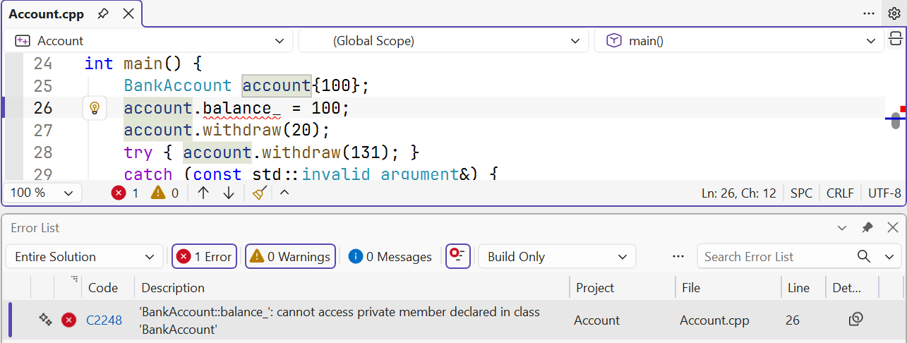

# Композиція та життя об’єктів

## Композиція та розділення на файли

**Композиція** (*composition*) описує відношення «містить». Замовлення
містить покупця й позиції. Коли позиції зберігаються за значенням у
`std::vector`, їхнім життям керує сам контейнер. Знищення замовлення
знищує його поля автоматично; писати цикл із `delete` не потрібно.

Заголовок `Order.h` містить інтерфейс, потрібний користувачеві типу.
`Order.cpp` містить визначення методів; `main.cpp` використовує інтерфейс.
Кожен `.cpp` компілюється окремо, а компонувальник поєднує результати.
Команда для наведеного прикладу: `cl /std:c++latest /EHsc /W4 /utf-8 main.cpp Order.cpp`.
Якщо забути `Order.cpp`, оголошення буде видно, але визначення не знайдеться
під час компонування. Це інший етап, ніж помилка доступу до закритого поля.

`#pragma once` у цьому курсі захищає заголовок від повторного включення
в одній одиниці трансляції; директива підтримується MSVC. Заголовок має
сам включати потрібні для його оголошень стандартні заголовки. Не слід
покладатися на випадковий порядок `#include` в чужому файлі.

`inline static` задає одне спільне поле класу, а не копію на кожен об’єкт.
У прикладі воно рахує виклики конструктора з параметрами. Це не лічильник
живих об’єктів і не генератор унікальності скопійованих замовлень:
копіювання має окремі правила, які вивчатимемо в наступній темі.

Побудову показано на рис. 7.5.



Рис. 7.5. Замовлення володіє покупцем і позиціями {.caption}

### Приклад 3. Замовлення з окремим заголовком

**Умова.** Скомпонувати замовлення з покупця й позицій, порахувати суму та число первинно створених замовлень.

Файл `Order.h`:

```cpp
#pragma once
#include <string>
#include <vector>

struct Customer { std::string name; };
struct OrderLine { int cents; int count; };

class Order {
    Customer customer_;
    std::vector<OrderLine> lines_;
    inline static int created_ = 0;
public:
    Order(Customer customer, std::vector<OrderLine> lines);
    int total() const;
    static int created() { return created_; }
};
```

Файл `Order.cpp`:

```cpp
#include "Order.h"
#include <stdexcept>
#include <utility>

Order::Order(Customer customer, std::vector<OrderLine> lines)
    : customer_(std::move(customer)), lines_(std::move(lines)) {
    if (customer_.name.empty() || lines_.size() > 100)
        throw std::invalid_argument("order");
    for (const auto& line : lines_)
        if (line.cents < 0 || line.cents > 10'000 ||
            line.count < 1 || line.count > 100)
            throw std::invalid_argument("line");
    ++created_;
}

int Order::total() const {
    int sum = 0;
    for (const auto& line : lines_) sum += line.cents * line.count;
    return sum;
}
```

Файл `main.cpp`:

```cpp
#include "Order.h"
#include <cassert>
#include <print>
#include <stdexcept>

int main() {
    const Order a{{"Олена"}, {{2500, 2}, {700, 3}}};
    assert(a.total() == 7100);
    const Order empty{{"Тест"}, {}};
    assert(empty.total() == 0);
    try { Order bad{{""}, {}}; assert(false); }
    catch (const std::invalid_argument&) {}
    assert(Order::created() == 2);
    std::println("Сума: {} коп.; створено: {}",
        a.total(), Order::created());
}
```

Межі кількості позицій, ціни й кількості утримують суму в діапазоні `int`. Порожнє замовлення дозволено, порожнє ім’я покупця – ні. Лічильник збільшується лише після перевірок.

Результат виконання:

```text
Сума: 7100 коп.; створено: 2
```



Рис. 7.6. Захист закритого поля {.caption}

## Життя об’єктів і деструктор

**Деструктор** (*destructor*) завершує життя об’єкта. Для локального об’єкта
він викликається автоматично під час виходу з області видимості, також
коли вихід спричинив виняток. Для об’єкта під керуванням `unique_ptr`
він викликається, коли власник звільняє ресурс. Саме час життя власника,
а не слово «купа», визначає момент очищення.

У складеному об’єкті спочатку конструюються поля, потім виконується
тіло конструктора зовнішнього класу. Під час знищення спочатку
виконується тіло деструктора зовнішнього класу, потім поля знищуються
у зворотному порядку. Тому `Car` може використовувати `engine_` у своєму
деструкторі, але після завершення знищення звертатися до об’єкта не можна.

Якщо конструктор кидає виняток, готового зовнішнього об’єкта немає,
тож його деструктор не викликається. Проте вже повністю сконструйовані
поля буде знищено. Ця гарантія пояснює користь композиції з контейнерів
і розумних вказівників замість ручного керування ресурсами.

Виведення повідомлень у деструкторі нижче є навчальним трасуванням.
Звичайний клас зі `string` і `vector` переважно не потребує власного
деструктора. Деструктор не повинен випускати виняток: повторний виняток
під час розкручування стека може завершити програму через `std::terminate`.

### Приклад 4. Трасування життя об’єктів

**Умова.** Показати порядок створення та знищення автомобіля з двигуном у вкладеній області видимості.

```cpp
#include <memory>
#include <print>

struct Engine {
    Engine() { std::println("Engine()"); }
    ~Engine() { std::println("~Engine()"); }
};

class Car {
    Engine engine_;
public:
    Car() { std::println("Car()"); }
    ~Car() { std::println("~Car()"); }
};

int main() {
    std::println("Початок");
    {
        auto car = std::make_unique<Car>();
        std::println("Усередині");
    }

    std::println("Кінець");
}
```

Динамічний об’єкт належить локальному `unique_ptr`. Вихід з області видимості знищує власника, автомобіль і його двигун. Ручного `delete` немає.

Результат виконання:

```text
Початок
Engine()
Car()
Усередині
~Car()
~Engine()
Кінець
```
