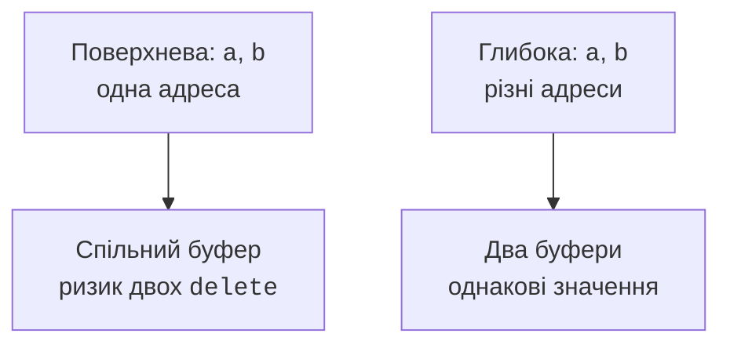
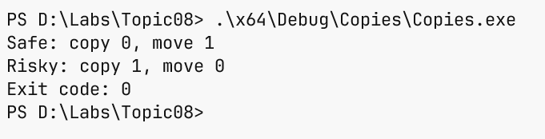
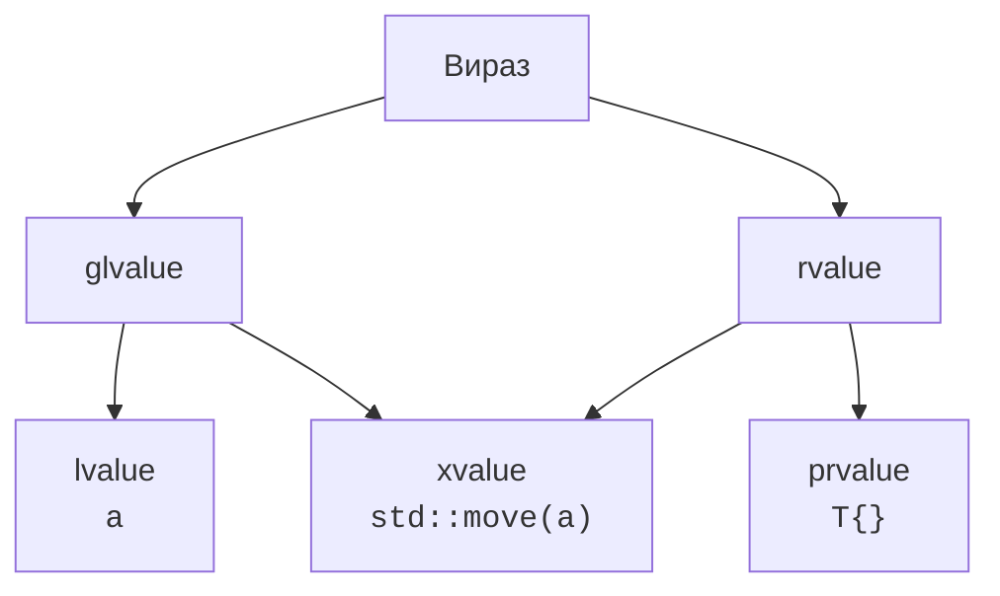
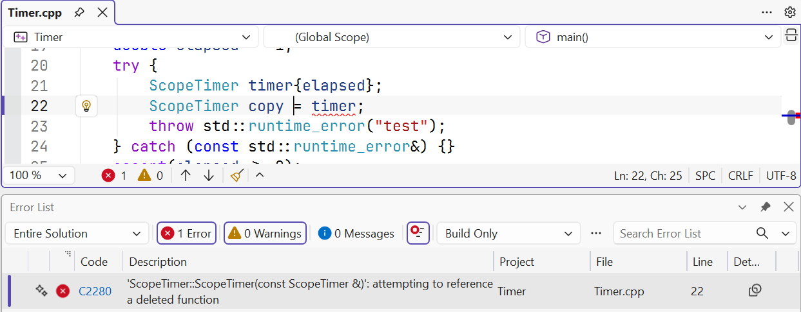

# Копіювання та переміщення

## Копія значення та копія адреси

Копіювання об’єкта з полем `int*` за замовчуванням копіює адресу.
Воно не створює другого масиву. Якщо обидва об’єкти вважають себе
власниками, знищення першого звільнить спільний буфер, а другий
залишиться з недійсною адресою. Повторне звільнення має невизначену
поведінку. Це проблема контракту володіння, а не лише синтаксису `delete`.

**Глибока копія** (*deep copy*) створює незалежний ресурс і переносить
значення елементів. **Поверхнева копія** (*shallow copy*) переносить лише
поля, серед яких може бути адреса. Вона цілком правильна для невласного
спостерігача, якщо зовнішній ресурс живе достатньо довго. Тому наявність
вказівника сама по собі не означає, що його треба видаляти.

Конструктор копіювання створює новий об’єкт з наявного: `T b{a}`.
Присвоєння копіюванням змінює вже готовий об’єкт: `b = a`.
Другий випадок повинен коректно поводитися з ресурсом, який `b` уже
мав, та із самоприсвоєнням `a = a`. Це різні етапи життя, тому одна
правильна реалізація не робить автоматично правильною іншу.

Для навчального рядка порожній стан подаємо парою нульового розміру
й нульової адреси. Метод `text()` повертає стандартний рядок, тож
користувач не отримує доступу до власного буфера. У промисловому коді
зазвичай одразу використовують `std::string`; ручна реалізація потрібна
тут, щоб побачити обов’язки власника ресурсу.

Побудову показано на рис. 8.1.



Рис. 8.1. Адресна та незалежна копії буфера {.caption}

### Приклад 1. Власний рядок

**Умова.** Реалізувати незалежну копію, copy-and-swap та передачу буфера; порожнє джерело лишається придатним до використання.

```cpp
#include <algorithm>
#include <cassert>
#include <print>
#include <string>
#include <string_view>
#include <utility>
class MyString {
    std::size_t size_ = 0;
    char* data_ = nullptr;
public:
    explicit MyString(std::string_view s = {}) : size_(s.size()),
        data_(size_ ? new char[size_] : nullptr) {
        if (size_) std::copy_n(s.data(), size_, data_);
    }
    ~MyString() { delete[] data_; }
    MyString(const MyString& x) : MyString(x.text()) {}
    MyString(MyString&& x) noexcept
        : size_(std::exchange(x.size_, 0)),
          data_(std::exchange(x.data_, nullptr)) {}
    void swap(MyString& x) noexcept {
        std::swap(size_, x.size_);
        std::swap(data_, x.data_);
    }
    MyString& operator=(const MyString& x) {
        MyString temp{x};
        swap(temp);
        return *this;
    }
    MyString& operator=(MyString&& x) noexcept {
        if (this != &x) {
            delete[] data_;
            data_ = std::exchange(x.data_, nullptr);
            size_ = std::exchange(x.size_, 0);
        }
        return *this;
    }
    std::string text() const {
        return size_ ? std::string(data_, size_) : std::string{};
    }
};
int main() {
    MyString a{"alpha"};
    MyString b{a};
    a = MyString{"beta"};
    assert(b.text() == "alpha");
    b = b;
    MyString c{std::move(b)};
    assert(b.text().empty());
    b = c;
    c = std::move(c);
    assert(c.text() == "alpha" && b.text() == "alpha");
    MyString empty;
    empty = std::move(b);
    assert(b.text().empty());
    std::println("{} {}", a.text(), empty.text());
}
```

Копіювання створює нове сховище. Переміщення передає адресу та зануляє джерело. Самопереміщення тут свідомо зберігає значення; це явний контракт цього класу.

Результат виконання:

```text
beta alpha
```



Рис. 8.2. Копії та переміщення під час reserve {.caption}

## Переміщення та noexcept

**Переміщення** (*move*) дозволяє передати ресурс, коли попереднє значення
джерела більше не потрібне. Сам `std::move` нічого не переносить:
він змінює категорію виразу та дозволяє вибрати перевантаження з `T&&`.
Ресурс передає конструктор або оператор присвоєння переміщенням.

У власному буфері домовляємося, що після переміщення джерело порожнє.
Для багатьох стандартних типів гарантія слабша: стан коректний,
але його конкретне значення не визначене, якщо документація не
обіцяє іншого. Можна знищити об’єкт або присвоїти йому нове значення;
операції з додатковими передумовами потрібно виконувати обережно.

`noexcept` повідомляє, що операція не випустить виняток. Якщо це
все-таки станеться, програма завершиться через `std::terminate`.
Для простого перенесення вказівника та розміру така обіцянка природна;
для операції, що виділяє пам’ять або викликає невідому функцію, її
не можна додавати лише заради швидкодії.

Під час перевиділення `vector` прагне зберегти гарантії у разі помилки.
Якщо переміщення може кинути виняток, а копіювання доступне, реалізація
може копіювати старі елементи. Приклад порівнює два типи з однаковими
лічильниками, але різними специфікаціями переміщення. Ми навмисно
викликаємо `reserve(capacity()+1)`, щоб гарантовано вимагати новий буфер.

Побудову показано на рис. 8.3.



Рис. 8.3. Категорії виразів зі спільним xvalue {.caption}

### Приклад 2. Трасувальник переміщення

**Умова.** Порівняти перенесення одного елемента vector для безвиняткового та потенційно виняткового move.

```cpp
#include <cassert>
#include <print>
#include <vector>
struct Safe {
    inline static int copies = 0, moves = 0;
    Safe() = default;
    Safe(const Safe&) { ++copies; }
    Safe(Safe&&) noexcept { ++moves; }
};
struct Risky {
    inline static int copies = 0, moves = 0;
    Risky() = default;
    Risky(const Risky&) { ++copies; }
    Risky(Risky&&) noexcept(false) { ++moves; }
};
int main() {
    std::vector<Safe> a(1);
    a.reserve(a.capacity() + 1);
    std::vector<Risky> b(1);
    b.reserve(b.capacity() + 1);
    assert(Safe::moves == 1 && Safe::copies == 0);
    assert(Risky::copies == 1 && Risky::moves == 0);
    std::println("Safe: copy {}, move {}",
        Safe::copies, Safe::moves);
    std::println("Risky: copy {}, move {}",
        Risky::copies, Risky::moves);
}
```

Початкове створення елементів не копіює їх. Після примусового reserve лічильники показують вибір перевиділення на перевіреній реалізації. Тип Risky не кидає виняток фактично, але його сигнатура дозволяє це.

Результат виконання:

```text
Safe: copy 0, move 1
Risky: copy 1, move 0
```



Рис. 8.4. Заборонене копіювання guard {.caption}
