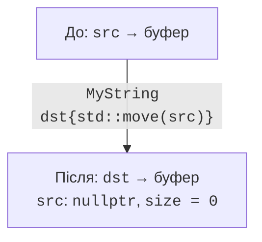
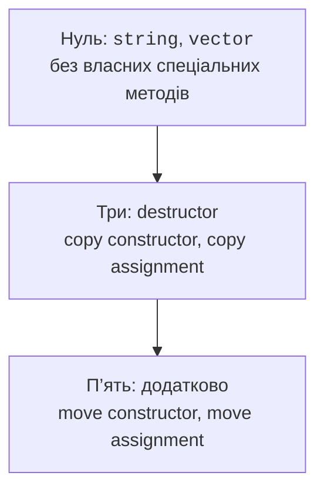

# RAII і правило нуля, трьох і п’яти

## RAII та межа області видимості

**RAII** (*Resource Acquisition Is Initialization*) пов’язує володіння
ресурсом із життям об’єкта. Конструктор отримує ресурс або повідомляє
про невдачу, деструктор звільняє. Ресурсом може бути пам’ять, файл,
блокування, тимчасовий стан потоку чи право користування обладнанням.
Важливий принцип один: кожен ресурс має зрозумілого власника.

Ранній `return` і виняток не повинні вимагати ручного дублювання
очищення в усіх гілках. Якщо ресурс записано в правильно реалізований
RAII-об’єкт, розкручування стека викличе його деструктор. Це не означає,
що очищення відбудеться після примусового завершення процесу чи збою
живлення: гарантія стосується нормального механізму життя об’єктів C++.

Таймер області видимості не володіє пам’яттю, але використовує той самий
принцип: момент створення записується, а на виході обчислюється інтервал.
У прикладі результат пишеться в зовнішнє посилання; це посилання має
жити довше за таймер. Копіювання заборонене, щоб не отримати двох
незалежних завершень одного вимірювання.

Деструктор таймера не виводить у потік і не виділяє пам’ять. Він лише
записує число, тому його контракт простіший. Для журналювання помилки
запису потрібно обробляти окремо: покладатися на виняток із деструктора
під час обробки іншого винятку небезпечно.

Побудову показано на рис. 8.5.



Рис. 8.5. Передавання ресурсу без дублювання власника {.caption}

### Приклад 3. Таймер області видимості

**Умова.** Записати тривалість ділянки навіть після винятку; заборонити копіювання таймера.

```cpp
#include <cassert>
#include <chrono>
#include <print>
#include <stdexcept>

class ScopeTimer {
    using Clock = std::chrono::steady_clock;
    Clock::time_point start_ = Clock::now();
    double& result_;
public:
    explicit ScopeTimer(double& result) : result_(result) {}
    ScopeTimer(const ScopeTimer&) = delete;
    ScopeTimer& operator=(const ScopeTimer&) = delete;

    ~ScopeTimer() noexcept {
        result_ = std::chrono::duration<double>(
            Clock::now() - start_).count();
    }
};

int main() {
    double elapsed = -1;
    try {
        ScopeTimer timer{elapsed};
        throw std::runtime_error("test");
    } catch (const std::runtime_error&) {}
    assert(elapsed >= 0);
    std::println("Таймер завершено: {}", elapsed >= 0);
}
```

Числовий час залежить від запуску. Стабільний тест перевіряє, що деструктор виконався й записав невід’ємний інтервал. Об’єкт elapsed створено раніше, ніж таймер.

Результат виконання:

```text
Таймер завершено: true
```

## Правило нуля, трьох і п’яти

**Правило трьох** пов’язує деструктор, конструктор копіювання та
присвоєння копіюванням. Якщо клас вручну керує ресурсом і потребує
однієї з цих функцій, решту треба принаймні свідомо розглянути.
**Правило п’яти** додає дві операції переміщення. Це рекомендації щодо
узгодженості володіння, а не вимога всюди писати п’ять тіл функцій.

**Правило нуля** рекомендує будувати класи з типів, які вже правильно
керують ресурсами: `vector`, `string`, `unique_ptr`. Тоді клас предметної
області не визначає власні спеціальні функції. Компілятор поєднує
семантику його полів. Якщо поле є `unique_ptr`, копіювання класу
може бути автоматично недоступним, і це часто саме бажаний контракт.

Користувацьке оголошення деструктора може перешкодити неявному
генеруванню переміщення. Оголошені операції переміщення впливають
на доступність неявних копій. Не слід запам’ятовувати це як правило
«компілятор завжди створює все»: перевіряйте конкретний набір функцій
та властивості всіх полів і базових класів.

`= delete` явно забороняє операцію, а `= default` просить реалізацію
за правилами мови. У цій темі використовується переносимий запис
`= delete;`. Нові діагностичні можливості C++26 не потрібні для контракту
move-only. Причину заборони можна зрозуміло описати коментарем і документацією.

Побудову показано на рис. 8.6.



Рис. 8.6. Вибір правила володіння {.caption}

### Приклад 4. Правило нуля

**Умова.** Скопіювати документ на string/vector та змінити копію без впливу на оригінал.

```cpp
#include <cassert>
#include <print>
#include <string>
#include <utility>
#include <vector>

struct Document {
    std::string title;
    std::vector<int> pages;
};

Document makeDocument() {
    return Document{"Звіт", {10, 20}};
}

int main() {
    Document a = makeDocument();
    Document b = a;
    b.pages.at(0) = 99;
    assert(a.pages.at(0) == 10);
    Document c = std::move(b);
    assert(c.pages.at(0) == 99);
    b = Document{"Новий", {}};
    assert(b.pages.empty());
    std::println("{}: {}", a.title, a.pages.at(0));
    std::println("{}: {}", c.title, c.pages.at(0));
}
```

Клас не визначає жодної спеціальної функції. Після переміщення тест не покладається на порожній рядок чи місткість джерела, а явно присвоює новий коректний стан.

Результат виконання:

```text
Звіт: 10
Звіт: 99
```
