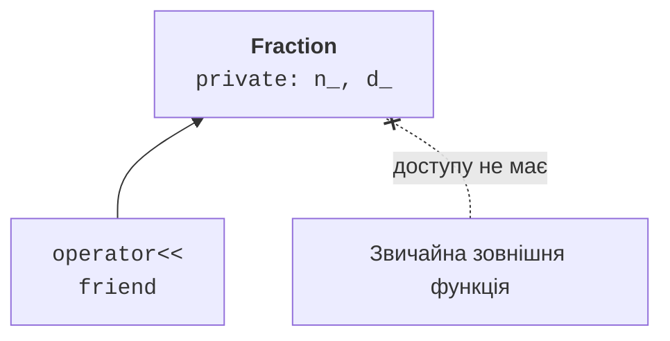

# Індексування, виклик та інкремент

## Індексування та вибір семантики

`operator[]` має позначати доступ до елемента, а не довільну дію.
Неконстантне перевантаження повертає посилання для зміни, константне –
значення або константне посилання для читання. Обидва повинні мати
однакове правило індексу. У прикладі вектора допустимі лише 0, 1 і 2.

Стандарт не зобов’язує будь-який `operator[]` перевіряти межі.
Наш навчальний клас делегує `std::array::at`, тому помилковий індекс
кидає `out_of_range`. Контракт треба читати для конкретного типу;
не можна переносити поведінку `at` на неперевірений доступ інших контейнерів.

Унарний мінус вектора має зрозумілий геометричний зміст. Для скалярного
та векторного добутків одночасне використання `*` може заплутати
користувача. У прикладі обираємо іменований метод `dot`, щоб назва
визначала результат. Перевантаження є інструментом, а не вимогою
замінити всі методи символами.

C++23 допускає багатопараметровий `operator[]`. Матриця нижче використовує
`m[row, column]`; підтримку перевірено на MSVC 19.51 у режимі latest.
Для старішого компілятора можна зберегти той самий контракт через
`at(row, column)`. Синтаксис `deducing this` може скоротити дублювання,
але в першій реалізації дві явні версії легше перевірити й пояснити.

Побудову показано на рис. 9.5.



Рис. 9.5. Явний дозвіл доступу дружній функції {.caption}

### Приклад 3. Вектор у просторі

**Умова.** Надати індексований доступ, унарний мінус і скалярний добуток.

```cpp
#include <array>
#include <cassert>
#include <print>
#include <stdexcept>

class Vec3 {
    std::array<double, 3> data_;
public:
    Vec3(double x, double y, double z) : data_{x, y, z} {}
    double& operator[](std::size_t i) { return data_.at(i); }

    const double& operator[](std::size_t i) const {
        return data_.at(i);
    }

    Vec3 operator-() const {
        return {-data_[0], -data_[1], -data_[2]};
    }

    double dot(const Vec3& x) const {
        return data_[0] * x[0] + data_[1] * x[1] +
            data_[2] * x[2];
    }
};

int main() {
    Vec3 a{1, 2, 3};
    const Vec3 b{-1, 0, 2};
    assert(a.dot(b) == 5);
    assert((-a)[2] == -3);
    a[0] = 4;
    try { a[3] = 0; assert(false); }
    catch (const std::out_of_range&) {}
    std::println("Добуток: {}", a.dot(b));
}
```

Константна версія дозволяє читати b, але не змінювати його компонент через індекс. Наведені невеликі цілі значення точно подаються в double; цей тест не заявляє довільну числову стійкість.

Результат виконання:

```text
Добуток: 2
```

## Виклик об’єкта та інкремент

Клас із `operator()` називають **функціональним об’єктом** (*function object*),
або функтором. На відміну від простої функції, він може зберігати стан:
наступний номер, тариф чи лічильник викликів. Вираз `counter()` викликає
метод об’єкта, тому дві незалежні копії лічильника мають незалежні стани.

Префіксний `++x` за домовленістю змінює об’єкт і повертає посилання
на новий стан. Постфіксний `x++` має фіктивний параметр `int`, який
розрізняє сигнатури, та зазвичай повертає попереднє значення за значенням.
Його зручно реалізувати через копію і префіксну форму.

Перед інкрементом максимального цілого потрібно визначити поведінку:
кинути виняток, насититися на межі чи використати інший діапазон.
Мовне знакове переповнення не є прийнятним способом «перейти до нуля».
У прикладі генератора вибрана явна відмова без зміни стану.

`explicit operator bool` дозволяє використати об’єкт в умові `if`,
але не сприяє небажаному перетворенню на ціле в арифметиці.
Значення true треба визначити предметно: ненульова матриця, відкритий
ресурс чи наявне значення. Не називайте true «валідністю», якщо всі
сконструйовані об’єкти класу вже зобов’язані бути валідними.

### Приклад 4. Лічильник-функтор

**Умова.** Показати виклик, префіксний і постфіксний інкремент, захист максимальної межі.

```cpp
#include <cassert>
#include <limits>
#include <print>
#include <stdexcept>

class Counter {
    int value_;
public:
    explicit Counter(int n) : value_(n) {}
    int value() const { return value_; }

    Counter& operator++() {
        if (value_ == std::numeric_limits<int>::max())
            throw std::overflow_error("counter");
        ++value_; return *this;
    }

    Counter operator++(int) {
        Counter old = *this; ++*this; return old;
    }

    int operator()() { return (*this)++.value(); }
};

int main() {
    Counter c{10};
    assert(c() == 10);
    assert((c++).value() == 11);
    assert((++c).value() == 13);
    Counter max{std::numeric_limits<int>::max()};
    try { ++max; assert(false); }
    catch (const std::overflow_error&) {}
    assert(max.value() == std::numeric_limits<int>::max());
    std::println("Поточний: {}", c.value());
}
```

Постфіксна форма повертає копію старого стану. Виклик counter використовує саме її, тому віддає номер і готує наступний. На максимальній межі операція не змінює об’єкт.

Результат виконання:

```text
Поточний: 13
```
