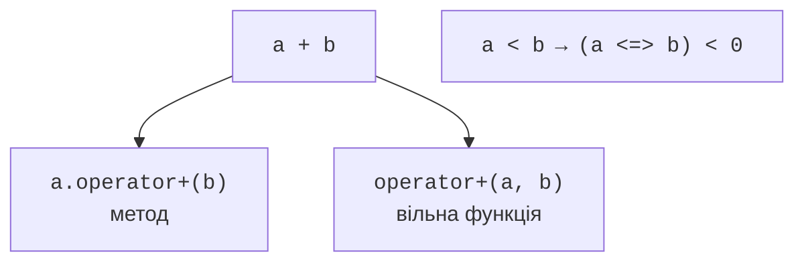
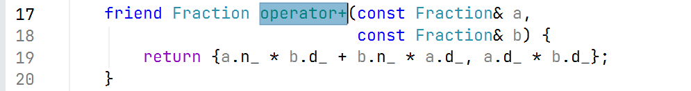
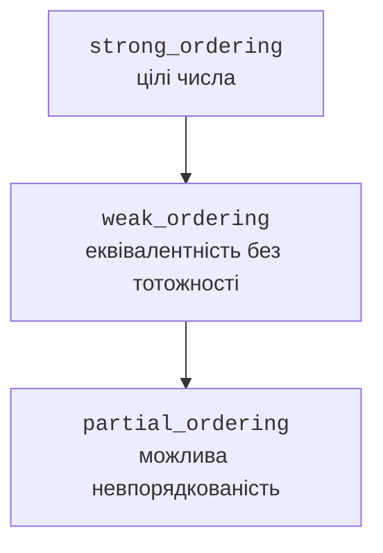

# Операції як інтерфейс

## Операція як частина інтерфейсу

Перевантажена операція є функцією зі спеціальним ім’ям. Вираз `a + b`
для класового типу може звернутися до методу або вільної функції.
Це дає змогу записувати предметні обчислення природно: суму дробів,
добуток матриць, порівняння версій. Однак зручний синтаксис не виправдовує
несподівану семантику. Додавання не повинно раптом записувати файл.

Не можна створювати нові символи операцій, змінювати їхній пріоритет
або арність. Не перевантажуються, зокрема, `::`, `.`, `.*` і `?:`.
Щонайменше один операнд звичайної перевантаженої операції повинен
мати класовий або перелічуваний тип. Власний клас не дає права
перевизначити зміст додавання двох вбудованих цілих чисел.

Для дробу спочатку потрібен інваріант: знаменник додатний, чисельник
і знаменник скорочені, нуль має єдине подання. Без нормалізації
рівність полів не відповідатиме рівності математичних значень.
Перевірка знаменника нуль виконується до ділення чи скорочення.

Приклад навмисно обмежує вхідні чисельники й знаменники мільйоном.
Це робить проміжні добутки безпечними для `long long`; результат,
який не проходить контракт конструктора, відхиляється. Повна довільна
точність є окремою задачею, а не прихованою властивістю короткого класу.

Побудову показано на рис. 9.1.



Рис. 9.1. Вираз і можливі функціональні форми {.caption}

### Приклад 1. Дріб

**Умова.** Скоротити раціональні числа, додати їх і порівняти без плаваючої крапки.

```cpp
#include <cassert>
#include <compare>
#include <iostream>
#include <numeric>
#include <stdexcept>

class Fraction {
    long long n_, d_;
public:
    Fraction(long long n, long long d) : n_(n), d_(d) {
        if (n < -1'000'000 || n > 1'000'000 ||
            d < -1'000'000 || d > 1'000'000 || d == 0)
            throw std::invalid_argument("fraction range");
        if (d_ < 0) { n_ = -n_; d_ = -d_; }
        const auto g = std::gcd(n_, d_);
        n_ /= g; d_ /= g;
    }

    friend Fraction operator+(const Fraction& a,
                              const Fraction& b) {
        return {a.n_ * b.d_ + b.n_ * a.d_, a.d_ * b.d_};
    }
    bool operator==(const Fraction&) const = default;

    std::strong_ordering operator<=>(const Fraction& x) const {
        return n_ * x.d_ <=> x.n_ * d_;
    }

    friend std::ostream& operator<<(std::ostream& out,
                                    const Fraction& x) {
        return out << x.n_ << '/' << x.d_;
    }
};

int main() {
    Fraction a{1, 2}, b{1, 3};
    assert((a + b == Fraction{5, 6}));
    assert((Fraction{-2, -4} == a));
    assert((Fraction{0, 3} == Fraction{0, 1}));
    assert(a > b);
    try { Fraction bad{1, 0}; assert(false); }
    catch (const std::invalid_argument&) {}
    std::cout << a << " + " << b << " = " << a + b << '\n';
}
```

Нормалізовані поля дозволяють defaulted рівність. Власний spaceship порівнює перехресні добутки, а не чисельники окремо. Зовнішні дужки в assert потрібні там, де initializer-list містить кому.

Результат виконання:

```text
1/2 + 1/3 = 5/6
```



Рис. 9.2. Перехід до перевантаженої операції {.caption}

## Арифметика, симетрія та складені операції

Зазвичай `operator+=` змінює лівий операнд і повертає посилання
на нього. `operator+` може прийняти лівий операнд за значенням,
виконати `+=` над копією та повернути нове значення. Так одна
реалізація визначає арифметичний зміст двох форм запису.

Метод має неявний лівий операнд `this`. Для симетричного множення
`money * count` і `count * money` зручні дві вільні функції: друга
делегує першій. Не варто робити конструктор суми неявним лише для
того, щоб число випадково перетворювалося на гроші в будь-якому виразі.

Перед арифметикою перевіряйте можливість переповнення. У прикладі
грошової суми перевірка `limit / count` виконується до множення;
нульовий множник обробляється без ділення на нуль. `+=` перевіряє
вільний залишок діапазону, а не обчислює вже переповнену суму.

Перевантаження `<<` працює з потоками, але не робить тип автоматично
придатним до `std::println`. Для останнього потрібна спеціалізація
`std::formatter`, яка використовує шаблони. У цій темі поточним
обов’язковим інтерфейсом є `operator<<`; formatter розглядаємо як
подальше розширення після теми шаблонів, а не як приховану передумову.

Побудову показано на рис. 9.3.



Рис. 9.3. Перехід від сильнішого порядку до слабшого {.caption}

### Приклад 2. Гроші

**Умова.** Зберігати невід’ємні копійки, узгодити +=, + і симетричне множення на цілу кількість.

```cpp
#include <cassert>
#include <iostream>
#include <stdexcept>

class Money {
    long long cents_;
    static constexpr long long limit = 1'000'000'000;
public:
    explicit Money(long long n = 0) : cents_(n) {
        if (n < 0 || n > limit)
            throw std::invalid_argument("money");
    }

    Money& operator+=(Money b) {
        if (b.cents_ > limit - cents_)
            throw std::overflow_error("sum");
        cents_ += b.cents_; return *this;
    }

    friend Money operator+(Money a, Money b) { return a += b; }

    friend Money operator*(Money a, int n) {
        if (n < 0 || (n > 0 && a.cents_ > limit / n))
            throw std::invalid_argument("count");
        return Money{a.cents_ * n};
    }

    friend Money operator*(int n, Money a) { return a * n; }
    bool operator==(const Money&) const = default;

    friend std::ostream& operator<<(std::ostream& out, Money a) {
        return out << a.cents_ << " коп.";
    }
};

int main() {
    Money a{1250};
    assert(a * 3 == 3 * a);
    assert(a * 0 == Money{});
    a += Money{50};
    assert(a == Money{1300});
    try { auto bad = a * -1; (void)bad; assert(false); }
    catch (const std::invalid_argument&) {}
    std::cout << a * 3 << '\n';
}
```

Копійки зберігаються цілими, тож арифметика не використовує наближені дроби. Виведення навмисно не змінює формат чужого потоку. Конвертація валют до цього контракту не входить.

Результат виконання:

```text
3900 коп.
```


Рис. 9.4. Відсутній форматувальник власного типу {.caption}
